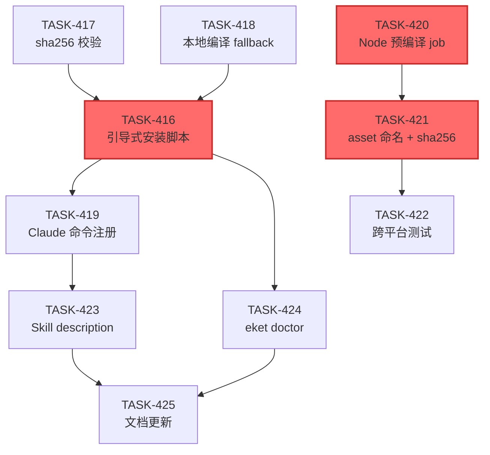

# EPIC-005 任务依赖图

```mermaid
graph TD
    %% M1: 核心安装流程
    T416[TASK-416<br/>引导式安装脚本]
    T417[TASK-417<br/>sha256 校验]
    T418[TASK-418<br/>本地编译 fallback]
    T419[TASK-419<br/>Claude 命令注册]
    
    %% M2: GitHub Actions
    T420[TASK-420<br/>Node 预编译 job]
    T421[TASK-421<br/>asset 命名 + sha256]
    T422[TASK-422<br/>跨平台测试]
    
    %% M3: 用户体验
    T423[TASK-423<br/>Skill description]
    T424[TASK-424<br/>eket doctor]
    T425[TASK-425<br/>文档更新]
    
    %% 依赖关系
    T417 --> T416
    T418 --> T416
    T416 --> T419
    
    T420 --> T421
    T421 --> T422
    
    T419 --> T423
    T416 --> T424
    T423 --> T425
    T424 --> T425
    
    %% 关键路径标注
    classDef critical fill:#ff6b6b,stroke:#c92a2a,stroke-width:2px
    class T416,T420,T421 critical
```

## 关键路径：3-5 天

**并行执行策略**：
- Phase 1: T417/T418/T420 并行 → T416/T421
- Phase 2: T419/T422/T424 并行
- Phase 3: T423 → T425

## INVEST 校验：全通过 ✅

总工时 48h → 3 Slaver 并行 → 实际 **3-5 天**
