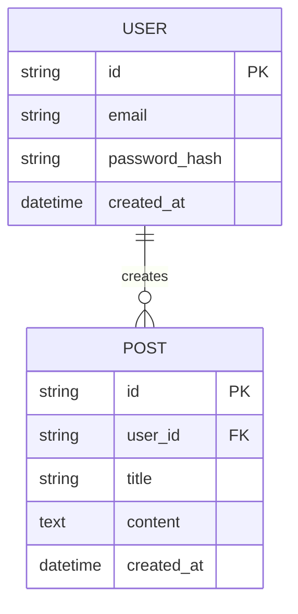

# Step 2: 架构设计 SOP

**版本**: 1.0.0
**最后更新**: 2026-03-23
**负责智能体**: 技术经理

---

## 目标

基于需求文档，设计系统架构、选择技术栈、定义 API 和数据库 schema。

---

## 输入

| 输入项 | 位置 | 说明 |
|--------|------|------|
| 需求文档 | `confluence/projects/{project}/requirements/requirements.md` | 功能和非功能性需求 |
| 用户故事 | `confluence/projects/{project}/requirements/user-stories.md` | 用户场景 |
| 验收标准 | `confluence/projects/{project}/requirements/acceptance-criteria.md` | 验收条件 |

---

## 输出

| 输出项 | 位置 | 说明 |
|--------|------|------|
| 系统架构文档 | `confluence/projects/{project}/architecture/system-architecture.md` | 整体架构设计 |
| 技术栈文档 | `confluence/projects/{project}/architecture/tech-stack.md` | 技术选型说明 |
| API 设计文档 | `confluence/projects/{project}/architecture/api-design.md` | API 接口定义 |
| 数据库设计 | `confluence/projects/{project}/architecture/database-design.md` | Schema 设计 |
| 部署架构 | `confluence/projects/{project}/architecture/deployment-architecture.md` | 部署方案 |

---

## 使用 Skills

| Skill | 用途 | 调用顺序 |
|-------|------|---------|
| `architecture_design` | 系统架构设计 | 1 |
| `api_design` | API 接口设计 | 2 |
| `database_design` | 数据库 schema 设计 | 3 |

---

## 详细步骤

### 2.1 系统架构设计

**目的**: 设计系统的整体架构

**调用 Skill**: `architecture_design`

**步骤**:
1. 分析非功能性需求（性能、扩展性、安全性）
2. 选择架构模式（单体/微服务/Serverless）
3. 定义系统组件和交互
4. 设计数据流和控制流

**架构决策记录模板**:
```markdown
## 架构决策：{decision_name}

### 背景
{为什么需要做这个决策}

### 选项
- **选项 A**: {描述}
  - 优点：...
  - 缺点：...

- **选项 B**: {描述}
  - 优点：...
  - 缺点：...

### 决策
选择 **{选项}**

### 理由
{为什么选择这个选项}

### 影响
{这个决策带来的影响}
```

**检查清单**:
- [ ] 架构模式选择合理
- [ ] 组件职责清晰
- [ ] 组件间耦合度低
- [ ] 满足非功能性需求
- [ ] 架构决策已记录

---

### 2.2 技术栈选型

**目的**: 选择适合项目需求的技术栈

**步骤**:
1. 分析功能需求和非功能性需求
2. 列出候选技术
3. 评估每个技术的优缺点
4. 做出技术选型决策

**技术栈评估维度**:
| 维度 | 说明 | 权重 |
|------|------|------|
| 功能匹配度 | 是否满足功能需求 | 高 |
| 性能 | 是否满足性能要求 | 高 |
| 学习曲线 | 团队熟悉程度 | 中 |
| 社区生态 | 文档、库、工具 | 中 |
| 可维护性 | 代码可读性、测试支持 | 高 |
| 成本 | 许可费用、云资源成本 | 中 |

**技术栈文档模板**:
```markdown
# {项目名} - 技术栈

## 前端

| 类别 | 技术 | 版本 | 理由 |
|------|------|------|------|
| 框架 | React | 18.x | 生态丰富，团队熟悉 |
| 状态管理 | Zustand | 4.x | 轻量，易用 |
| 构建工具 | Vite | 5.x | 快速开发体验 |

## 后端

| 类别 | 技术 | 版本 | 理由 |
|------|------|------|------|
| 运行时 | Node.js | 20.x | 性能优秀 |
| 框架 | Express | 4.x | 成熟稳定 |
| 数据库 | PostgreSQL | 15.x | 功能强大 |

## 基础设施

| 类别 | 技术 | 版本 | 理由 |
|------|------|------|------|
| 部署平台 | Cloudflare Pages | - | 免费，CDN 集成 |
| CI/CD | GitHub Actions | - | 与 GitHub 集成 |
```

**检查清单**:
- [ ] 技术选型满足功能需求
- [ ] 技术选型满足非功能性需求
- [ ] 技术评估记录完整
- [ ] 技术决策有理有据

---

### 2.3 API 设计

**目的**: 定义系统对外的 API 接口

**调用 Skill**: `api_design`

**步骤**:
1. 识别需要的 API 端点
2. 定义请求/响应格式
3. 定义错误处理机制
4. 定义认证和授权机制

**API 设计原则**:
- **RESTful**: 使用标准 HTTP 方法和状态码
- **版本化**: URL 中包含版本号 (`/api/v1/`)
- **一致性**: 命名、格式保持一致
- **文档化**: 每个端点有详细说明

**API 端点模板**:
```markdown
### {端点名称}

**路径**: `{METHOD} /api/v1/{path}`

**描述**: {端点功能描述}

**认证**: {认证方式，如 JWT}

**请求**:
```json
{
  "field1": "type: string, required",
  "field2": "type: number, optional"
}
```

**响应 (200 OK)**:
```json
{
  "data": {...},
  "meta": {
    "page": 1,
    "total": 100
  }
}
```

**错误响应**:
```json
{
  "error": {
    "code": "ERROR_CODE",
    "message": "人类可读的错误信息"
  }
}
```

**示例**:
```bash
curl -X GET https://api.example.com/api/v1/users \
  -H "Authorization: Bearer {token}"
```
```

**检查清单**:
- [ ] 所有功能有对应 API 端点
- [ ] 使用标准 HTTP 方法
- [ ] 错误处理一致
- [ ] 认证机制完善
- [ ] API 文档完整

---

### 2.4 数据库设计

**目的**: 设计数据库 schema

**调用 Skill**: `database_design`

**步骤**:
1. 识别实体和关系
2. 设计表结构
3. 定义索引和约束
4. 设计迁移策略

**ER 图模板**:


**表结构模板**:
```markdown
### {table_name}

**描述**: {表的用途}

| 字段 | 类型 | 约束 | 说明 |
|------|------|------|------|
| id | UUID | PRIMARY KEY | 唯一标识 |
| created_at | TIMESTAMP | NOT NULL, DEFAULT NOW() | 创建时间 |
| updated_at | TIMESTAMP | NOT NULL, DEFAULT NOW() | 更新时间 |

**索引**:
- `idx_{field}` on `{field}` - {索引用途}

**外键**:
- `{field}` references `{other_table}({other_field})`
```

**检查清单**:
- [ ] 实体识别完整
- [ ] 关系定义正确
- [ ] 范式化合理（通常 3NF）
- [ ] 索引设计合理
- [ ] 迁移策略明确

---

### 2.5 部署架构设计

**目的**: 设计系统的部署方案

**步骤**:
1. 选择部署平台
2. 设计 CI/CD 流程
3. 定义环境（dev/staging/prod）
4. 设计监控和日志方案

**部署架构模板**:
```markdown
# 部署架构

## 环境

| 环境 | 用途 | 访问方式 |
|------|------|---------|
| development | 开发测试 | 本地 |
| staging | 预发布测试 | https://staging.example.com |
| production | 生产环境 | https://example.com |

## CI/CD 流程

```
代码提交 → GitHub Actions → 测试 → 构建 → 部署
```

## 监控

- **应用监控**: {工具}
- **日志**: {工具}
- **告警**: {工具}
```

**检查清单**:
- [ ] 部署平台选择合理
- [ ] CI/CD 流程完整
- [ ] 环境隔离清晰
- [ ] 监控方案完善

---

### 2.6 创建 Checkpoint

**Checkpoint 名称**: `phase1_architecture_complete`

**Checkpoint 文件**: `.eket/state/checkpoints/{project}-architecture-complete.md`

**内容**:
```markdown
# Checkpoint: Phase1 Architecture Complete

**项目**: {project}
**时间**: {timestamp}
**负责人**: 技术经理

---

## 检查项

- [ ] 系统架构文档已创建
- [ ] 技术栈选型完成
- [ ] API 设计完成
- [ ] 数据库设计完成
- [ ] 部署架构完成

## 交付物

- [ ] system-architecture.md
- [ ] tech-stack.md
- [ ] api-design.md
- [ ] database-design.md
- [ ] deployment-architecture.md

## 架构决策记录

- [ ] 架构决策已记录
- [ ] 技术选型评估已记录

---

**状态**: checkpoint_recorded
```

---

## 质量检查

### 架构质量

- [ ] 架构满足功能需求
- [ ] 架构满足非功能性需求
- [ ] 组件职责清晰
- [ ] 组件间解耦

### 技术选型质量

- [ ] 技术选型有理有据
- [ ] 技术栈一致性好
- [ ] 团队能够胜任

### API 设计质量

- [ ] API 设计 RESTful
- [ ] 命名一致
- [ ] 错误处理统一
- [ ] 文档完整

### 数据库设计质量

- [ ] 范式化合理
- [ ] 索引设计合理
- [ ] 扩展性考虑

---

## 相关文件

- [Phase 1 SOP](../phase-1-initiation/README.md)
- [Architecture Design Skill](../../../template/skills/design/architecture_design.yml)
- [API Design Skill](../../../template/skills/design/api_design.yml)
- [Database Design Skill](../../../template/skills/design/database_design.yml)

---

**SOP 版本**: 1.0.0
**创建日期**: 2026-03-23
**维护者**: EKET Framework Team
