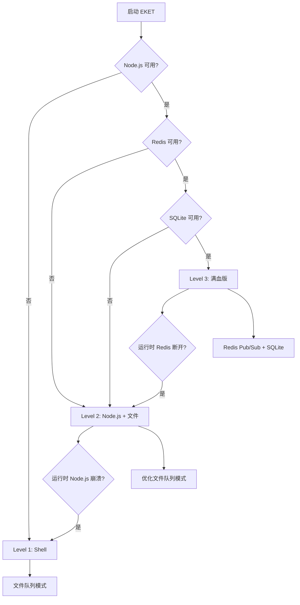

# EKET 三级架构设计

**版本**: v2.3.0
**最后更新**: 2026-04-08

---

## 🎯 设计理念

EKET 采用**渐进式三级架构**设计，确保在不同环境下都能稳定运行：

```
┌─────────────────────────────────────────────────────┐
│ Level 1: Shell + 文档 (基础版)                      │
│ ✅ 目标: 所有核心功能可用                           │
│ 📦 依赖: Bash 4.0+, 文件系统, Markdown 文档         │
│ 👥 用户: 快速启动, 零配置, 最小依赖                │
│ ⭐ 优先级: P0 (最高) - 必须 100% 可用               │
└─────────────────────────────────────────────────────┘
           ↓ 渐进增强 (文档从上往下写)
┌─────────────────────────────────────────────────────┐
│ Level 2: Node.js + 文件队列 (增强版)                │
│ ✅ 目标: 更高效、更专业、更丰富                     │
│ 📦 依赖: Node.js 18+, npm, TypeScript, 文件队列     │
│ 👥 用户: 开发者, 需要更好的性能和类型安全          │
│ ⭐ 优先级: P1 (高) - 应该完整                       │
└─────────────────────────────────────────────────────┘
           ↓ 完整功能 (文档从上往下写)
┌─────────────────────────────────────────────────────┐
│ Level 3: Node.js + Redis + SQLite (满血版)          │
│ ✅ 目标: 生产级、高并发、持久化                     │
│ 📦 依赖: Level 2 + Redis 6.0+, SQLite 3.35+, Docker│
│ 👥 用户: 生产环境, 高并发, 分布式协作              │
│ ⭐ 优先级: P2 (中) - 可以渐进优化                   │
└─────────────────────────────────────────────────────┘
```

**关键原则**：
1. **文档组织**：从 Level 1 → Level 3（用户从简单到复杂）
2. **运行时降级**：从 Level 3 → Level 1（系统从高级到基础）

---

## 📚 Level 1: Shell + 文档 (基础版)

### 核心功能

**Master-Slaver 协作**：
- ✅ Master 启动和角色分配
- ✅ Slaver 任务认领和执行
- ✅ 文件队列消息传递
- ✅ 状态跟踪和同步

**依赖要求**：
```bash
# 检查环境
bash --version  # >= 4.0
git --version   # >= 2.30
```

**无需安装**：
- ❌ 不需要 Node.js
- ❌ 不需要 Redis
- ❌ 不需要 SQLite
- ❌ 不需要 Docker

### 快速启动 (30 秒)

```bash
# 1. 克隆仓库
git clone https://github.com/godlockin/eket.git
cd eket

# 2. 启动 Master (Shell 模式)
./scripts/eket-start.sh --role master

# 3. 启动 Slaver (Shell 模式)
./scripts/eket-start.sh --role slaver --profile backend_dev

# 完成！Level 1 已就绪
```

### 核心脚本

| 脚本 | 功能 | 优先级 |
|------|------|--------|
| `scripts/eket-start.sh` | 启动 Master/Slaver | P0 |
| `scripts/heartbeat-monitor.sh` | 心跳监控 | P0 |
| `scripts/generate-stats.sh` | 生成统计报告 | P0 |
| `scripts/cleanup-idle-agents.sh` | 清理空闲 Agent | P1 |
| `scripts/broadcast-task-reset.sh` | 广播任务重置 | P1 |
| `lib/adapters/hybrid-adapter.sh` | 命令路由和降级 | P0 |

### 文件队列机制

**队列目录结构**：
```
.eket/
├── data/
│   └── queue/
│       ├── pending/        # 待处理消息
│       ├── processing/     # 处理中消息
│       ├── processed/      # 已处理消息
│       └── failed/         # 失败消息
├── inboxes/
│   ├── master/            # Master 收件箱
│   └── slaver-{id}/       # Slaver 收件箱
└── heartbeats/
    └── {instance-id}.json # 心跳文件
```

**消息格式** (JSON):
```json
{
  "id": "msg_abc123",
  "from": "slaver-001",
  "to": "master",
  "type": "task_complete",
  "timestamp": 1234567890,
  "payload": {
    "task_id": "TASK-001",
    "status": "done"
  }
}
```

**队列操作**：
```bash
# 发送消息
echo '{"id":"msg1","from":"master","to":"slaver-001","type":"assign_task"}' \
  > .eket/inboxes/slaver-001/msg1.json

# 读取消息
cat .eket/inboxes/master/*.json

# 清理已处理
mv .eket/data/queue/pending/*.json .eket/data/queue/processed/
```

### 降级保障

Level 1 是**最后的降级目标**，确保即使所有高级功能失败，系统仍可用：

```bash
# 检查当前运行级别
./lib/adapters/hybrid-adapter.sh check

# 输出示例：
# [INFO] Node.js: ❌ 不可用
# [INFO] Redis: ❌ 不可用
# [INFO] Shell: ✅ 可用
# [INFO] 当前级别: Level 1 (Shell + 文件队列)
```

---

## 🚀 Level 2: Node.js + 文件队列 (增强版)

### 功能增强

**相比 Level 1 增加**：
- ✅ TypeScript 类型安全
- ✅ 丰富的 CLI 命令
- ✅ 更高效的文件队列（去重、归档、校验和）
- ✅ 断路器和重试机制
- ✅ LRU 内存缓存
- ✅ 日志和监控
- ✅ Web Dashboard（可选）
- ✅ OpenCLAW Gateway（可选）

**依赖要求**：
```bash
# 安装 Node.js
node --version  # >= 18.0.0
npm --version   # >= 9.0.0

# 安装依赖
cd node && npm install

# 构建
npm run build
```

### 快速启动

```bash
# 1. 构建 Node.js 版本
cd node
npm install
npm run build
cd ..

# 2. 启动 Master (Node.js 模式)
node node/dist/index.js instance:start --role master

# 3. 启动 Slaver (Node.js 模式)
node node/dist/index.js instance:start --role slaver --profile backend_dev

# 或使用 hybrid adapter 自动选择最佳模式
./lib/adapters/hybrid-adapter.sh instance:start --role master
```

### CLI 命令

```bash
# 系统诊断
node dist/index.js system:doctor
node dist/index.js system:check

# 实例管理
node dist/index.js instance:start --auto
node dist/index.js instance:start --human --role frontend_dev
node dist/index.js instance:set-role <role>

# 任务管理
node dist/index.js project:init
node dist/index.js task:claim [id]

# Web 服务
node dist/index.js web:dashboard --port 3000
node dist/index.js hooks:start --port 8899

# 消息队列测试
node dist/index.js queue:test
```

### 优化的文件队列

**特性**：
- ✅ 原子写入（临时文件 + rename）
- ✅ 校验和验证（防止损坏）
- ✅ 自动去重（基于消息 ID）
- ✅ 自动归档（已处理消息）
- ✅ 重试机制（失败重试 3 次）

**实现** (`src/core/optimized-file-queue.ts`):
```typescript
import { OptimizedFileMessageQueue } from './core/optimized-file-queue.js';

const queue = new OptimizedFileMessageQueue({
  queueDir: '.eket/data/queue',
  maxRetries: 3,
  deduplication: true,
  archiveProcessed: true
});

await queue.enqueue(message);
const msg = await queue.dequeue();
```

### 降级逻辑

Level 2 在以下情况自动降级到 Level 1：

```typescript
// hybrid-adapter.sh 自动判断
if (nodeAvailable && nodeBinExists) {
  // 使用 Level 2 (Node.js)
  node dist/index.js $command
} else {
  // 降级到 Level 1 (Shell)
  bash scripts/$command.sh
}
```

---

## 💎 Level 3: Node.js + Redis + SQLite (满血版)

### 完整功能

**相比 Level 2 增加**：
- ✅ Redis Pub/Sub 实时消息
- ✅ Redis 连接池和主从切换
- ✅ SQLite 持久化存储 (WAL 模式)
- ✅ 三级 Master 选举（Redis → SQLite → File）
- ✅ 分布式缓存（LRU + Redis 二级）
- ✅ 性能监控和告警
- ✅ 事务支持
- ✅ 知识库系统

**依赖要求**：
```bash
# Redis (推荐 Docker)
docker run -d --name eket-redis -p 6379:6379 redis:7-alpine

# 或手动安装
redis-server --version  # >= 6.0.0

# 环境变量
export EKET_REDIS_HOST=localhost
export EKET_REDIS_PORT=6379
export EKET_SQLITE_PATH=~/.eket/data/sqlite/eket.db
```

### 快速启动

```bash
# 1. 启动 Redis
docker run -d --name eket-redis -p 6379:6379 redis:7-alpine

# 或使用脚本
./scripts/docker-redis.sh

# 2. 启动 Master (满血模式)
node node/dist/index.js instance:start --role master

# 系统自动检测 Redis 可用，使用 Level 3
```

### Redis 功能

**消息队列** (Pub/Sub):
```typescript
import { MessageQueue } from './core/message-queue.js';

const queue = new MessageQueue({
  useRedis: true,
  fallbackToFile: true  // Redis 不可用时降级到文件
});

await queue.publish('tasks', message);
queue.subscribe('tasks', handler);
```

**缓存层** (LRU + Redis):
```typescript
import { CacheLayer } from './core/cache-layer.js';

const cache = new CacheLayer({
  useRedis: true,
  maxMemorySize: 100 * 1024 * 1024  // 100MB
});

await cache.set('key', value, 300);  // 5分钟 TTL
const val = await cache.get('key');
```

**Master 选举** (三级降级):
```typescript
import { electMaster } from './core/master-election.js';

// 尝试顺序: Redis SETNX → SQLite 行锁 → 文件 mkdir
const result = await electMaster({
  instanceId: 'instance-001',
  leaseDuration: 30000  // 30秒租约
});

if (result.success && result.data.isMaster) {
  console.log('I am Master!');
}
```

### SQLite 功能

**知识库** (Retrospective, Pattern, Decision):
```typescript
import { KnowledgeBase } from './core/knowledge-base.js';

const kb = new KnowledgeBase();

await kb.addRetrospective({
  project: 'eket',
  content: 'Round 3 completed with 87% test pass rate',
  tags: ['round3', 'testing']
});

const patterns = await kb.searchPatterns('optimization');
```

**连接管理** (四级降级):
```typescript
import { ConnectionManager } from './core/connection-manager.js';

// 尝试顺序: Remote Redis → Local Redis → SQLite → File
const conn = await ConnectionManager.getInstance();
const level = conn.getCurrentLevel();
// 返回: 'remote_redis' | 'local_redis' | 'sqlite' | 'file'
```

### 性能优化

**WAL 模式** (Round 2 优化):
```sql
PRAGMA journal_mode = WAL;
PRAGMA synchronous = NORMAL;
```

**基准测试结果** (Round 4 验证):
- Redis Write P95: 0.96ms (目标 <5ms) ✅
- Redis Read P95: 0.53ms (目标 <5ms) ✅
- SQLite Insert P95: 0.04ms (目标 <10ms) ✅
- SQLite Select P95: 0.00ms (目标 <10ms) ✅

**运行基准测试**:
```bash
node node/benchmarks/simple-benchmark.js
```

### 四级降级逻辑

Level 3 在运行时根据依赖可用性自动降级：

```
Level 3: Redis + SQLite
  ↓ Redis 不可用
Level 2: Node.js + 文件队列
  ↓ Node.js 不可用
Level 1: Shell + 文件队列
  ↓ 所有失败
优雅退出 + 错误日志
```

**自动降级示例**:
```typescript
// MessageQueue 自动降级
const queue = new MessageQueue({ useRedis: true, fallbackToFile: true });

// 如果 Redis 连接失败，自动切换到文件队列
await queue.publish('tasks', message);  // 透明降级
```

**查看当前级别**:
```bash
node dist/index.js system:check

# 输出：
# ✅ Redis: Connected (localhost:6379)
# ✅ SQLite: /Users/xxx/.eket/data/sqlite/eket.db
# ✅ Node.js: v18.x
# 🎯 当前运行级别: Level 3 (满血版)
```

---

## 🔄 降级决策树



---

## 📊 功能对比矩阵

| 功能 | Level 1 | Level 2 | Level 3 |
|------|---------|---------|---------|
| **Master-Slaver 协作** | ✅ | ✅ | ✅ |
| **任务分配和认领** | ✅ | ✅ | ✅ |
| **心跳监控** | ✅ | ✅ | ✅ |
| **消息传递** | 文件队列 | 优化文件队列 | Redis Pub/Sub |
| **消息持久化** | ✅ | ✅ | ✅ |
| **消息去重** | ❌ | ✅ | ✅ |
| **消息归档** | ❌ | ✅ | ✅ |
| **断路器** | ❌ | ✅ | ✅ |
| **重试机制** | ❌ | ✅ | ✅ |
| **LRU 缓存** | ❌ | 内存 | 内存 + Redis |
| **Master 选举** | 文件锁 | 文件锁 | Redis + SQLite + 文件 |
| **知识库** | ❌ | ❌ | ✅ |
| **性能监控** | ❌ | 基础 | 完整 |
| **Web Dashboard** | ❌ | ✅ | ✅ |
| **OpenCLAW 集成** | ❌ | ✅ | ✅ |
| **事务支持** | ❌ | ❌ | ✅ |
| **分布式部署** | ❌ | ❌ | ✅ |

---

## 🎯 使用建议

### 场景 1: 快速试用

**推荐**: **Level 1** (Shell + 文档)
```bash
git clone https://github.com/godlockin/eket.git
cd eket
./scripts/eket-start.sh --role master
```

**优点**: 零配置，30 秒启动

### 场景 2: 本地开发

**推荐**: **Level 2** (Node.js + 文件队列)
```bash
cd node && npm install && npm run build
node dist/index.js instance:start --role master
node dist/index.js web:dashboard --port 3000
```

**优点**: 丰富功能，无需外部依赖

### 场景 3: 团队协作

**推荐**: **Level 3** (Redis + SQLite)
```bash
docker run -d --name eket-redis -p 6379:6379 redis:7-alpine
node dist/index.js instance:start --role master
```

**优点**: 实时消息，分布式支持

### 场景 4: 生产环境

**推荐**: **Level 3** + 高可用配置
```bash
# Redis 主从
# SQLite 定期备份
# 多 Master 选举
# 完整监控告警
```

---

## 🔧 环境变量

```bash
# Level 2/3 共用
export EKET_LOG_LEVEL=info          # debug | info | warn | error
export EKET_LOG_DIR=./logs

# Level 3 专用
export EKET_REDIS_HOST=localhost
export EKET_REDIS_PORT=6379
export EKET_REDIS_PASSWORD=          # 可选
export EKET_REMOTE_REDIS_HOST=       # 远程 Redis（主从）
export EKET_REMOTE_REDIS_PORT=6379

export EKET_SQLITE_PATH=~/.eket/data/sqlite/eket.db
export EKET_MEMORY_WARNING_THRESHOLD=0.75
export EKET_MEMORY_CRITICAL_THRESHOLD=0.9
```

---

## 📚 相关文档

- **Level 1 详细指南**: [docs/guides/SHELL-MODE.md](../guides/SHELL-MODE.md)
- **Level 2 详细指南**: [docs/guides/NODEJS-MODE.md](../guides/NODEJS-MODE.md)
- **Level 3 详细指南**: [docs/guides/FULL-STACK-MODE.md](../guides/FULL-STACK-MODE.md)
- **降级策略**: [docs/architecture/DEGRADATION-STRATEGY.md](./DEGRADATION-STRATEGY.md)
- **性能基准**: [docs/performance/TASK-015-completion-report.md](../performance/TASK-015-completion-report.md)

---

**版本**: v2.3.0
**最后更新**: 2026-04-08
**维护者**: EKET Framework Team
