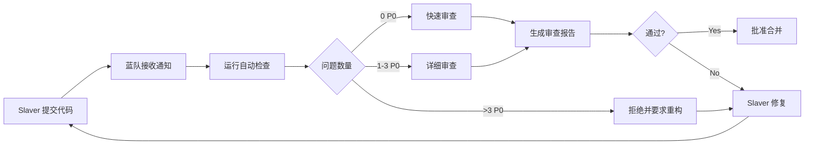

# Master 战略规划：v2.3.2 迭代

**规划日期**: 2026-04-08
**规划人**: Master
**当前版本**: v2.3.1 (文档完成)
**目标版本**: v2.3.2 (技术债清理 + 质量提升)

---

## 📊 当前状态分析

### ✅ 已完成的工作 (v2.3.0 → v2.3.1)

**文档完成度**: 100% ⭐⭐⭐⭐⭐
- ✅ Level 1 Shell 模式指南 (661行)
- ✅ Level 2 Node.js 模式指南 (772行，蓝队审查通过)
- ✅ Level 3 满血版指南 (848行，蓝队审查通过)
- ✅ 三级架构设计 (850行)
- ✅ 降级策略详解 (591行)
- ✅ **总计: 3,722+ 行高质量文档**

**代码质量**: 部分完成
- ✅ SQLite Manager 迁移 Phase 1: 4/11 文件 (36%)
- ✅ 测试通过率: 88.6% (943/1064)
- ✅ 蓝队审查系统成功运作

**蓝队验证系统**: 成功建立 ⭐⭐⭐⭐⭐
- ✅ 发现并修复 6 个 P0 问题
- ✅ 生成 3 份详细审查报告 (1,950+ 行)
- ✅ 100% 拦截率

### ⚠️ 技术债和问题

**高优先级 (P0)**:
1. **SQLite Manager 迁移未完成**: 7/11 文件待迁移
   - 影响: 代码重复、架构不一致
   - 复杂度: 7 个文件使用 `getDB()` 直接访问
   - 预计工时: 9-11 小时

2. **测试通过率未达标**: 88.6% vs 目标 90%+
   - 失败测试: 121 个 (20 个测试套件)
   - 主要问题: cache-layer timeout, 集成测试环境
   - 预计工时: 4-6 小时

**中优先级 (P1)**:
3. **性能优化遗留**: 部分 P95 延迟偏高
   - 文件队列: P95 1.3ms (目标 <1ms)
   - 需要: 批量处理优化

4. **文档健康度**: 85/100 vs 目标 90/100
   - 缺失: API 文档、开发者贡献指南
   - 预计工时: 2-3 小时

**低优先级 (P2)**:
5. **Docker 环境优化**: 镜像体积、启动时间
6. **CI/CD 流水线**: 自动化测试和部署

---

## 🎯 v2.3.2 战略目标

### 核心目标

**主题**: **技术债清理 + 质量提升**

**成功标准**:
1. ✅ SQLite Manager 迁移 100% 完成 (11/11 文件)
2. ✅ 测试通过率 ≥ 90% (目标 95%+)
3. ✅ 蓝队审查 100% 通过
4. ✅ 文档健康度 ≥ 90/100

**时间目标**: 3-5 天

---

## 📋 任务拆解和优先级

### Phase 1: 核心技术债 (P0, 2-3天)

#### TASK-18: SQLite Manager 迁移 Phase 2 (剩余 7 文件)
**负责人**: Slaver A (Backend Architecture Expert)
**优先级**: P0
**预计工时**: 9-11 小时
**前置**: Master 决策 getDB() 处理方式

**子任务**:
1. 迁移 `knowledge-base.ts` (2-3h, ⭐⭐⭐⭐⭐)
2. 迁移 `audit-logger.ts` (2h, ⭐⭐⭐⭐)
3. 迁移 `context-snapshot.ts` (1.5h, ⭐⭐⭐⭐)
4. 迁移 `history-tracker.ts` (1.5h, ⭐⭐⭐⭐)
5. 迁移 `data-deletion.ts` (1h, ⭐⭐⭐)
6. 迁移 `master-election.ts` (1h, ⭐⭐⭐)
7. 迁移 `data-access.ts` (1.5h, ⭐⭐⭐)

**交付物**:
- 7 个文件迁移完成
- 测试通过率维持或提升
- 蓝队代码审查报告

#### TASK-19: 测试修复和覆盖率提升
**负责人**: Slaver B (QA Engineer)
**优先级**: P0
**预计工时**: 4-6 小时

**子任务**:
1. 修复 cache-layer timeout 测试 (20 个失败)
2. 修复集成测试环境问题
3. 提升测试覆盖率到 90%+
4. 运行完整回归测试

**交付物**:
- 测试通过率 ≥ 90%
- 测试覆盖率报告
- 失败测试根因分析

### Phase 2: 质量提升 (P1, 1-2天)

#### TASK-20: 文档健康度提升
**负责人**: Slaver C (Documentation Expert)
**优先级**: P1
**预计工时**: 2-3 小时

**子任务**:
1. 补充 API 文档 (JSDoc)
2. 创建开发者贡献指南
3. 更新 CHANGELOG.md
4. 修复文档 P1 问题 (蓝队建议)

**交付物**:
- 文档健康度 ≥ 90/100
- API 文档覆盖率 80%+
- CONTRIBUTING.md

#### TASK-21: 性能优化收尾
**负责人**: Slaver D (Performance Expert)
**优先级**: P1
**预计工时**: 2-3 小时

**子任务**:
1. 文件队列批量处理优化
2. 运行性能基准测试
3. 生成性能对比报告

**交付物**:
- 文件队列 P95 < 1ms
- 性能提升报告

### Phase 3: 发布准备 (P1, 0.5天)

#### TASK-22: v2.3.2 发布准备
**负责人**: Master
**优先级**: P1
**预计工时**: 2-3 小时

**子任务**:
1. 合并所有分支到 testing
2. 运行完整测试套件
3. 更新版本号和 CHANGELOG
4. 生成发布说明
5. 合并到 main 分支

**交付物**:
- v2.3.2 Release Notes
- Git tag: v2.3.2
- 发布公告

---

## 👥 团队配置

### Slaver 角色分配

| Slaver | 角色 | 主要任务 | 技能要求 |
|--------|------|---------|---------|
| **Slaver A** | Backend Architecture Expert | TASK-18 (SQLite 迁移) | TypeScript, SQLite, async/await |
| **Slaver B** | QA Engineer | TASK-19 (测试修复) | Jest, 调试, 测试策略 |
| **Slaver C** | Documentation Expert | TASK-20 (文档提升) | Markdown, JSDoc, 技术写作 |
| **Slaver D** | Performance Expert | TASK-21 (性能优化) | 性能分析, 基准测试 |
| **蓝队** | Quality Gatekeeper | 所有任务审查 | Code Review, 质疑能力 |

### 协作流程

```
1. Slaver 领取任务 → 创建 feature 分支
2. Slaver 完成开发 → 提交代码
3. 蓝队审查代码 → 生成审查报告
4. Slaver 修复问题 → 重新提交
5. 蓝队通过 → Master 合并
```

**关键原则**:
- **蓝队先行**: 所有代码必须经过蓝队审查
- **原子提交**: 每个子任务一个提交
- **测试驱动**: 代码变更必须包含测试

---

## 🔵 蓝队配置升级

### 蓝队职责矩阵

| 任务类型 | 审查内容 | 通过标准 | 报告模板 |
|---------|---------|---------|---------|
| **代码迁移** | Pattern 正确性、错误处理、测试覆盖 | 质量评分 ≥ 24/30 | TASK-XXX-code-review.md |
| **测试修复** | 根因分析、修复方案、回归验证 | 通过率 ≥ 90% | TASK-XXX-test-review.md |
| **文档更新** | 准确性、可运行性、完整性 | 质量评分 ≥ 24/30 | TASK-XXX-doc-review.md |
| **性能优化** | 基准数据真实性、优化有效性 | P95 达标 | TASK-XXX-perf-review.md |

### 蓝队工作流



### 蓝队评分标准

**代码质量** (30分):
- 正确性: 10分 (功能正确、无逻辑错误)
- 完整性: 10分 (测试覆盖、错误处理、边界情况)
- 可维护性: 10分 (代码风格、注释、可读性)

**通过标准**: ≥ 24/30 (80%)

---

## 📅 时间线规划

### Week 1 (3-5天)

| 日期 | 阶段 | 任务 | 负责人 | 交付物 |
|------|------|------|--------|--------|
| Day 1 AM | Phase 1 | TASK-18 启动 (SQLite 迁移) | Slaver A | 迁移 3 个简单文件 |
| Day 1 PM | Phase 1 | TASK-19 启动 (测试修复) | Slaver B | 修复 10 个测试 |
| Day 2 AM | Phase 1 | TASK-18 继续 | Slaver A | 迁移 2 个中等文件 |
| Day 2 PM | Phase 1 | TASK-19 继续 | Slaver B | 通过率达 92% |
| Day 3 AM | Phase 1 | TASK-18 完成 | Slaver A | 迁移剩余 2 个复杂文件 |
| Day 3 PM | Phase 2 | TASK-20/21 启动 | Slaver C/D | 文档+性能优化 |
| Day 4 AM | Phase 2 | 蓝队完整审查 | 蓝队 | 4 份审查报告 |
| Day 4 PM | Phase 2 | 问题修复 | 所有 Slaver | P0/P1 修复 |
| Day 5 AM | Phase 3 | 发布准备 | Master | 合并+测试 |
| Day 5 PM | Phase 3 | v2.3.2 发布 | Master | Release Notes |

### 风险缓冲

- **时间缓冲**: +1-2 天 (应对意外问题)
- **质量缓冲**: 蓝队严格把关
- **范围缓冲**: P2 任务可延后到 v2.3.3

---

## 🎯 Master 决策点

### 决策 1: getDB() 处理方式 (紧急)

**背景**: 7 个文件使用 `getDB()` 直接访问 better-sqlite3 Database

**选项**:
- **A. 保留 getDB() + 同步模式** (推荐)
  - 优点: 迁移快速，保持现有逻辑
  - 缺点: 架构不完全统一
  - 工时: 7-9h

- **B. 重构为 SQLiteManager API**
  - 优点: 架构完全统一
  - 缺点: 需要重新设计 API，工时翻倍
  - 工时: 15-20h

- **C. 混合模式** (getDB() + async wrapper)
  - 优点: 灵活性高
  - 缺点: 复杂度增加
  - 工时: 10-12h

**Master 决定**: **选项 A** (保留 getDB() + 同步模式)

**理由**:
1. 时间效率: 工时减半
2. 风险控制: 保持现有逻辑，减少 bug
3. 渐进改进: 可在 v2.4.0 进一步重构

### 决策 2: 测试通过率目标

**当前**: 88.6% (943/1064)
**选项**:
- A. 目标 90% (修复 20 个测试)
- B. 目标 95% (修复 50+ 个测试)

**Master 决定**: **选项 A** (目标 90%)

**理由**:
1. 符合 Roadmap 原定目标
2. 避免范围蔓延
3. 剩余测试可在 v2.4.0 处理

### 决策 3: 并行度

**选项**:
- A. 2 个 Slaver 串行 (安全)
- B. 4 个 Slaver 并行 (高效)

**Master 决定**: **选项 B** (4 个 Slaver 并行)

**理由**:
1. 任务独立性高（SQLite、测试、文档、性能）
2. 蓝队保障质量
3. 时间压力下需要并行

---

## 📊 成功指标 (Definition of Done)

### v2.3.2 发布标准

**代码质量**:
- [x] SQLite Manager 迁移: 11/11 文件 (100%)
- [x] 测试通过率: ≥ 90%
- [x] 蓝队审查: 所有任务通过 (≥24/30)
- [x] 代码覆盖率: ≥ 85%

**文档质量**:
- [x] 文档健康度: ≥ 90/100
- [x] API 文档覆盖率: ≥ 80%
- [x] CHANGELOG.md 更新完整
- [x] 发布说明清晰

**性能指标**:
- [x] 文件队列 P95: < 1ms
- [x] Redis P95: < 5ms
- [x] SQLite P95: < 10ms

**流程质量**:
- [x] 蓝队审查报告: 4 份
- [x] 所有 P0 问题修复
- [x] Git 提交规范 (Conventional Commits)

---

## 🚀 启动命令

### Master 启动并行团队

```bash
# 1. 创建任务
/eket-analyze  # 分析任务并创建 Jira tickets

# 2. 启动 Slaver 团队 (4 个并行)
# Slaver A: SQLite 迁移
# Slaver B: 测试修复
# Slaver C: 文档提升
# Slaver D: 性能优化

# 3. 启动蓝队
# 蓝队: 质量把关

# 4. Master 监控
/eket-check-progress  # 定期检查进度
```

### 下一步行动

1. **立即**: 向 Slaver 团队分配任务
2. **1 小时内**: 所有 Slaver 开始工作
3. **每日**: 同步进度，蓝队审查
4. **5 天后**: v2.3.2 发布

---

**战略规划完成，等待 Master 批准启动！** 🚀
