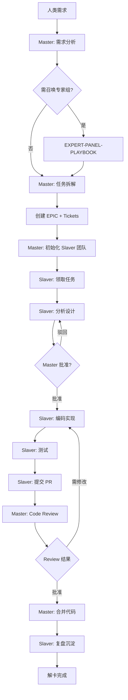

# EKET 从开卡到解卡完整流程 — v2.9.0

## 流程总览



---

## Phase 1: Master 开卡（需求 → Tickets）

### 1.1 需求分析（强制读取 EXPERT-PANEL-PLAYBOOK.md）

**触发条件**（任一满足即召唤专家组）:
- 新需求
- 架构变更
- 重构/迁移
- 生产事故根因分析
- 跨 Sprint 规划

**输入闸门（5-Why + 4-W）**:
```
❌ 不合格 → 打回追问
├── Who: 仅"用户"二字
├── What: 仅动词（"优化"/"改善"）
├── Why: 跳过直接写方案
├── When: 无法被证伪的验收标准
└── Why-5: 回答循环（伪命题）
```

**产出物**: `jira/tickets/<EPIC-ID>/requirement-analysis.md`（6节强制）
1. 原始诉求（原文引用）
2. 受益人 × 场景矩阵
3. 验收标准（Given-When-Then）
4. 非目标（Out of Scope）
5. 未知与假设
6. 风险与缓解

**校验**: `bash scripts/check-requirement-analysis.sh <EPIC-ID>`

### 1.2 任务拆解（INVEST 原则）

**垂直切片优先**:
```
❌ 反模式: FEAT-1 设计 DB / FEAT-2 写 API / FEAT-3 写 UI
✅ 正模式: FEAT-1 登录最小闭环（DB+API+UI 全栈）
```

**INVEST 校验**:
- I (Independent): 可独立交付
- N (Negotiable): 可讨论实现方式
- V (Valuable): 有用户价值
- E (Estimable): 可估算工时（2d/0.5d/3h）
- S (Small): ≤3天工作量
- T (Testable): 有明确验收标准

**产出物**:
- `jira/tickets/TASK-NNN.md`（元数据 + 需求 + 验收标准）
- 依赖关系：`blocked_by: [TASK-MMM]`

### 1.3 初始化 Slaver 团队

**红线**: 任务拆解后**必须立即**初始化 Slaver，禁止积压在 backlog

```bash
# Master 创建 Slaver 派遣消息
echo "type: task_available
epic_id: EPIC-002
tasks: [TASK-001, TASK-002, ...]
priority: P1" > shared/message_queue/broadcast/task-dispatch-$(date +%s).json
```

---

## Phase 2: Slaver 领卡与分析

### 2.1 领取任务（eket task:claim）

**流程**:
```bash
# 1. Slaver 启动
eket task:claim --auto  # 自动选择 ready 状态票据

# 2. 系统行为
- 检查 .eket/ACTIVE_CONTEXT.md（如存在 → 继续上次任务）
- 否则查询 DB: SELECT * FROM tickets WHERE status='ready' ORDER BY priority
- 更新状态: status='in_progress', assignee='slaver_<id>', claimed_at=NOW()
- 写入 MD: **负责人**: slaver_<id>
- 创建 worktree: .worktrees/<TASK-ID>/
- 注入活跃上下文: .eket/ACTIVE_CONTEXT.md
- 推送相关经验: 读取 confluence/memory/{pitfalls,patterns}/
```

**产出**:
- `jira/tickets/TASK-NNN.md` 元数据更新（负责人/领取时间）
- `.eket/ACTIVE_CONTEXT.md` 创建
- Worktree 创建（可选，基于配置）

### 2.2 分析设计（必须先提交分析报告）

**红线**: Slaver **禁止**领取后直接编码，必须先分析并获 Master 批准

**流程**:
```markdown
1. 阅读 ticket 需求和验收标准
2. 阅读相关代码（pitfalls/patterns 提示）
3. 设计技术方案
4. 写入 ticket `## 分析报告` 节（技术方案/影响面/风险）
5. 更新状态: status='analysis_review'
6. 发送消息到 Master: 
   shared/message_queue/inbox/analysis-review-<ticket-id>-<timestamp>.json
7. **等待 Master 批准**
```

**分析报告模板**（写入 ticket）:
```markdown
## 分析报告

**Slaver**: slaver_<id>
**分析时间**: YYYY-MM-DD HH:MM

### 技术方案
<实现方案描述>

### 影响面分析
| 模块 | 影响程度 | 说明 |
|------|---------|------|
| ... | 高/中/低 | ... |

### 风险评估
| 风险 | 可能性 | 影响 | 缓解措施 |
|------|--------|------|---------|
| ... | H/M/L | H/M/L | ... |

### 预估工时
X 小时
```

**Master 审批**:
- ✅ 批准 → status='approved'，Slaver 开始编码
- ❌ 驳回 → Slaver 重新分析
- ⚠️ 需升级 → 拆分任务或调整方案

---

## Phase 3: Slaver 实施（编码 → 测试 → PR）

### 3.1 编码实现

**TDD 流程**:
```
1. 先写测试（失败的红色测试）
2. 实现最小代码让测试通过（绿色）
3. 重构优化（保持绿色）
```

**分析瘫痪检测**:
- 连续读取 5+ 文件无写操作 → 立刻写代码或报 BLOCKED

**禁止操作**:
- ❌ 修改验收标准/优先级/依赖
- ❌ 横向协助其他 Slaver（需上报 Master）

### 3.2 测试验证

**必须执行**:
```bash
npm test                 # 单元测试全量通过
npm run lint             # 无 error
npm run format           # 代码格式化
```

**4-Level Artifact Verification**:
- L1 存在性: 文件确实存在于 PR diff
- L2 实质性: 真实逻辑，非空函数/stub
- L3 接线正确: 被正确 import/export/注册
- L4 数据流动: 关键路径有集成测试

### 3.3 提交 PR

**命令**:
```bash
eket pr:create --ticket TASK-NNN
```

**系统行为**:
```
1. 提交代码到 feature/<TASK-ID>-<desc> 分支
2. 创建 PR 到 testing 分支
3. 生成 PR 描述（关联 ticket/变更摘要/测试结果）
4. 更新 ticket: status='review', pr_url='...'
5. 发送消息: shared/message_queue/inbox/pr-review-request-<id>.json
6. 等待 Master 审核
```

**PR 描述必含**:
- 关联 Ticket ID
- 变更摘要（文件数/行数）
- **真实测试输出**（`npm test` stdout，非截图）
- 验收标准对照（逐条打勾）

---

## Phase 4: Master Review 与合并

### 4.1 Code Review（强制 Checklist）

**缺任何一项 = 直接 reject**:
- [ ] PR 描述包含真实 `npm test` stdout
- [ ] CI `test` check 为绿色
- [ ] 无未解释的新 mock
- [ ] 变更与验收标准一一对应

**4-Level Verification**（代码类 PR）:
- [ ] L1-L3 全部通过
- [ ] L4 适用时必须有集成测试

### 4.2 合并代码

**分支策略**:
```
feature/<TASK-ID> → testing → main → miao
```

**合并命令**:
```bash
git checkout testing
git merge feature/<TASK-ID> --no-ff
git push origin testing

git checkout main
git merge testing
git push origin main

git checkout miao
git merge main
git push origin miao
```

**禁止**:
- ❌ 直接向 miao/testing/main 提交
- ❌ 无 CI 绿灯合并
- ❌ 跳过分支同步

---

## Phase 5: Slaver 解卡与复盘

### 5.1 更新票据状态

**命令**:
```bash
eket task:complete TASK-NNN
```

**系统行为**:
```
1. 更新 MD: **状态**: done, **完成时间**: NOW()
2. 更新 DB: UPDATE tickets SET status='done', completed_at=NOW()
3. 清理 worktree（如使用）
4. 删除 .eket/ACTIVE_CONTEXT.md
5. 更新 slaver_instances: status='idle'
```

### 5.2 复盘与知识沉淀

**Slaver 必须写**（ticket 内）:
```markdown
## 复盘

### 做了什么
<执行摘要>

### 3Q 复盘
**Q1 哪些做得好？**
<经验>

**Q2 哪些可以改进？**
<问题>

**Q3 下次怎么做？**
<改进方向>

### 知识沉淀
- 遇到坑 → confluence/memory/pitfalls/
- 通用解法 → confluence/memory/patterns/
- 经验教训 → confluence/memory/lessons/
```

**自动触发**:
- `eket task:complete` 后触发 Memory Curator
- 检查 ticket 复盘节，提取通用知识

---

## 关键节点与时间要求

| 阶段 | 时间限制 | 超时处理 |
|------|---------|---------|
| 需求分析 | ≤4小时 | Master 停止，写 BLOCKED 报告 |
| 分析报告审批 | ≤24小时 | Master 决策阻塞，升级人类 |
| 编码实现 | ticket 预估工时 | Slaver 超时 → Master 介入/重新分配 |
| Code Review | ≤24小时 | Master 响应阻塞，优先处理 |
| 分支同步 | ≤10分钟 | 自动化脚本执行 |

---

## 数据流转

```
人类需求（inbox/human_input.md）
    ↓
Master 分析（EXPERT-PANEL-PLAYBOOK）
    ↓
EPIC 创建（jira/tickets/<EPIC-ID>/）
    ↓
Tickets 拆解（jira/tickets/TASK-NNN.md）
    ↓  status='ready'
Slaver 领取（eket task:claim）
    ↓  status='in_progress'
分析报告（ticket ## 分析报告节）
    ↓  status='analysis_review'
Master 批准
    ↓  status='approved'
Slaver 编码（feature/<TASK-ID> 分支）
    ↓
Slaver 提交 PR
    ↓  status='review'
Master Review（4-Level Verification）
    ↓  批准
Master 合并（feature → testing → main → miao）
    ↓
Slaver 解卡（eket task:complete）
    ↓  status='done'
复盘沉淀（confluence/memory/）
```

---

## 关键文件位置

| 文件 | 用途 | 更新者 |
|------|------|--------|
| `inbox/human_input.md` | 人类需求输入 | 人类 |
| `jira/tickets/<EPIC-ID>/requirement-analysis.md` | 需求分析 | Master |
| `jira/tickets/TASK-NNN.md` | Ticket | Master创建 → Slaver更新 |
| `.eket/ACTIVE_CONTEXT.md` | 当前活跃任务 | 系统自动 |
| `shared/message_queue/inbox/` | 消息队列 | Master/Slaver |
| `confluence/memory/` | 知识沉淀 | Slaver |

---

## 状态机转换

```
backlog → ready → in_progress → analysis_review → approved → 
  → (编码) → review → (合并) → done
  
特殊状态:
- blocked: 依赖未满足
- dropped: 需求取消
- wont-fix: 决策不做
```

---

**参考文档**:
- Master 规范: `template/docs/MASTER-RULES.md`
- Slaver 规范: `template/docs/SLAVER-RULES.md`
- 专家组手册: `template/docs/EXPERT-PANEL-PLAYBOOK.md`
- Master 工作流: `template/docs/MASTER-WORKFLOW.md`
- Slaver 自动执行: `template/docs/SLAVER-AUTO-EXEC-GUIDE.md`
