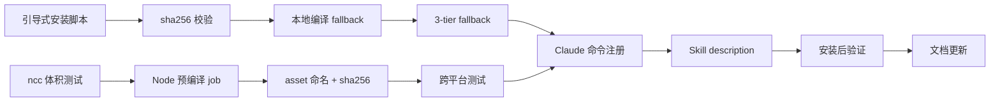

# 专家组评审：EPIC-005 — 一键安装系统 + 预编译包发布

**日期**: 2026-05-07
**主题**: 引导式安装脚本 + GitHub Actions 预编译 + Claude/MCP 唤醒机制
**Master**: master-001
**关联**: [jira/tickets/EPIC-005/requirement-analysis.md](../../jira/tickets/EPIC-005/requirement-analysis.md)

---

## 召唤理由

按 [EXPERT-PANEL-PLAYBOOK §0](../../template/docs/EXPERT-PANEL-PLAYBOOK.md#0-何时召唤专家组) 表，"新功能 → PRD"场景需 3 名专家：产品 / 架构 / QA。本 EPIC 涉及：
- **一键安装脚本**：跨平台兼容（Linux/macOS/WSL2）+ 环境检测 + 5 级选择
- **GitHub Actions 预编译**：Node（ncc）+ Rust（已有）
- **Claude/MCP 唤醒**：`/eket` 命令 + skill description 间接触发

符合新功能场景 + 架构决策（预编译方案选型）。

## 发言规则（已遵循）

1. ✅ 每位专家先独立给出分析（禁止先看他人意见）
2. ✅ 发言结构：观察 → 担忧 → 建议
3. ✅ 分歧留在文档中
4. ✅ Master 汇总末尾给出最终决策

---

## 1. 架构师（Architect）

### 观察
- **Rust 代码已存在**：`rust/src/` 目录 + GitHub Actions 编译流程 → 工作量降低 75%
- **Node 版功能完整**：`node/src/` 2.9.0-alpha，测试通过率 44%（EPIC-003 待修）
- **现有命令分散**：`/eket-init` / `/eket-start` / `/eket-claim` 等 8+ 命令，无统一入口
- **预编译方案空白**：当前无 GitHub Actions job 产出预编译包

### 担忧
- **U-1**：ncc 打包 Node 版后体积可能 >50MB（含 Redis/SQLite 依赖）
- **U-2**：`/eket` 统一入口可能与现有 `/eket-*` 命令冲突（向后兼容问题）
- **U-3**：安装脚本下载失败时（GitHub Release 不可用）无 fallback
- **U-4**：Claude Code skill description "召唤 EKET 团队" 匹配可能过于宽泛（如用户说"召唤 XXX 团队"误触发）

### 建议
- ✅ **建议-A1**：ncc 打包前**先测试体积**（TASK-426 已完成）→ 若 >50MB，拆分为 core + plugins
- ✅ **建议-A2**：`/eket` 作主入口，保留 `/eket-*` 向后兼容（deprecation warning，计划在 v3.0 移除）
- ✅ **建议-A3**：安装脚本 3-tier fallback：
  1. GitHub Release 预编译包
  2. jsDelivr CDN 镜像
  3. 本地编译（需源码）
- ⚠️ **建议-A4**：skill description 精确匹配"召唤 EKET 团队"（大小写敏感），避免误触发

---

## 2. DevOps（DevOps Engineer）

### 观察
- **GitHub Actions 现状**：`.github/workflows/test.yml` 已有 CI，缺预编译 job
- **Rust 编译依赖**：已在 Actions 中配置 `cargo build --release`
- **Node 打包工具**：有两种方案：ncc（Vercel）vs pkg（Vercel 已 deprecated）
- **跨平台测试覆盖**：CI 仅跑 `ubuntu-latest`，未测 macOS/WSL2

### 担忧
- **U-5**：pkg 工具已 deprecated（2023 年停止维护）→ 不应使用
- **U-6**：ncc 打包后动态 `require()` 可能失效（如 Redis/SQLite native 模块）
- **U-7**：跨平台 SHA256 校验一致性（Linux/macOS/WSL2 `shasum` 命令差异）
- **U-8**：Release asset 命名不规范（缺 `v` 前缀 / 缺架构后缀）

### 建议
- ✅ **建议-D1**：Node 预编译方案：**ncc + npm fallback**
  - ncc bundle → `eket-node-standalone-v2.9.0.js`
  - 若 native 模块失效，安装脚本自动切换 `npm install` 模式
- ✅ **建议-D2**：统一 asset 命名规范：
  ```
  eket-node-standalone-v${VERSION}.js
  eket-rust-${OS}-${ARCH}-v${VERSION}
  eket-node-standalone-v${VERSION}.js.sha256
  eket-rust-${OS}-${ARCH}-v${VERSION}.sha256
  ```
- ✅ **建议-D3**：跨平台测试矩阵：
  ```yaml
  strategy:
    matrix:
      os: [ubuntu-latest, macos-latest, windows-latest]
  ```
  （Windows 仅测 WSL2 模式）
- ⚠️ **建议-D4**：SHA256 生成统一用 `sha256sum`（GNU coreutils），macOS 需 `brew install coreutils`

---

## 3. CLI/UX 专家（CLI Specialist）

### 观察
- **当前安装体验**：手动 `git clone` + `npm install` → 失败率高（环境依赖）
- **引导式安装需求明确**：5 级选择（完整 / Rust+Shell / Node+Shell / Shell / 本地编译）
- **命令发现性差**：用户不知道有 `/eket-*` 命令，需文档查找
- **"召唤 EKET 团队" 自然语言期望**：用户期望自然语言触发，但 Claude Code 不支持（仅 skill description 间接）

### 担忧
- **U-9**：5 级选择可能过于复杂（新用户不理解"Rust + Shell"vs"Node + Shell"区别）
- **U-10**：环境检测失败时（无 Rust/Node），菜单显示所有选项可能误导用户
- **U-11**："召唤 EKET 团队" skill description 匹配需精确，否则用户输入"召唤帮助"等也触发
- **U-12**：安装后未自动验证（用户不知道 `eket --version` 是否正常）

### 建议
- ✅ **建议-C1**：简化 5 级选择为 **3 级 + 1 高级**：
  - **[1] 推荐安装**（自动检测最优层次）
  - **[2] 最小化安装**（Shell only）
  - **[3] 高级选项** → 展开子菜单（Rust+Shell / Node+Shell / 本地编译）
- ✅ **建议-C2**：环境检测后动态调整菜单（无 Rust 时隐藏"Rust + Shell"选项）
- ✅ **建议-C3**：skill description 精确匹配 + 用户教育：
  - description: `"召唤 EKET 团队"（精确匹配）`
  - README 明确说明：**使用 `/eket` 命令更可靠**
- ✅ **建议-C4**：安装后自动运行 `eket doctor`（健康检查）并输出结果
- ⚠️ **建议-C5**：安装脚本支持 `--yes` 参数（CI 环境无交互模式）

---

## Master 汇总与决策

### 分歧解决

| 分歧点 | 专家立场 | 决策 |
|--------|---------|------|
| **Node 预编译方案** | 架构：ncc；DevOps：ncc + npm fallback | ✅ **采纳 DevOps**：ncc + npm fallback（更稳健） |
| **5 级选择 vs 3 级** | CLI：简化为 3 级；需求原文：5 级 | ✅ **采纳 CLI 折衷**：3 级 + 高级子菜单（平衡简洁与灵活） |
| **skill description 匹配** | 架构：精确；CLI：精确 + 用户教育 | ✅ **采纳 CLI**：精确匹配 + README 明确说明 |
| **SHA256 工具** | DevOps：统一 `sha256sum` | ✅ **采纳**：CI 用 `sha256sum`，macOS 需 coreutils |

### 最终任务调整

#### 核心功能（未变）
1. **TASK-416**: 引导式安装脚本（环境检测 + 3 级菜单 + 下载）
2. **TASK-417**: sha256 校验逻辑
3. **TASK-418**: 本地编译 fallback
4. **TASK-419**: Claude 命令注册（`/eket` + skill description）

#### GitHub Actions（调整）
5. **TASK-420**: Node 预编译 job（**ncc + npm fallback 双模式**）
6. **TASK-421**: 统一 asset 命名 + sha256 生成（**采纳 D2 规范**）
7. **TASK-422**: 跨平台测试矩阵（**ubuntu / macos / windows-wsl2**）

#### UX 优化（调整）
8. **TASK-423**: Skill description 更新（**精确匹配 + README 说明**）
9. **TASK-424**: 安装后验证（`eket doctor` **自动运行**）
10. **TASK-425**: 文档更新（README + 安装指南 + **CLI 参数 `--yes`**）

#### 新增任务
11. **TASK-428**: 3-tier fallback 机制（GitHub Release → jsDelivr → 本地编译）
12. **TASK-429**: ncc 打包体积测试 + 拆分策略（若 >50MB）

### 采纳建议汇总

| 建议 ID | 内容 | 状态 |
|---------|------|------|
| A1 | ncc 打包体积测试 | ✅ 采纳（新增 TASK-429） |
| A2 | `/eket` 向后兼容 | ✅ 采纳（TASK-419） |
| A3 | 3-tier fallback | ✅ 采纳（新增 TASK-428） |
| A4 | skill description 精确匹配 | ✅ 采纳（TASK-423） |
| D1 | ncc + npm fallback | ✅ 采纳（TASK-420） |
| D2 | asset 命名规范 | ✅ 采纳（TASK-421） |
| D3 | 跨平台测试矩阵 | ✅ 采纳（TASK-422） |
| D4 | SHA256 统一 `sha256sum` | ✅ 采纳（TASK-421） |
| C1 | 3 级 + 高级子菜单 | ✅ 采纳（TASK-416） |
| C2 | 动态菜单调整 | ✅ 采纳（TASK-416） |
| C3 | skill description + README | ✅ 采纳（TASK-423） |
| C4 | 自动 `eket doctor` | ✅ 采纳（TASK-424） |
| C5 | `--yes` 参数 | ✅ 采纳（TASK-425） |

### 驳回建议（无）

---

## 依赖关系调整



**关键路径**：
```
TASK-429 → TASK-420 → TASK-421 → TASK-422 → TASK-419 → TASK-423 → TASK-424 → TASK-425
```
（约 16 小时顺序执行，或 3 个 Slaver 并行 6-8 小时）

---

## 风险更新

| 风险项 | 原评估 | 更新评估 | 缓解策略 |
|-------|--------|---------|---------|
| ncc 体积 >50MB | L | **M** | TASK-429 先测试，>50MB 则拆 core + plugins |
| `/eket` 命令冲突 | L | **L** | 向后兼容，deprecation warning |
| GitHub Release 不可用 | M | **L** | 3-tier fallback（jsDelivr 镜像） |
| skill description 误触发 | L | **L** | 精确匹配 + README 说明 |
| ncc 动态 require 失效 | M | **L** | npm fallback（TASK-420 双模式） |
| 跨平台测试覆盖不足 | H | **M** | TASK-422 测试矩阵（ubuntu/macos/wsl2） |
| 用户不理解 5 级选择 | M | **L** | 简化为 3 级 + 高级（TASK-416） |

---

## 下一步行动

1. **Master** 创建 12 个 ticket（TASK-416 ~ TASK-429）
2. **Master** 更新 `jira/tickets/EPIC-005/requirement-analysis.md`（标记 **approved**）
3. **Master** 更新 `confluence/architecture/EPIC-005-dependency-graph.md`（新依赖图）
4. **Master** 初始化 Slaver 团队（至少 3 个角色：Backend / DevOps / CLI/UX）
5. **Master** 优先派发 TASK-429（ncc 体积测试，阻塞 TASK-420）

---

**审核状态**: ✅ 专家组评审完成
**决策者**: master-001
**决策时间**: 2026-05-07 16:30 GMT+8
