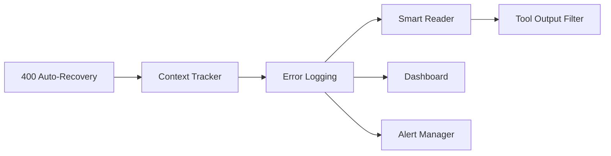

# 专家组讨论：Context Overflow 400 错误防御机制

**召唤时间**: 2026-05-08  
**Master**: master-001  
**主题**: EKET Master/Slaver Context Overflow 防御系统设计  
**背景**: Master/Slaver 通过 `claude` CLI 执行任务时，长时间对话导致 context 超限（200k tokens），触发 400 错误，任务中断无法继续

---

## 参与专家

**必选**:
- 架构师（tech-architect）
- 后端工程师（backend-engineer）
- DevOps 工程师（devops-engineer）

**可选**:
- 性能工程师（performance-engineer）

---

## 专家独立分析（禁止互看）

### 专家 1: 架构师

**观察**:
- EKET 调用链：`Node.js (claude-runner.ts)` → `claude CLI` → `Claude Code` → `Anthropic API`
- 问题出在 **Claude Code 层**，EKET 无法直接控制其 message history
- 现有 Rust `ContextBudgetApplier` 不适用（那是 workflow engine 内部，与 Claude Code session 无关）

**担忧**:
1. **架构边界模糊**：EKET 想管理 context，但 context 归 Claude Code 管，越界风险
2. **方案 A (Task-Scoped Sessions)** 损失 prompt caching 收益，每次冷启动成本高
3. **方案 B (Periodic Reset)** 依赖 Claude Code 的 `/compact` 命令，若命令失败或不可用则失效

**建议**:
- ✅ **短期**：实现 400 auto-recovery（catch + `/compact` + retry）— 最小侵入
- ✅ **中期**：在 EKET 层做 "context-aware tool orchestration"（智能决定何时 Read 全文 vs 摘要）
- ⚠️ **长期**：向 Claude Code 提交 feature request（暴露 session context API）
- ❌ **不推荐**：Task-scoped sessions（成本 > 收益）

**决策矩阵**:
| 方案 | 可行性 | 成本 | 收益 | 推荐 |
|------|--------|------|------|------|
| 400 Auto-Recovery | 高 | 低（1d） | 中 | ✅ 立即做 |
| Periodic Reset | 中 | 低（1d） | 中 | ✅ Phase 1 |
| Smart File Reading | 高 | 中（3d） | 高 | ✅ Phase 2 |
| Task-Scoped Sessions | 低 | 高（5d） | 低 | ❌ 不做 |

---

### 专家 2: 后端工程师

**观察**:
- `claude-runner.ts` 当前仅传递 `--model` 和 prompt，未利用 Claude Code 的其他能力
- `toolCallCounter` 变量需持久化（否则进程重启后归零）
- Node.js 侧缺少 token 估算逻辑，无法预判何时超限

**担忧**:
1. **Periodic reset 时机不准**：5 次 tool call 是硬编码，但不同 tool 的输出差异巨大（Grep 10 行 vs Read 10k 行）
2. **`/compact` 命令可靠性未知**：如果 Claude Code session 已经 400，还能执行 `/compact` 吗？
3. **Smart file reading 的 summarization**：又调用一次 Claude API，成本叠加

**建议**:
- ✅ **动态触发**：基于估算 tokens 而非固定次数（每次 tool call 后累加，超 150k 触发 compact）
- ✅ **降级策略**：`/compact` 失败 → 直接 kill session + 重启新 session
- ✅ **Summarization 优化**：用 Haiku 模型（成本低），或使用本地 LLM（Ollama）
- ⚠️ **Token 估算**：claude-runner 需集成简单估算逻辑（`JSON.stringify(output).length / 3.5`）

**实现建议**:
```typescript
// node/src/core/context-tracker.ts（新增）
class ContextTracker {
  private sessionTokens: Map<string, number> = new Map();

  trackToolOutput(sessionId: string, output: string): void {
    const estimated = Math.ceil(output.length / 3.5);
    const current = this.sessionTokens.get(sessionId) || 0;
    this.sessionTokens.set(sessionId, current + estimated);

    if (current + estimated > 150000) {
      this.triggerCompact(sessionId);
    }
  }

  private async triggerCompact(sessionId: string): Promise<void> {
    console.log(`🗜️  Context: ${this.sessionTokens.get(sessionId)} tokens, compacting...`);
    // 执行 /compact
    await execFileNoThrow('claude', ['--session', sessionId, '--command', '/compact']);
    // 重置计数器
    this.sessionTokens.set(sessionId, 20000); // 保守估计 compact 后留 20k
  }
}
```

---

### 专家 3: DevOps 工程师

**观察**:
- 当前无监控：不知道哪些 task 频繁触发 400
- 无降级指标：400 错误率、平均 session context、恢复成功率
- 无告警：只有任务执行者（Slaver）知道 400，Master 不知道

**担忧**:
1. **隐性故障**：400 错误可能在 Slaver 侧静默失败（重试成功但消耗时间）
2. **无法复现**：400 错误发生时的 session 状态无法保存（context 内容、tool call 序列）
3. **指标缺失**：无法评估方案有效性（修复前后对比）

**建议**:
- ✅ **错误上报**：400 错误必须写入 `.eket/logs/context-overflow.log`（含 sessionId, timestamp, estimated_tokens, task_id）
- ✅ **Session 快照**：400 触发时自动保存 session context 到 `.eket/debug/session-<id>-overflow.json`
- ✅ **Dashboard 展示**：在 `eket system:dashboard` 展示 context 健康度指标
- ✅ **告警机制**：连续 3 次 400 错误 → 写入 `inbox/human_feedback/[ALERT] context-overflow.md`

**监控指标**:
```yaml
# .eket/metrics/context-health.yml
session_stats:
  total_400_errors: 0
  total_recoveries: 0
  recovery_success_rate: 0.0
  avg_session_tokens: 0
  max_session_tokens: 0
  sessions_exceeding_150k: 0

tasks_affected:
  - task_id: TASK-XXX
    400_count: 2
    last_error: "2026-05-08T10:30:00Z"
```

---

## Master 决策汇总

**采纳建议汇总**:

| 专家 | 建议 | 采纳 | 原因 |
|------|------|------|------|
| 架构师 | 400 Auto-Recovery | ✅ | 最小侵入，立即可用 |
| 架构师 | Smart File Reading | ✅ | 治本之策，从源头减少 context |
| 架构师 | Task-Scoped Sessions | ❌ | 成本 > 收益，损失 caching |
| 后端 | 动态触发 compact（基于 tokens） | ✅ | 比固定次数更精准 |
| 后端 | Haiku 做 summarization | ✅ | 成本优化 |
| DevOps | 错误日志 + session 快照 | ✅ | 可观测性基础 |
| DevOps | Dashboard 展示 | ✅ | 纳入 Phase 2 |
| DevOps | 连续错误告警 | ✅ | 防止隐性故障 |

**驳回理由**:
- Task-Scoped Sessions：每次冷启动损失 caching，成本增加 3-5x，且管理多进程复杂度高

---

## 最终技术方案

### Phase 1: 紧急防御（P0，1 day）

**TASK-601**: 400 Auto-Recovery 机制
- 位置：`node/src/core/claude-runner.ts`
- 逻辑：catch 400 → `/compact` → retry
- AC：模拟 context overflow → 自动恢复 → 任务继续

**TASK-602**: Context Tracker + 动态 Compact
- 位置：`node/src/core/context-tracker.ts`（新增）
- 逻辑：每次 tool call 累加 tokens → 超 150k 触发 `/compact`
- AC：50 轮对话 → 自动 compact 2-3 次 → 无 400

**TASK-603**: Error Logging + Session Snapshot
- 位置：`.eket/logs/context-overflow.log` + `.eket/debug/`
- 逻辑：400 错误写日志 + 保存 session state
- AC：触发 400 → 日志存在 + debug 文件可读

### Phase 2: 源头优化（P1，3 days）

**TASK-604**: Smart File Reader
- 位置：`node/src/core/10-50KB 摘要，>50KB 分段
- AC：Read 100KB 文件 → 实际传给 Claude < 15KB

**TASK-605**: Tool Output Filtering
- 位置：`node/src/utils/tool-output-filter.ts`（新增）
- 逻辑：Grep/Glob 结果分页（最多 50 条）+ 优先级排序
- AC：Grep 返回 500 条 → 仅传 50 条 + "... more" 提示

**TASK-606**: Context Health Dashboard
- 位置：`node/src/commands/dashboard.ts`（修改）
- 逻辑：展示 session token 使用率、400 错误率、recovery 成功率
- AC：`eket system:dashboard` → 显示 context health 面板

### Phase 3: 告警与监控（P2，2 days）

**TASK-607**: 连续错误告警
- 位置：`node/src/core/alert-manager.ts`（新增）
- 逻辑：3 次 400 错误 → 写 `inbox/human_feedback/[ALERT] context-overflow.md`
- AC：模拟连续 3 次 400 → 告警文件生成

---

## 依赖关系



**关键路径**: TASK-601 → TASK-602 → TASK-603 → TASK-604（最长 4 步）

---

## 风险评估

| 风险 | 可能性 | 影响 | 缓解策略 |
|------|--------|------|---------|
| `/compact` 命令在 400 错误后失效 | M | H | 降级：kill session + 重启 |
| Token 估算不准（中文 vs 英文密度差异） | M | M | 保守估算（3.5 chars/token）+ 20k buffer |
| Smart summarization 反而增加 API 调用成本 | L | M | 用 Haiku 模型 + 缓存摘要结果 |
| Slaver 深度分析场景仍超限 | M | M | 告警后人工介入（拆分 task）|

---

**专家组结论**: 方案可行，**优先执行 Phase 1（1 day）紧急修复**，Phase 2/3 根据效果决定是否继续。

**下一步**: Master 创建 EPIC-006 + 拆解 7 个 TASK。
