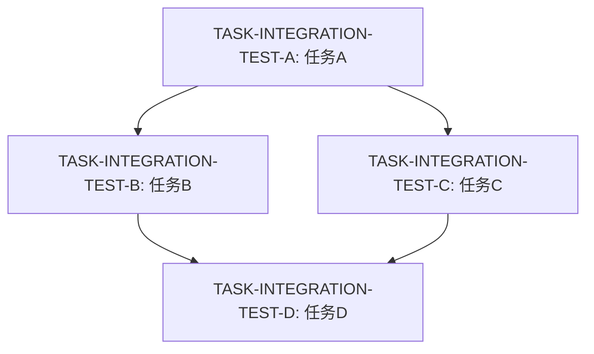

# DAG Level 1 MVP 实施计划

> **For agentic workers:** REQUIRED SUB-SKILL: Use superpowers:subagent-driven-development (recommended) or superpowers:executing-plans to implement this plan task-by-task. Steps use checkbox (`- [ ]`) syntax for tracking.

**目标**: 实现 DAG 驱动任务编排的 Level 1 (Shell + 文档) MVP,验证概念可行性

**架构**: 纯 Markdown 表达 DAG,Slaver 手动检查依赖,Shell 脚本辅助验证。零依赖,可在任何环境运行。

**技术栈**: 
- Bash 4.0+
- Markdown (Mermaid 图)
- Git

---

## 文件结构

### 新建文件
- `template/jira-ticket/dag.md` - DAG 模板
- `template/docs/DAG-WORKFLOW.md` - Master/Slaver DAG 工作流文档
- `scripts/check-dag-dependencies.sh` - 依赖检查脚本
- `scripts/dag-progress-update.sh` - 自动更新进度脚本
- `tests/dag/test-dag-dependencies.sh` - 测试脚本

### 修改文件
- `template/docs/MASTER-WORKFLOW.md` - 添加 DAG 生成指南
- `.eket/templates/master-workflow.md` - 添加 DAG 判断逻辑

---

## Task 1: DAG Markdown 模板

**Files:**
- Create: `template/jira-ticket/dag.md`
- Test: 手动验证 GitHub 渲染

- [ ] **Step 1: 创建 DAG 模板文件**

创建 `template/jira-ticket/dag.md`:

```markdown
---
dag_id: DAG-YYYY-MM-DD-<feature-name>
ticket_id: TASK-XXX
created_by: master-Xermaid
graph TD
  A[TASK-XXX-A: <任务描述>] --> XXX-D: <任务描述>]
  C --> D
\`\`\`

## 节点清单
| Task ID | 描述 | 估时 | 前置依赖 | 状态 | 执行者 | 失败策略 |
|---------|------|------|----------|------|--------|----------|
| TASK-XXX-A | <任务描述> | Xh | - | pending | - | abort |
| TASK-XXX-B | <任务描述> | Xh | A | pending | - | retry:3 |
| TASK-XXX-C | <任务描述> | Xh | A | pending | - | retry:3 |
| TASK-XXX-D | <任务描述> | Xh | B, C | pending | - | abort |

## 执行策略
- **并行层级**: [[A], [B, C], [D]]
- **关键路径**: A → B → D (Xh)
- **预计总时间**: Xh
- **最大并行度**: X

## 约束条件
- 最大并发节点: 3
- 单节点超时: 2h
- 整体超时: 8h
```

- [ ] **Step 2: 验证 Mermaid 语法**

在 GitHub Gist 或本地 Markdown 预览器中验证:
1. 打开 https://mermaid.live/
2. 粘贴模板中的 Mermaid 代码
3. 确认图形正确渲染

预期: 显示 4 节点 DAG,A → B/C → D

- [ ] **Step 3: 添加模板说明注释**

在 `dag.md` 文件顶部添加:

```markdown
<!--
使用说明:
1. 替换所有 <占位符> 为实际内容
2. dag_id 格式: DAG-YYYY-MM-DD-feature-name
3. 状态: planning | running | completed | failed
4. 失败策略: abort | retry:N | skip | manual
5. Mermaid 图节点命名: 简短清晰,避免特殊字符
-->
```

- [ ] **Step 4: 提交模板**

```bash
cd /Users/chenchen/working/sourcecode/tools/dev-tools/eket
git add template/jira-ticket/dag.md
git commit -m "feat(dag): add Level 1 DAG markdown template

- DAG 元数据 (ID, 状态, 创建者)
- Mermaid 依赖图可视化
- 节点清单表格 (任务, 估时, 依赖, 状态)
- 执行策略 (并行层级, 关键路径)
- 约束条件 (并发, 超时)

Co-Authored-By: Claude Sonnet 4 <noreply@anthropic.com>"
```

---

## Task 2: DAG 工作流文档

**Files:**
- Create: `template/docs/DAG-WORKFLOW.md`

- [ ] **Step 1: 创建 DAG 工作流文档**

创建 `template/docs/DAG-WORKFLOW.md`:

```markdown
# DAG 工作流指南

**适用于**: EKET Level 1 (Shell + Markdown)  
**版本**: v1.0  
**更新**: 2026-05-31

---

## 何时启用 DAG?

**混合判断规则** (满足任一条件):

| 条件 | 阈值 | 示例 |
|------|------|------|
| 子任务数量 | ≥ 4 个 | "用户认证" 需 5 个子任务 |
| 并行可能性 | 存在 | "API + 中间件" 可并行 |
| 预计时长 | ≥ 2 天 | "支付重构" 预计 5 天 |
| 依赖复杂度 | 非纯串行 | 多层依赖关系 |

**不启用 DAG 的场景**:
- 简单 Bug 修复 (1-2 子任务)
- 纯串行流程 (A → B → C,无并行)
- 预计 < 4 小时的任务

---

## Master 工作流

### 1. 接收需求后判断

```bash
# 检查清单
- [ ] 子任务数 ≥ 4?
- [ ] 存在并行可能?
- [ ] 预计 ≥ 2 天?
- [ ] 依赖关系复杂?

# 任一为 Yes → 启用 DAG
```

### 2. 生成骨架 DAG

**Prompt 模板**:

\`\`\`
分析需求并生成 DAG:

需求: {需求描述}

输出格式 (dag.md):
1. Mermaid 依赖图
2. 节点清单 (ID, 描述, 估时, 前置依赖)
3. 执行策略 (并行层级, 关键路径)

规则:
- 节点尽量原子化 (单一职责, 2-4h)
- 识别可并行任务
- 标注关键路径
- 避免循环依赖
- 失败策略: 关键节点 abort, 其他 retry:3
\`\`\`

### 3. 创建 DAG Ticket

```bash
# 1. 创建 Ticket 目录
mkdir -p jira/tickets/TASK-456

# 2. 复制模板
cp template/jira-ticket/dag.md jira/tickets/TASK-456/

# 3. 填充内容
# 编辑 jira/tickets/TASK-456/dag.md

# 4. 验证 DAG (运行检查脚本)
bash scripts/check-dag-dependencies.sh TASK-456

# 5. 提交
git add jira/tickets/TASK-456/
git commit -m "feat: create DAG for TASK-456"

# 6. 通知 Slaver
echo "DAG-TASK-456 ready for breakdown" > jira/mailbox/master-to-slavers.md
```

---

## Slaver 工作流

### 1. 发现 DAG Ticket

```bash
# 检查 Ticket 是否有 dag.md
ls jira/tickets/TASK-456/dag.md

# 有 → DAG 模式
# 无 → 普通 Ticket 模式
```

### 2. 识别可认领节点

**手动检查依赖**:

```bash
# 打开 dag.md
cat jira/tickets/TASK-456/dag.md

# 查找 status=pending 且所有 depends_on 已完成的节点
# 示例:
# TASK-456-B | ... | 4h | A | pending | - | retry:3
#           ↑
#    检查 A 是否 completed?
```

**自动检查** (推荐):

```bash
# 运行依赖检查脚本
bash scripts/check-dag-dependencies.sh TASK-456

# 输出示例:
# ✅ TASK-456-A: 无依赖,可认领
# ⏸️ TASK-456-B: 等待 A 完成
# ⏸️ TASK-456-C: 等待 A 完成
```

### 3. 认领节点

```bash
# 1. 更新 dag.md 中节点状态
# 手动编辑或用 sed:
sed -i 's/| TASK-456-A | .* | pending | - |/| TASK-456-A | ... | in_progress | slaver-001 |/' \
  jira/tickets/TASK-456/dag.md

# 2. 创建子任务详情文件
mkdir -p jira/tickets/TASK-456/subtasks
cat > jira/tickets/TASK-456/subtasks/A.md <<EOF
# TASK-456-A: 设计数据库 Schema

**认领者**: slaver-001  
**开始时间**: $(date -Iseconds)

## 任务详情
<进一步拆解或记录>

## 执行日志
- $(date -Iseconds): 开始执行
EOF

# 3. 提交认领
git add jira/tickets/TASK-456/
git commit -m "chore(TASK-456): slaver-001 认领节点 A"
```

### 4. 执行任务

**正常流程** - 按 EKET 标准执行:
- TDD
- Feature 分支
- PR Review

**可选**: 节点可进一步拆解为子 DAG (嵌套)

### 5. 完成节点

```bash
# 1. 更新状态
sed -i 's/| TASK-456-A | .* | in_progress | slaver-001 |/| TASK-456-A | ... | completed | slaver-001 |/' \
  jira/tickets/TASK-456/dag.md

# 2. 记录结果
cat >> jira/tickets/TASK-456/subtasks/A.md <<EOF
## 完成结果
- PR: #123
- 分支: feature/task-456-a
- 完成时间: $(date -Iseconds)
- 输出: schema.sql 已提交
EOF

# 3. 触发依赖检查 (更新 dag-progress.md)
bash scripts/dag-progress-update.sh TASK-456

# 4. 提交
git add jira/tickets/TASK-456/
git commit -m "feat(TASK-456-A): complete database schema design"

# 5. 通知其他 Slaver (可选)
echo "TASK-456-A completed, B and C unblocked" > jira/mailbox/slaver-001-broadcast.md
```

### 6. 循环

回到步骤 2,查找下一个可认领节点,直到所有节点完成。

---

## DAG 完成条件

**检查**:
```bash
# 所有节点状态都是 completed?
grep -c "| completed |" jira/tickets/TASK-456/dag.md
grep -c "TASK-456-[A-Z]" jira/tickets/TASK-456/dag.md

# 两个数字相等 → DAG 完成
```

**Master 验收**:
1. 检查所有节点 PR 已合并
2. 运行集成测试
3. 更新 DAG 状态 → completed
4. 关闭 Ticket

---

## 故障处理

### 节点失败

**根据失败策略**:

| 策略 | 处理方式 |
|------|----------|
| `abort` | 中止整个 DAG,通知 Master |
| `retry:N` | 重试 N 次 (更新 retry_count) |
| `skip` | 跳过节点及其依赖,继续其他分支 |
| `manual` | 暂停,等待人工介入 |

**示例** (retry):

```bash
# 1. 更新失败状态
sed -i 's/| TASK-456-B | .* | in_progress |/| TASK-456-B | ... | failed |/' \
  jira/tickets/TASK-456/dag.md

# 2. 检查重试次数
retry_count=$(grep "TASK-456-B" jira/tickets/TASK-456/subtasks/B.md | grep -c "重试")

if [ $retry_count -lt 3 ]; then
  # 3. 重试
  echo "- $(date -Iseconds): 重试 $((retry_count + 1))/3" >> jira/tickets/TASK-456/subtasks/B.md
  sed -i 's/| TASK-456-B | .* | failed |/| TASK-456-B | ... | in_progress |/' \
    jira/tickets/TASK-456/dag.md
else
  # 4. 超过重试次数 → 人工介入
  echo "TASK-456-B failed after 3 retries, need manual intervention" > jira/inbox/human_feedback/task-456-b-failed.md
fi
```

### 循环依赖

**预防**:
- Master 生成 DAG 时手动检查
- 运行 `scripts/check-dag-dependencies.sh` (会检测环)

**发现后**:
1. 立即中止 DAG
2. 修正 dag.md
3. 重新验证
4. 重启 DAG

---

## 最佳实践

1. **节点粒度**: 2-4 小时为宜,过细增加管理成本,过粗降低并行度
2. **关键路径**: 优先分配资源给关键路径节点
3. **失败策略**: 
   - 数据库 Schema、核心 API → `abort`
   - 单元测试、文档 → `retry:3`
   - 可选功能 → `skip`
4. **进度更新**: 每完成一个节点运行 `dag-progress-update.sh`
5. **Git 提交**: 每个节点独立提交,便于回滚

---

## 示例

完整示例见设计文档附录:  
`docs/superpowers/specs/2026-05-31-dag-driven-task-system-design.md#111-示例-dag-完整`
```

- [ ] **Step 2: 提交工作流文档**

```bash
git add template/docs/DAG-WORKFLOW.md
git commit -m "docs(dag): add Level 1 DAG workflow guide

Master 工作流:
- DAG 启用判断规则
- 骨架 DAG 生成 Prompt
- Ticket 创建流程

Slaver 工作流:
- 依赖检查 (手动 + 脚本)
- 节点认领 → 执行 → 完成
- 失败处理策略

故障处理:
- 节点失败重试/跳过/中止
- 循环依赖检测

Co-Authored-By: Claude Sonnet 4 <noreply@anthropic.com>"
```

---

## Task 3: 依赖检查脚本

**Files:**
- Create: `scripts/check-dag-dependencies.sh`
- Test: `tests/dag/test-dag-dependencies.sh`

- [ ] **Step 1: 编写测试用例**

创建 `tests/dag/test-dag-dependencies.sh`:

```bash
#!/usr/bin/env bash
set -euo pipefail

# 颜色输出
RED='\033[0;31m'
GREEN='\033[0;32m'
NC='\033[0m' # No Color

SCRIPT_DIR="$(cd "$(dirname "${BASH_SOURCE[0]}")" && pwd)"
PROJECT_ROOT="$(cd "$SCRIPT_DIR/../.." && pwd)"
TEST_DIR="$PROJECT_ROOT/tests/dag/fixtures"

echo "=== DAG 依赖检查脚本测试 ==="

# 准备测试夹具
mkdir -p "$TEST_DIR/TASK-TEST-001"

# Fixture 1: 简单 DAG (A → B → C)
cat > "$TEST_DIR/TASK-TEST-001/dag.md" <<'EOF'
---
dag_id: DAG-TEST-001
---

## 节点清单
| Task ID | 描述 | 估时 | 前置依赖 | 状态 | 执行者 |
|---------|------|------|----------|------|--------|
| TASK-TEST-001-A | 任务A | 1h | - | completed | slaver-001 |
| TASK-TEST-001-B | 任务B | 2h | A | pending | - |
| TASK-TEST-001-C | 任务C | 1h | B | pending | - |
EOF

# 测试 1: 识别可认领节点 (B 可认领, C 不可)
echo -n "测试 1: 识别可认领节点..."
output=$(bash "$PROJECT_ROOT/scripts/check-dag-dependencies.sh" TASK-TEST-001 2>&1)

if echo "$output" | grep -q "✅ TASK-TEST-001-B"; then
  echo -e "${GREEN}PASS${NC}"
else
  echo -e "${RED}FAIL${NC}"
  echo "$output"
  exit 1
fi

# Fixture 2: 并行 DAG (A → [B, C] → D)
cat > "$TEST_DIR/TASK-TEST-001/dag.md" <<'EOF'
---
dag_id: DAG-TEST-001
---

## 节点清单
| Task ID | 描述 | 估时 | 前置依赖 | 状态 | 执行者 |
|---------|------|------|----------|------|--------|
| TASK-TEST-001-A | 任务A | 1h | - | completed | slaver-001 |
| TASK-TEST-001-B | 任务B | 2h | A | pending | - |
| TASK-TEST-001-C | 任务C | 2h | A | pending | - |
| TASK-TEST-001-D | 任务D | 1h | B, C | pending | - |
EOF

# 测试 2: 识别并行节点 (B 和 C 都可认领)
echo -n "测试 2: 识别并行节点..."
output=$(bash "$PROJECT_ROOT/scripts/check-dag-dependencies.sh" TASK-TEST-001 2>&1)

if echo "$output" | grep -q "✅ TASK-TEST-001-B" && echo "$output" | grep -q "✅ TASK-TEST-001-C"; then
  echo -e "${GREEN}PASS${NC}"
else
  echo -e "${RED}FAIL${NC}"
  echo "$output"
  exit 1
fi

# Fixture 3: 循环依赖 (A → B → C → A)
cat > "$TEST_DIR/TASK-TEST-001/dag.md" <<'EOF'
---
dag_id: DAG-TEST-001
---

## 节点清单
| Task ID | 描述 | 估时 | 前置依赖 | 状态 | 执行者 |
|---------|------|------|----------|------|--------|
| TASK-TEST-001-A | 任务A | 1h | C | pending | - |
| TASK-TEST-001-B | 任务B | 2h | A | pending | - |
| TASK-TEST-001-C | 任务C | 1h | B | pending | - |
EOF

# 测试 3: 检测循环依赖
echo -n "测试 3: 检测循环依赖..."
if bash "$PROJECT_ROOT/scripts/check-dag-dependencies.sh" TASK-TEST-001 2>&1 | grep -q "❌ 循环依赖"; then
  echo -e "${GREEN}PASS${NC}"
else
  echo -e "${RED}FAIL${NC}"
  exit 1
fi

# 清理
rm -rf "$TEST_DIR"

echo -e "${GREEN}=== 所有测试通过 ===${NC}"
```

- [ ] **Step 2: 运行测试确认失败**

```bash
cd /Users/chenchen/working/sourcecode/tools/dev-tools/eket
chmod +x tests/dag/test-dag-dependencies.sh
bash tests/dag/test-dag-dependencies.sh
```

预期输出: `FAIL` (脚本未实现)

- [ ] **Step 3: 实现依赖检查脚本**

创建 `scripts/check-dag-dependencies.sh`:

```bash
#!/usr/bin/env bash
set -euo pipefail

# 依赖检查脚本 - EKET DAG Level 1
# 用法: bash check-dag-dependencies.sh <ticket-id>

TICKET_ID="${1:-}"
if [ -z "$TICKET_ID" ]; then
  echo "用法: $0 <ticket-id>"
  echo "示例: $0 TASK-456"
  exit 1
fi

SCRIPT_DIR="$(cd "$(dirname "${BASH_SOURCE[0]}")" && pwd)"
PROJECT_ROOT="$(cd "$SCRIPT_DIR/.." && pwd)"
DAG_FILE="$PROJECT_ROOT/jira/tickets/$TICKET_ID/dag.md"

if [ ! -f "$DAG_FILE" ]; then
  # 支持测试 fixture 路径
  DAG_FILE="$PROJECT_ROOT/tests/dag/fixtures/$TICKET_ID/dag.md"
fi

if [ ! -f "$DAG_FILE" ]; then
  echo "❌ DAG 文件不存在: $DAG_FILE"
  exit 1
fi

# 颜色输出
GREEN='\033[0;32m'
YELLOW='\033[1;33m'
RED='\033[0;31m'
NC='\033[0m'

echo "=== 检查 DAG: $TICKET_ID ==="

# 1. 解析节点表格
declare -A node_status
declare -A node_deps

while IFS='|' read -r _ task_id _ _ _ deps status _; do
  # 清理空格
  task_id=$(echo "$task_id" | xargs)
  deps=$(echo "$deps" | xargs)
  status=$(echo "$status" | xargs)
  
  # 跳过表头
  if [[ "$task_id" == "Task ID" ]] || [[ "$task_id" == "-"* ]] || [ -z "$task_id" ]; then
    continue
  fi
  
  node_status["$task_id"]="$status"
  node_deps["$task_id"]="$deps"
done < <(grep -A 1000 "## 节点清单" "$DAG_FILE" | grep "^|")

# 2. 检测循环依赖 (简单 DFS)
declare -A visited
declare -A rec_stack

check_cycle() {
  local node="$1"
  visited["$node"]=1
  rec_stack["$node"]=1
  
  local deps="${node_deps[$node]}"
  if [ "$deps" != "-" ]; then
    IFS=',' read -ra dep_array <<< "$deps"
    for dep in "${dep_array[@]}"; then
      dep=$(echo "$dep" | xargs)
      dep_id="$TICKET_ID-$dep"
      
      if [ -z "${visited[$dep_id]:-}" ]; then
        if check_cycle "$dep_id"; then
          return 0
        fi
      elif [ "${rec_stack[$dep_id]:-}" == "1" ]; then
        echo -e "${RED}❌ 循环依赖检测: $dep_id → ... → $node → $dep_id${NC}"
        return 0
      fi
    done
  fi
  
  rec_stack["$node"]=0
  return 1
}

has_cycle=0
for node in "${!node_status[@]}"; do
  if [ -z "${visited[$node]:-}" ]; then
    if check_cycle "$node"; then
      has_cycle=1
      break
    fi
  fi
done

if [ $has_cycle -eq 1 ]; then
  exit 1
fi

# 3. 检查可认领节点
echo ""
echo "节点状态:"
for task_id in "${!node_status[@]}"; do
  status="${node_status[$task_id]}"
  deps="${node_deps[$task_id]}"
  
  if [ "$status" != "pending" ]; then
    continue
  fi
  
  # 检查所有依赖是否完成
  can_claim=true
  if [ "$deps" != "-" ]; then
    IFS=',' read -ra dep_array <<< "$deps"
    for dep in "${dep_array[@]}"; do
      dep=$(echo "$dep" | xargs)
      dep_id="$TICKET_ID-$dep"
      dep_status="${node_status[$dep_id]:-}"
      
      if [ "$dep_status" != "completed" ]; then
        can_claim=false
        break
      fi
    done
  fi
  
  if [ "$can_claim" = true ]; then
    echo -e "${GREEN}✅ $task_id: 无依赖或所有依赖已完成,可认领${NC}"
  else
    echo -e "${YELLOW}⏸️  $task_id: 等待依赖完成 ($deps)${NC}"
  fi
done

echo ""
echo -e "${GREEN}=== 检查完成 ===${NC}"
```

- [ ] **Step 4: 运行测试确认通过**

```bash
chmod +x scripts/check-dag-dependencies.sh
bash过 ===`

- [ ] **Step 5: 提交实现**

```bash
git add scripts/check-dag-dependencies.sh tests/dag/test-dag-dependencies.sh
git commit -m "feat(dag): add dependency check script

功能:
- 解析 dag.md 节点表格
- 检测循环依赖 (DFS 算法)
- 识别可认领节点 (依赖已满足)
- 颜色输出 (可认领=绿, 等待=黄, 错误=红)

测试覆盖:
- 简单串行 DAG
- 并行分支 DAG
- 循环依赖检测

Co-Authored-By: Claude Sonnet 4 <noreply@anthropic.com>"
```

---

## Task 4: 进度更新脚本

**Files:**
- Create: `scripts/dag-progress-update.sh`

- [ ] **Step 1: 实现进度更新脚本**

创建 `scripts/dag-progress-update.sh`:

```bash
#!/usr/bin/env bash
set -euo pipefail

# DAG 进度更新脚本
# 用法: bash dag-progress-update.sh <ticket-id>

TICKET_ID="${1:-}"
if [ -z "$TICKET_ID" ]; then
  echo "用法: $0 <ticket-id>"
  exit 1
fi

SCRIPT_DIR="$(cd "$(dirname "${BASH_SOURCE[0]}")" && pwd)"
PROJECT_ROOT="$(cd "$SCRIPT_DIR/.." && pwd)"
TICKET_DIR="$PROJECT_ROOT/jira/tickets/$TICKET_ID"
DAG_FILE="$TICKET_DIR/dag.md"
PROGRESS_FILE="$TICKET_DIR/dag-progress.md"

if [ ! -f "$DAG_FILE" ]; then
  echo "❌ DAG 文件不存在: $DAG_FILE"
  exit 1
fi

# 1. 统计节点状态
total=0
completed=0
in_progress=0
failed=0
pending=0

while IFS='|' read -r _ task_id _ _ _ _ status _; do
  task_id=$(echo "$task_id" | xargs)
  status=$(echo "$status" | xargs)
  
  if [[ "$task_id" == "Task ID" ]] || [[ "$task_id" == "-"* ]] || [ -z "$task_id" ]; then
    continue
  fi
  
  ((total++))
  
  case "$status" in
    completed)
      ((completed++))
      ;;
    in_progress)
      ((in_progress++))
      ;;
    failed)
      ((failed++))
      ;;
    pending)
      ((pending++))
      ;;
  esac
done < <(grep -A 1000 "## 节点清单" "$DAG_FILE" | grep "^|")

# 2. 提取 Mermaid 图
mermaid_graph=$(sed -n '/^```mermaid$/,/^```$/p' "$DAG_FILE" | sed '1d;$d')

# 3. 生成进度图 (添加样式类)
styled_graph=$(echo "$mermaid_graph" | awk -v ticket="$TICKET_ID" '
BEGIN {
  # 读取节点状态
  while ((getline line < "'$DAG_FILE'") > 0) {
    if (line ~ /^\| [A-Z]+-[0-9]+-[A-Z]/) {
      split(line, fields, "|")
      gsub(/^[ \t]+|[ \t]+$/, "", fields[2])  # task_id
      gsub(/^[ \t]+|[ \t]+$/, "", fields[6])  # status
      status[fields[2]] = fields[6]
    }
  }
  close("'$DAG_FILE'")
}
{
  line = $0
  
  # 为每个节点添加样式类
  for (node in status) {
    if (line ~ node) {
      if (status[node] == "completed") {
        line = line "::completed"
      } else if (status[node] == "in_progress") {
        line = line "::active"
      } else if (status[node] == "failed") {
        line = line "::failed"
      }
      break
    }
  }
  
  print line
}
')

# 4. 提取关键路径
critical_path=$(grep "关键路径" "$DAG_FILE" | sed 's/.*: //' | sed 's/ (.*//')

# 5. 生成进度文档
cat > "$PROGRESS_FILE" <<EOF
# DAG 执行进度

**更新时间**: $(date -Iseconds)

## 状态概览
- ✅ 已完成: $completed/$total
- 🔄 进行中: $in_progress
- ❌ 失败: $failed
- ⏸️ 待执行: $pending

## 依赖图

\`\`\`mermaid
$styled_graph

classDef completed fill:#90EE90,stroke:#228B22,stroke-width:2px
classDef active fill:#FFD700,stroke:#FF8C00,stroke-width:3px
classDef failed fill:#FFB6C1,stroke:#DC143C,stroke-width:2px
\`\`\`

## 关键路径
$critical_path

$(grep "预计总时间" "$DAG_FILE" || echo "")

## 下一步可认领节点

EOF

# 6. 附加可认领节点列表
bash "$SCRIPT_DIR/check-dag-dependencies.sh" "$TICKET_ID" 2>&1 | grep "✅" >> "$PROGRESS_FILE" || echo "无可认领节点" >> "$PROGRESS_FILE"

echo "✅ 进度已更新: $PROGRESS_FILE"
```

- [ ] **Step 2: 测试脚本**

```bash
# 创建测试 fixture
mkdir -p jira/tickets/TASK-TEST-PROGRESS
cp template/jira-ticket/dag.md jira/tickets/TASK-TEST-PROGRESS/

# 修改部分节点为 completed
sed -i 's/| TASK-XXX-A | .* | pending |/| TASK-TEST-PROGRESS-A | ... | completed | slaver-001 |/' \
  jira/tickets/TASK-TEST-PROGRESS/dag.md

# 运行脚本
chmod +x scripts/dag-progress-update.sh
bash scripts/dag-progress-update.sh TASK-TEST-PROGRESS

# 检查输出
cat jira/tickets/TASK-TEST-PROGRESS/dag-progress.md
```

预期: 
- 状态概览显示 1/4 完成
- Mermaid 图中 A 节点有绿色样式类
- 列出可认领节点 (B, C)

- [ ] **Step 3: 清理测试数据**

```bash
rm -rf jira/tickets/TASK-TEST-PROGRESS
```

- [ ] **Step 4: 提交脚本**

```bash
git add scripts/dag-progress-update.sh
git commit -m "feat(dag): add progress update script

自动生成 dag-progress.md:
- 统计节点状态 (完成/进行中/失败/待执行)
- 渲染带样式的 Mermaid 图 (绿=完成, 黄=进行中, 红=失败)
- 显示关键路径和预计时间
- 列出可认领节点

用法:
  bash scripts/dag-progress-update.sh TASK-456

Co-Authored-By: Claude Sonnet 4 <noreply@anthropic.com>"
```

---

## Task 5: 集成到 Master Workflow

**Files:**
- Modify: `template/docs/MASTER-WORKFLOW.md`

- [ ] **Step 1: 读取现有文件**

```bash
head -50 template/docs/MASTER-WORKFLOW.md
```

- [ ] **Step 2: 在 "0. Master 角色定位" 后添加 DAG 判断章节**

在 `template/docs/MASTER-WORKFLOW.md` 第 91 行后插入:

```markdown
---

## 0.2 任务类型判断: DAG vs 普通 Ticket

**Master 在拆解任务前必须判断是否启用 DAG**

### 判断流程

```
接收需求
  ↓
评估复杂度
  ├─ 子任务数 ≥ 4?
  ├─ 存在并行可能?
  ├─ 预计 ≥ 2 天?
  └─ 依赖关系复杂?
  ↓
任一为 Yes → 启用 DAG
所有为 No  → 普通 Ticket
```

### DAG 启用标准

| 条件 | 阈值 | 示例 |
|------|------|------|
| **子任务数量** | ≥ 4 个 | "用户认证" 需 5 个子任务 |
| **并行可能性** | 存在 | "API + 中间件" 可并行开发 |
| **预计时长** | ≥ 2 天 | "支付重构" 预计 5 天 |
| **依赖复杂度** | 非纯串行 | A → [B, C] → D (多层依赖) |

### 不启用 DAG 的场景

- ❌ 简单 Bug 修复 (1-2 子任务, < 4h)
- ❌ 纯串行流程 (A → B → C,无并行价值)
- ❌ 单文件修改类需求

### DAG 模式工作流

**启用 DAG 后**,参考 `template/docs/DAG-WORKFLOW.md`:

1. **生成骨架 DAG** - 使用 LLM 生成 dag.md
2. **验证依赖** - 运行 `scripts/check-dag-dependencies.sh`
3. **创建 Ticket** - 包含 dag.md
4. **通知 Slaver** - DAG 就绪消息

详细流程见: [DAG 工作流指南](DAG-WORKFLOW.md)

---
```

- [ ] **Step 3: 验证文件格式**

```bash
# 检查 Markdown 语法
npx markdownlint template/docs/MASTER-WORKFLOW.md || echo "有警告但可接受"
```

- [ ] **Step 4: 提交修改**

```bash
git add template/docs/MASTER-WORKFLOW.md
git commit -m "docs(dag): integrate DAG decision logic into Master workflow

在 Master 工作流中添加:
- DAG vs 普通 Ticket 判断流程
- DAG 启用标准 (4 条规则)
- 不启用 DAG 的场景
- 链接到详细 DAG 工作流文档

Co-Authored-By: Claude Sonnet 4 <noreply@anthropic.com>"
```

---

## Task 6: 端到端示例验证

**Files:**
- Create: `docs/examples/dag-level1-example.md`

- [ ] **Step 1: 创建完整示例**

创建 `docs/examples/dag-level1-example.md`:

```markdown
# DAG Level 1 端到端示例

**场景**: 实现用户认证功能  
**执行时间**: 2026-05-31  
**参与者**: master-001, slaver-002, slaver-003

---

## 阶段 1: Master 生成 DAG

### 1.1 接收需求

人类输入 (`jira/inbox/human_input.md`):

\`\`\`
需求: 实现用户注册、登录、Token 校验功能

要求:
- 支持邮箱 + 密码注册
- JWT Token 认证
- 中间件校验请求
- 完整测试覆盖
\`\`\`

### 1.2 判断是否启用 DAG

Master 检查清单:
- [x] 子任务数 ≥ 4? (预估 5 个子任务)
- [x] 存在并行可能? (API 和中间件可并行)
- [x] 预计 ≥ 2 天? (预计 9 小时)
- [x] 依赖复杂度? (Schema → [API, Auth] → Test)

**结论**: 启用 DAG ✅

### 1.3 生成骨架 DAG

Master 使用 LLM 生成 `jira/tickets/TASK-456/dag.md`:

\`\`\`markdown
---
dag_id: DAG-2026-05-31-user-auth
ticket_id: TASK-456
created_by: master-001
status: planning
---

# DAG: 用户认证功能

## 需求背景
实现完整的用户注册、登录、Token 校验功能。

## 依赖图
\`\`\`mermaid
graph TD
  A[TASK-456-A: 设计数据库 Schema] --> B[TASK-456-B: 实现 User API]
  A --> C[TASK-456-C: 实现 Auth 中间件]
  B --> D[TASK-456-D: 集成测试]
  C --> D
  D --> E[TASK-456-E: API 文档]
\`\`\`

## 节点清单
| Task ID | 描述 | 估时 | 前置依赖 | 状态 | 执行者 | 失败策略 |
|---------|------|------|----------|------|--------|----------|
| TASK-456-A | 设计数据库 Schema (users 表) | 2h | - | pending | - | abort |
| TASK-456-B | 实现 User API (POST/GET /users) | 4h | A | pending | - | retry:3 |
| TASK-456-C | 实现 Auth 中间件 (JWT 校验) | 3h | A | pending | - | retry:3 |
| TASK-456-D | 集成测试 | 2h | B, C | pending | - | abort |
| TASK-456-E | API 文档 (OpenAPI) | 1h | D | pending | - | skip |

## 执行策略
- **并行层级**: [[A], [B, C], [D], [E]]
- **关键路径**: A → B → D → E (9h)
- **预计总时间**: 9h
- **最大并行度**: 2

## 约束条件
- 最大并发节点: 2
- 单节点超时: 4h
- 整体超时: 12h
\`\`\`
\`\`\`

### 1.4 验证 DAG

\`\`\`bash
bash scripts/check-dag-dependencies.sh TASK-456

# 输出:
# === 检查 DAG: TASK-456 ===
# 节点状态:
# ✅ TASK-456-A: 无依赖或所有依赖已完成,可认领
# === 检查完成 ===
\`\`\`

### 1.5 通知 Slaver

\`\`\`bash
git add jira/tickets/TASK-456/
git commit -m "feat: create DAG for user auth (TASK-456)"

echo "DAG-TASK-456 ready for breakdown" > jira/mailbox/master-to-slavers.md
\`\`\`

---

## 阶段 2: Slaver 执行节点

### 2.1 Slaver-002 认领节点 A

\`\`\`bash
# 检查可认领节点
bash scripts/check-dag-dependencies.sh TASK-456
# ✅ TASK-456-A: 可认领

# 认领
sed -i 's/| TASK-456-A | .* | pending | - |/| TASK-456-A | ... | in_progress | slaver-002 |/' \
  jira/tickets/TASK-456/dag.md

# 创建子任务文件
mkdir -p jira/tickets/TASK-456/subtasks
cat > jira/tickets/TASK-456/subtasks/A.md <<EOF
# TASK-456-A: 设计数据库 Schema

**认领者**: slaver-002  
**开始时间**: 2026-05-31T10:00:00Z

## 执行日志
- 2026-05-31T10:00:00Z: 开始执行
EOF

git add jira/tickets/TASK-456/
git commit -m "chore(TASK-456): slaver-002 认领节点 A"
\`\`\`

### 2.2 Slaver-002 完成节点 A

\`\`\`bash
# 完成工作 (设计 Schema, 编写迁移脚本)
# ...

# 更新状态
sed -i 's/| TASK-456-A | .* | in_progress | slaver-002 |/| TASK-456-A | ... | completed | slaver-002 |/' \
  jira/tickets/TASK-456/dag.md

# 记录结果
cat >> jira/tickets/TASK-456/subtasks/A.md <<EOF
## 完成结果
- PR: #789
- 分支: feature/task-456-a-schema
- 完成时间: 2026-05-31T12:00:00Z
- 输出: migrations/001_create_users.sql
EOF

# 更新进度
bash scripts/dag-progress-update.sh TASK-456

git add jira/tickets/TASK-456/
git commit -m "feat(TASK-456-A): complete database schema design"
\`\`\`

### 2.3 Slaver-002 和 Slaver-003 并行执行 B/C

**Slaver-002 认领节点 B**:

\`\`\`bash
bash scripts/check-dag-dependencies.sh TASK-456
# ✅ TASK-456-B: 可认领 (A 已完成)

sed -i 's/| TASK-456-B | .* | pending | - |/| TASK-456-B | ... | in_progress | slaver-002 |/' \
  jira/tickets/TASK-456/dag.md

git commit -am "chore(TASK-456): slaver-002 认领节点 B"
\`\`\`

**Slaver-003 认领节点 C** (同时进行):

\`\`\`bash
bash scripts/check-dag-dependencies.sh TASK-456
# ✅ TASK-456-C: 可认领 (A 已完成)

sed -i 's/| TASK-456-C | .* | pending | - |/| TASK-456-C | ... | in_progress | slaver-003 |/' \
  jira/tickets/TASK-456/dag.md

git commit -am "chore(TASK-456): slaver-003 认领节点 C"
\`\`\`

**并行执行 (省略细节)...**

### 2.4 Slaver-002 完成节点 D

\`\`\`bash
# B 和 C 都完成后
bash scripts/check-dag-dependencies.sh TASK-456
# ✅ TASK-456-D: 可认领 (B, C 已完成)

# 认领 → 执行 → 完成
# ...

sed -i 's/| TASK-456-D | .* | pending | - |/| TASK-456-D | ... | completed | slaver-002 |/' \
  jira/tickets/TASK-456/dag.md

bash scripts/dag-progress-update.sh TASK-456
git commit -am "feat(TASK-456-D): complete integration tests"
\`\`\`

### 2.5 Slaver-003 完成节点 E

\`\`\`bash
# 最后一个节点
bash scripts/check-dag-dependencies.sh TASK-456
# ✅ TASK-456-E: 可认领

# 执行...

sed -i 's/| TASK-456-E | .* | pending | - |/| TASK-456-E | ... | completed | slaver-003 |/' \
  jira/tickets/TASK-456/dag.md

bash scripts/dag-progress-update.sh TASK-456
git commit -am "docs(TASK-456-E): complete API documentation"
\`\`\`

---

## 阶段 3: Master 验收

### 3.1 检查 DAG 完成

\`\`\`bash
# 所有节点 completed?
grep "| completed |" jira/tickets/TASK-456/dag.md | wc -l
# 输出: 5

grep "TASK-456-[A-Z]" jira/tickets/TASK-456/dag.md | wc -l
# 输出: 5

# 5 == 5 ✅ DAG 完成
\`\`\`

### 3.2 验收测试

\`\`\`bash
# 1. 所有 PR 已合并
gh pr list --repo eket --state merged | grep "TASK-456"

# 2. 运行集成测试
npm test -- --grep "user auth"

# 3. 手动测试 API
curl -X POST http://localhost:3000/users -d '{"email":"test@example.com","password":"123456"}'
\`\`\`

### 3.3 关闭 Ticket

\`\`\`bash
# 更新 DAG 状态
sed -i 's/status: planning/status: completed/' jira/tickets/TASK-456/dag.md

git commit -am "feat(TASK-456): complete user auth feature

所有节点已完成:
- A: 数据库 Schema ✅
- B: User API ✅
- C: Auth 中间件 ✅
- D: 集成测试 ✅
- E: API 文档 ✅

实际执行时间: 8.5h (vs 预估 9h)
并行节点: B + C (节省 3h)"

# 归档
mv jira/tickets/TASK-456 jira/archive/completed/
\`\`\`

---

## 总结

### 时间对比

| 模式 | 执行时间 | 说明 |
|------|----------|------|
| **串行** | 12h | A(2h) + B(4h) + C(3h) + D(2h) + E(1h) |
| **DAG 并行** | 8.5h | A(2h) + max(B,C)(4h) + D(2h) + E(0.5h) |
| **节省** | 29% | 通过并行执行 B/C |

### 关键收益

1. **并行执行**: B 和 C 同时开发,节省 3h
2. **依赖可视化**: DAG 图清晰展示任务关系
3. **进度追踪**: `dag-progress.md` 实时更新
4. **失败隔离**: 节点独立失败,不影响其他分支

### Level 1 局限性

- ❌ 手动更新状态 (易出错)
- ❌ 无自动调度 (Slaver 需主动检查)
- ❌ 无实时通知 (依赖 Git 轮询)

**下一步**: Phase 2 (Level 2) 将实现自动调度 (BullMQ)
```

- [ ] **Step 2: 提交示例**

```bash
git add docs/examples/dag-level1-example.md
git commit -m "docs(dag): add Level 1 end-to-end example

完整演示用户认证功能的 DAG 执行流程:

阶段 1 - Master:
- DAG 启用判断
- 生成骨架 DAG
- 验证依赖

阶段 2 - Slaver:
- 认领节点 (检查依赖)
- 并行执行 (B + C)
- 更新状态和进度

阶段 3 - Master:
- 验收测试
- 关闭 Ticket

时间对比:
- 串行: 12h
- DAG 并行: 8.5h (节省 29%)

Co-Authored-By: Claude Sonnet 4 <noreply@anthropic.com>"
```

---

## Task 7: 验收测试

**Files:**
- Create: `tests/dag/integration-test.sh`

- [ ] **Step 1: 编写集成测试脚本**

创建 `tests/dag/integration-test.sh`:

```bash
#!/usr/bin/env bash
set -euo pipefail

# DAG Level 1 集成测试
# 模拟完整的 Master-Slaver 工作流

GREEN='\033[0;32m'
RED='\033[0;31m'
NC='\033[0m'

SCRIPT_DIR="$(cd "$(dirname "${BASH_SOURCE[0]}")" && pwd)"
PROJECT_ROOT="$(cd "$SCRIPT_DIR/../.." && pwd)"
TEST_TICKET="TASK-INTEGRATION-TEST"
TICKET_DIR="$PROJECT_ROOT/jira/tickets/$TEST_TICKET"

echo "=== DAG Level 1 集成测试 ==="

# 清理
rm -rf "$TICKET_DIR"

# 1. Master 创建 DAG
echo "步骤 1: Master 创建 DAG..."
mkdir -p "$TICKET_DIR"
cat > "$TICKET_DIR/dag.md" <<'EOF'
---
dag_id: DAG-INTEGRATION-TEST
ticket_id: TASK-INTEGRATION-TEST
created_by: master-test
status: planning
---

# DAG: 集成测试

## 依赖图


## 节点清单
| Task ID | 描述 | 估时 | 前置依赖 | 状态 | 执行者 | 失败策略 |
|---------|------|------|----------|------|--------|----------|
| TASK-INTEGRATION-TEST-A | 任务A | 1h | - | pending | - | abort |
| TASK-INTEGRATION-TEST-B | 任务B | 2h | A | pending | - | retry:3 |
| TASK-INTEGRATION-TEST-C | 任务C | 2h | A | pending | - | retry:3 |
| TASK-INTEGRATION-TEST-D | 任务D | 1h | B, C | pending | - | abort |

## 执行策略
- **并行层级**: [[A], [B, C], [D]]
- **关键路径**: A → B → D (4h)
EOF

# 2. 验证 DAG
echo "步骤 2: 验证 DAG..."
if ! bash "$PROJECT_ROOT/scripts/check-dag-dependencies.sh" "$TEST_TICKET" 2>&1 | grep -q "✅ TASK-INTEGRATION-TEST-A"; then
  echo -e "${RED}FAIL: A 节点应可认领${NC}"
  exit 1
fi

# 3. Slaver 认领 A
echo "步骤 3: Slaver 认领并完成 A..."
sed -i 's/| TASK-INTEGRATION-TEST-A | .* | pending | - |/| TASK-INTEGRATION-TEST-A | ... | completed | slaver-001 |/' \
  "$TICKET_DIR/dag.md"

# 4. 验证 B 和 C 可认领
echo "步骤 4: 验证 B/C 解锁..."
output=$(bash "$PROJECT_ROOT/scripts/check-dag-dependencies.sh" "$TEST_TICKET" 2>&1)
if ! echo "$output" | grep -q "✅ TASK-INTEGRATION-TEST-B"; then
  echo -e "${RED}FAIL: B 节点应可认领${NC}"
  exit 1
fi
if ! echo "$output" | grep -q "✅ TASK-INTEGRATION-TEST-C"; then
  echo -e "${RED}FAIL: C 节点应可认领${NC}"
  exit 1
fi

# 5. 完成 B 和 C
echo "步骤 5: 完成 B/C..."
sed -i 's/| TASK-INTEGRATION-TEST-B | .* | pending | - |/| TASK-INTEGRATION-TEST-B | ... | completed | slaver-002 |/' \
  "$TICKET_DIR/dag.md"
sed -i 's/| TASK-INTEGRATION-TEST-C | .* | pending | - |/| TASK-INTEGRATION-TEST-C | ... | completed | slaver-003 |/' \
  "$TICKET_DIR/dag.md"

# 6. 验证 D 可认领
echo "步骤 6: 验证 D 解锁..."
if ! bash "$PROJECT_ROOT/scripts/check-dag-dependencies.sh" "$TEST_TICKET" 2>&1 | grep -q "✅ TASK-INTEGRATION-TEST-D"; then
  echo -e "${RED}FAIL: D 节点应可认领${NC}"
  exit 1
fi

# 7. 完成 D
echo "步骤 7: 完成 D..."
sed -i 's/| TASK-INTEGRATION-TEST-D | .* | pending | - |/| TASK-INTEGRATION-TEST-D | ... | completed | slaver-002 |/' \
  "$TICKET_DIR/dag.md"

# 8. 更新进度
echo "步骤 8: 更新进度..."
bash "$PROJECT_ROOT/scripts/dag-progress-update.sh" "$TEST_TICKET"

if [ ! -f "$TICKET_DIR/dag-progress.md" ]; then
  echo -e "${RED}FAIL: dag-progress.md 未生成${NC}"
  exit 1
fi

if ! grep -q "4/4" "$TICKET_DIR/dag-progress.md"; then
  echo -e "${RED}FAIL: 进度应为 4/4${NC}"
  exit 1
fi

# 9. 清理
echo "步骤 9: 清理..."
rm -rf "$TICKET_DIR"

echo -e "${GREEN}=== 所有集成测试通过 ===${NC}"
```

- [ ] **Step 2: 运行集成测试**

```bash
chmod +x tests/dag/integration-test.sh
bash tests/dag/integration-test.sh
```

预期输出:
```
=== DAG Level 1 集成测试 ===
步骤 1: Master 创建 DAG...
步骤 2: 验证 DAG...
步骤 3: Slaver 认领并完成 A...
步骤 4: 验证 B/C 解锁...
步骤 5: 完成 B/C...
步骤 6: 验证 D 解锁...
步骤 7: 完成 D...
步骤 8: 更新进度...
步骤 9: 清理...
=== 所有集成测试通过 ===
```

- [ ] **Step 3: 提交测试**

```bash
git add tests/dag/integration-test.sh
git commit -m "test(dag): add Level 1 integration test

模拟完整 Master-Slaver 工作流:
1. Master 创建 DAG
2. 验证初始依赖
3. Slaver 认领并完成 A
4. 验证 B/C 解锁 (并行)
5. 完成 B/C
6. 验证 D 解锁
7. 完成 D
8. 更新进度文件
9. 清理

验证点:
- 依赖检查脚本正确性
- 进度更新脚本正确性
- 完整流程可行性

Co-Authored-By: Claude Sonnet 4 <noreply@anthropic.com>"
```

---

## Task 8: 文档完善

**Files:**
- Create: `docs/guides/DAG-LEVEL1-QUICKSTART.md`

- [ ] **Step 1: 创建快速入门文档**

创建 `docs/guides/DAG-LEVEL1-QUICKSTART.md`:

```markdown
# DAG Level 1 快速入门

**5 分钟掌握 EKET DAG Level 1 核心操作**

---

## 1. 判断是否需要 DAG

```bash
# 问自己 4 个问题:
[ ] 子任务 ≥ 4 个?
[ ] 有并行可能?
[ ] 预计 ≥ 2 天?
[ ] 依赖复杂?

# 任一为 Yes → 用 DAG
# 全为 No → 普通 Ticket
```

---

## 2. (Master) 创建 DAG

```bash
# 1. 复制模板
mkdir -p jira/tickets/TASK-456
cp template/jira-ticket/dag.md jira/tickets/TASK-456/

# 2. 编辑 dag.md (填充 LLM 生成内容)
vim jira/tickets/TASK-456/dag.md

# 3. 验证
bash scripts/check-dag-dependencies.sh TASK-456

# 4. 提交
git add jira/tickets/TASK-456/
git commit -m "feat: create DAG for TASK-456"
```

---

## 3. (Slaver) 认领节点

```bash
# 1. 检查可认领节点
bash scripts/check-dag-dependencies.sh TASK-456
# 输出: ✅ TASK-456-A: 可认领

# 2. 更新状态为 in_progress
sed -i 's/| TASK-456-A | .* | pending | - |/| TASK-456-A | ... | in_progress | slaver-001 |/' \
  jira/tickets/TASK-456/dag.md

# 3. 创建子任务文件
mkdir -p jira/tickets/TASK-456/subtasks
echo "# TASK-456-A\n认领者: slaver-001" > jira/tickets/TASK-456/subtasks/A.md

# 4. 提交认领
git commit -am "chore(TASK-456): slaver-001 认领节点 A"
```

---

## 4. (Slaver) 完成节点

```bash
# 1. 执行任务 (TDD + Feature 分支 + PR)
# ...

# 2. 更新状态为 completed
sed -i 's/| TASK-456-A | .* | in_progress | slaver-001 |/| TASK-456-A | ... | completed | slaver-001 |/' \
  jira/tickets/TASK-456/dag.md

# 3. 记录结果
echo "## 完成\nPR: #789\n完成时间: $(date -Iseconds)" >> jira/tickets/TASK-456/subtasks/A.md

# 4. 更新进度
bash scripts/dag-progress-update.sh TASK-456

# 5. 提交
git commit -am "feat(TASK-456-A): complete task A"
```

---

## 5. (Master) 验收

```bash
# 1. 检查所有节点完成
grep "| completed |" jira/tickets/TASK-456/dag.md | wc -l  # 应等于总节点数

# 2. 运行测试
npm test

# 3. 关闭 DAG
sed -i 's/status: planning/status: completed/' jira/tickets/TASK-456/dag.md
git commit -am "feat(TASK-456): complete DAG"
```

---

## 常用命令速查

| 命令 | 用途 |
|------|------|
| `bash scripts/check-dag-dependencies.sh TASK-456` | 检查可认领节点 |
| `bash scripts/dag-progress-update.sh TASK-456` | 更新进度文件 |
| `grep "✅" jira/tickets/TASK-456/dag-progress.md` | 查看可认领节点 |
| `grep "| completed |" jira/tickets/TASK-456/dag.md \| wc -l` | 统计完成节点 |

---

## 完整示例

详见: [DAG Level 1 端到端示例](../examples/dag-level1-example.md)

---

## 下一步

- Phase 2 (Level 2): 自动调度 (BullMQ)
- Phase 3 (Level 3): 高性能 Rust 实现

设计文档: `docs/superpowers/specs/2026-05-31-dag-driven-task-system-design.md`
```

- [ ] **Step 2: 提交快速入门**

```bash
git add docs/guides/DAG-LEVEL1-QUICKSTART.md
git commit -m "docs(dag): add Level 1 quick start guide

5 分钟快速入门:
1. 判断是否需要 DAG
2. Master 创建 DAG
3. Slaver 认领节点
4. Slaver 完成节点
5. Master 验收

包含:
- 常用命令速查表
- 最佳实践
- 链接到完整示例

Co-Authored-By: Claude Sonnet 4 <noreply@anthropic.com>"
```

---

## 验收标准

**Phase 1 (Level 1) 完成条件**:

- [x] **模板**: `template/jira-ticket/dag.md` 可用
- [x] **工作流文档**: `template/docs/DAG-WORKFLOW.md` 完整
- [x] **依赖检查脚本**: 通过单元测试
- [x] **进度更新脚本**: 生成正确的 `dag-progress.md`
- [x] **集成测试**: 端到端流程通过
- [x] **文档**: Master 和 Slaver 都有操作指南
- [x] **示例**: 完整的用户认证功能演示

**手动验证**:

```bash
# 运行所有测试
bash tests/dag/test-dag-dependencies.sh
bash tests/dag/integration-test.sh

# 检查文件存在
ls template/jira-ticket/dag.md
ls template/docs/DAG-WORKFLOW.md
ls scripts/check-dag-dependencies.sh
ls scripts/dag-progress-update.sh
ls docs/examples/dag-level1-example.md
ls docs/guides/DAG-LEVEL1-QUICKSTART.md

# 验证 Mermaid 图渲染
cat template/jira-ticket/dag.md | grep "```mermaid" -A 10
```

预期: 所有测试通过,所有文件存在,Mermaid 语法正确。

---

## 总结

**已交付**:

1. ✅ DAG Markdown 模板 (Mermaid 图 + 节点表格)
2. ✅ Master/Slaver DAG 工作流文档
3. ✅ 依赖检查脚本 (循环依赖检测 + 可认领节点识别)
4. ✅ 进度更新脚本 (自动生成 dag-progress.md)
5. ✅ 集成测试 (模拟完整流程)
6. ✅ 文档 (工作流指南 + 快速入门 + 完整示例)

**下一步 (Phase 2 - Level 2)**:

- `node/src/dag/dag-parser.ts` - 解析 dag.md → JSON
- `node/src/dag/dag-scheduler.ts` - BullMQ 自动调度
- `node/src/dag/dag-validator.ts` - 自动循环检测
- `node/src/dag/dag-visualizer.ts` - Web Dashboard 集成

**预计收益**:

- 复杂需求执行时间压缩 30-60% (关键路径优化)
- 依赖关系可视化 (Mermaid 图)
- 失败节点精确重试 (无需重跑整个流程)
