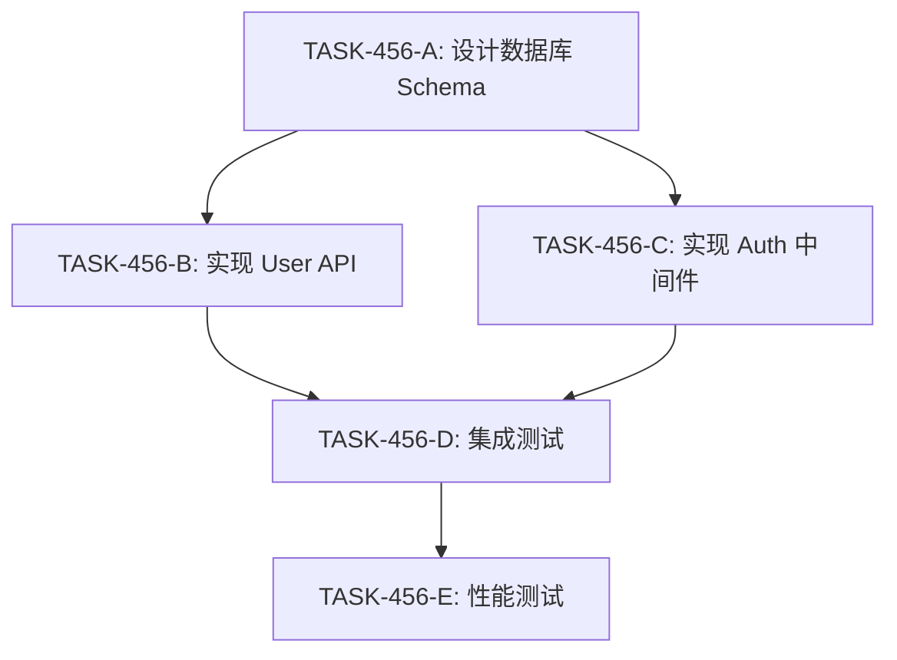
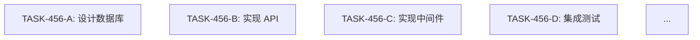
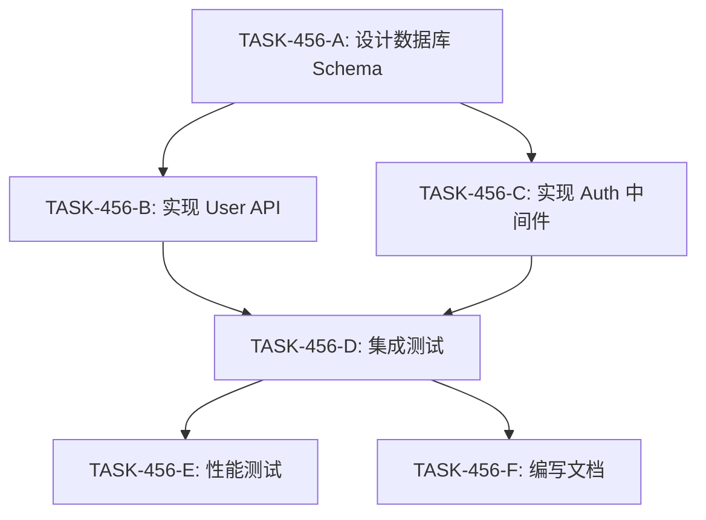

# DAG 驱动的需求分析与任务拆解系统设计

**版本**: v1.0  
**日期**: 2026-05-31  
**状态**: Draft  
**作者**: Claude (Brainstorming Session)

---

## 执行摘要

为 EKET 框架引入 **DAG (有向无环图) 驱动的任务编排系统**,实现复杂需求的自动并行执行。设计遵循 EKET 核心理念:

- ✅ **三级渐进架构**: Level 1 (Shell+文档) → Level 2 (Node.js+BullMQ) → Level 3 (Rust+petgraph)
- ✅ **优雅降级**: Redis 不可用时自动回退到文件队列
- ✅ **最小侵入**: DAG 作为增强层,不破坏现有 Ticket 系统
- ✅ **混合模式**: Master 生成骨架 DAG,Slaver 细化执行

### 核心价值

| 指标 | 现状 (串行) | 目标 (DAG) |
|------|-------------|-----------|
| **复杂需求执行时间** | 线性累加 (如 10 个任务 × 2h = 20h) | 并行压缩 (关键路径 8h) |
| **并行度** | 1 (单 Slaver 串行) | 3-5 (多 Slaver 并发) |
| **依赖可见性** | 隐式 (靠人工记忆) | 显式 (DAG 图) |
| **失败恢复** | 重做整个流程 | 仅重试失败节点 |

---

## 1. 背景与动机

### 1.1 现有问题

**场景**: 实现"用户认证功能"需求

```
当前流程 (串行):
1. Slaver-1 设计数据库 (2h)
2. Slaver-1 实现 User API (4h)
3. Slaver-1 实现 Auth 中间件 (3h)
4. Slaver-1 集成测试 (2h)
总计: 11 小时
```

**痛点**:
- ❌ API 和中间件可并行,但现有系统无法表达依赖关系
- ❌ 一个任务失败需重跑整个流程
- ❌ 无法可视化任务依赖和进度

### 1.2 理想状态

```
DAG 驱动流程:
层级 1: [设计数据库] (2h)
        ↓
层级 2: [实现 API] + [实现中间件] (并行, max 4h)
        ↓
层级 3: [集成测试] (2h)

总计: 8 小时 (节省 27%)
```

---

## 2. 架构设计

### 2.1 总体架构

```
┌─────────────────────────────────────────────────────┐
│            Master (需求分析 + DAG 生成)              │
│  ┌─────────────────────────────────────────────┐   │
│  │  1. 接收人类需求                             │   │
│  │  2. 判断是否启用 DAG (混合判断规则)          │   │
│  │  3. 生成骨架 DAG (高层任务依赖)              │   │
│  │  4. 创建 DAG Ticket 到 jira/tickets/        │   │
│  └─────────────────────────────────────────────┘   │
└─────────────────────────────────────────────────────┘
                         │
         ┌───────────────┼───────────────┐
         │               │               │
         ▼               ▼               ▼
  ┌────────────┐  ┌────────────┐  ┌────────────┐
  │  Slaver 1  │  │  Slaver 2  │  │  Slaver 3  │
  │            │  │            │  │            │
  │ 认领节点   │  │ 认领节点   │  │ 认领节点   │
  │ 细化子DAG  │  │ 细化子DAG  │  │ 细化子DAG  │
  │ 并行执行   │  │ 并行执行   │  │ 并行执行   │
  └────────────┘  └────────────┘  └────────────┘
         │               │               │
         └───────────────┼───────────────┘
                         ▼
              ┌──────────────────┐
              │   DAG Scheduler   │
              │  (Level 1/2/3)    │
              └──────────────────┘
```

### 2.2 三级实现策略

| Level | 技术栈 | DAG 表示 | 调度方式 | 适用场景 |
|-------|--------|----------|----------|----------|
| **Level 1** | Shell + Markdown | `dag.md` (Mermaid 图) | 人工检查依赖 | 快速验证、最小部署 |
| **Level 2** | Node.js + BullMQ | JSON DAG 结构 | BullMQ Flow API | 本地开发、自动并行 |
| **Level 3** | Rust + petgraph | 内存图结构 | tokio 并发 | 生产环境、高并发 |

**关键设计原则**:
1. **向下兼容**: Level 2/3 能读取 Level 1 的 `dag.md` 并自动转换
2. **优雅降级**: Redis 不可用时,Level 2 自动回退到文件队列 + 串行执行
3. **最小侵入**: DAG 作为可选增强层,不破坏现有 Ticket 系统

---

## 3. 数据结构

### 3.1 DAG 启用判断规则

**混合判断标准** (满足任一条件启用 DAG):

```typescript
interface DAGTriggerRule {
  minSubtasks: 4;             // 最少 4 个子任务
  hasParallelBranches: true;  // 存在并行可能
  estimatedDays: 2;           // 预计超过 2 天
  complexDependencies: true;  // 依赖关系复杂 (非纯串行)
}
```

**示例判断**:
```
需求: "修复登录按钮样式" → 1 个子任务 → ❌ 普通 Ticket
需求: "实现用户认证"     → 5 个子任务 + 并行分支 → ✅ 启用 DAG
需求: "重构支付系统"     → 预计 5 天 → ✅ 启用 DAG
```

### 3.2 Level 1: Markdown 格式

```markdown
---
dag_id: DAG-2026-05-31-user-auth
ticket_id: TASK-456
created_by: master-001
status: planning
---

# DAG: 用户认证功能

## 依赖图


## 节点清单
| Task ID | 描述 | 估时 | 前置依赖 | 状态 | 执行者 |
|---------|------|------|----------|------|--------|
| TASK-456-A | 设计数据库 Schema | 2h | - | pending | - |
| TASK-456-B | 实现 User API | 4h | A | pending | - |
| TASK-456-C | 实现 Auth 中间件 | 3h | A | pending | - |
| TASK-456-D | 集成测试 | 2h | B, C | pending | - |
| TASK-456-E | 性能测试 | 1h | D | pending | - |

## 执行策略
- **并行层级**: [[A], [B, C], [D], [E]]
- **关键路径**: A → B → D → E (9h)
- **最大并行度**: 2 (层级 2)
```

### 3.3 Level 2/3: JSON 结构

```typescript
interface DAGSpec {
  dag_id: string;               // DAG-2026-05-31-user-auth
  ticket_id: string;            // TASK-456
  created_by: string;           // master-001
  status: 'planning' | 'running' | 'completed' | 'failed';
  nodes: DAGNode[];
  edges: DAGEdge[];
  metadata: {
    critical_path: string[];    // 关键路径节点 ID
    estimated_total_time: string; // "9h"
    parallel_layers: string[][]; // 按层级分组
    created_at: number;
    updated_at: number;
  };
  constraints?: DAGConstraints;
}

interface DAGNode {
  id: string;                   // TASK-456-A
  description: string;
  estimated_time: string;       // "2h"
  required_role?: string;       // 'backend_dev' | 'frontend_dev'
  status: 'pending' | 'in_progress' | 'completed' | 'failed';
  assignee?: string;            // slaver-001
  started_at?: number;
  completed_at?: number;
  result?: {
    success: boolean;
    output?: string;
    error?: string;
  };
  failure_policy?: {
    type: 'abort' | 'skip' | 'retry' | 'manual';
    max_retries?: number;
    skip_dependents?: string[];    // 失败时跳过的依赖节点
    continue_dependents?: string[]; // 失败时继续的依赖节点
  };
}

interface DAGEdge {
  from: string;                 // TASK-456-A
  to: string;                   // TASK-456-B
  type: 'hard' | 'soft';        // hard: 必须等待; soft: 建议顺序
}

interface DAGConstraints {
  max_total_time?: string;      // "8h" - 整个 DAG 超时
  max_node_time?: string;       // "2h" - 单节点超时
  max_parallel_nodes?: number;  // 3 - 最多并发数
  resource_limits?: {
    memory?: string;            // "2GB"
    cpu?: number;               // 2 cores
  };
}
```

### 3.4 文件系统组织

```
eket/
├── jira/
│   └── tickets/
│       ├── TASK-123/              # 简单任务 (无 DAG)
│       │   └── ticket.md
│       │
│       └── TASK-456/              # 复杂任务 (带 DAG)
│           ├── ticket.md          # 主需求描述
│           ├── dag.md             # Level 1 DAG 定义
│           ├── dag.json           # Level 2/3 机器处理格式
│           ├── dag-progress.md    # 实时进度 (自动生成)
│           ├── execution-log.jsonl # 执行日志
│           └── subtasks/          # 子任务详情
│               ├── A.md
│               ├── B.md
│               └── ...
│
├── node/src/dag/                  # Level 2 实现
│   ├── dag-parser.ts              # 解析 dag.md → DAGSpec
│   ├── dag-scheduler.ts           # BullMQ 调度器
│   ├── dag-validator.ts           # 检测循环依赖
│   ├── dag-visualizer.ts          # 生成进度 Mermaid 图
│   └── dag-monitor.ts             # 超时/资源监控
│
└── rust/crates/eket-engine/src/dag/  # Level 3 实现
    ├── parser.rs
    ├── scheduler.rs
    ├── validator.rs
    └── executor.rs
```

---

## 4. 工作流设计

### 4.1 Master 工作流 (骨架生成)

```
┌─────────────────────────┐
│ 1. 接收人类需求                          │
└─────────────────────────────────────────┘
                 ↓
┌─────────────────────────────────────────┐
│ 2. 初步分析 + DAG 启用判断              │
│    - 计算预估子任务数                    │
│    - 识别并行可能性                      │
│    - 评估复杂度                          │
└─────────────────────────────────────────┘
        ↓ 简单任务              ↓ 复杂任务
┌──────────────────┐    ┌──────────────────┐
│ 传统 Ticket 流程 │    │ 3. 生成骨架 DAG  │
└──────────────────┘    │    - 高层模块    │
                        │    - 模块依赖    │
                        └──────────────────┘
                                 ↓
                        ┌──────────────────┐
                        │ 4. 创建 DAG Ticket│
                        │    ticket.md     │
                        │    dag.md        │
                        └──────────────────┘
                                 ↓
                        ┌──────────────────┐
                        │ 5. 发送消息到队列│
                        │ "DAG-TASK-456    │
                        │  ready"          │
                        └──────────────────┘
```

**Master DAG 生成 Prompt 示例**:
```
分析需求并生成 DAG:

需求: {用户认证功能}

输出格式 (dag.md):
1. Mermaid 依赖图
2. 节点清单 (ID, 描述, 估时, 前置依赖)
3. 执行策略 (并行层级, 关键路径)

规则:
- 节点尽量原子化 (单一职责, 2-4h)
- 识别可并行任务
- 标注关键路径
- 避免循环依赖
```

### 4.2 Slave (细化 + 执行)

```
┌─────────────────────────────────────────┐
│ 1. 监听队列 → 发现 DAG Ticket           │
└─────────────────────────────────────────┘
                 ↓
┌─────────────────────────────────────────┐
│ 2. 读取 dag.md → 识别可认领节点         │
│    条件: status=pending                 │
│         && 所有 depends_on 已完成       │
└─────────────────────────────────────────┘
                 ↓
┌─────────────────────────────────────────┐
│ 3. 认领节点 (如 TASK-456-A)             │
│    - 更新 dag.md 状态 → in_progress     │
│    - 更新 assignee 字段                 │
│    - 创建 subtasks/A.md                 │
└─────────────────────────────────────────┘
                 ↓
┌─────────────────────────────────────────┐
│ 4. 执行节点任务                          │
│    - 可能进一步拆解为子 DAG             │
│    - 输出: 代码/文档/配置               │
└─────────────────────────────────────────┘
                 ↓
┌─────────────────────────────────────────┐
│ 5. 完成节点                              │
│    - 更新 dag.md 状态 → completed       │
│    - 记录结果到 subtasks/A.md           │
│    - 触发依赖检查 (通知调度器)          │
└─────────────────────────────────────────┘
                 ↓
         回到步骤 2 (循环)
```

### 4.3 DAG 调度器逻辑 (Level 2/3)

#### Level 2: BullMQ 调度

```typescript
// node/src/dag/dag-scheduler.ts
import { Queue, FlowProducer, Worker } from 'bullmq';

class BullMQDAGScheduler {
  private flowProducer: FlowProducer;
  private queue: Queue;
  
  async schedule(dagSpec: DAGSpec) {
    // 1. 转换 DAG 为 BullMQ Flow Tree
    const flowTree = this.buildFlowTree(dagSpec);
    
    // 2. 提交到 BullMQ
    await this.flowProducer.add({
      name: dagSpec.dag_id,
      queueName: 'dag-root',
      children: flowTree,
      opts: {
        attempts: 3,        // 失败重试 3 次
        backoff: { 
          type: 'exponential', 
          delay: 5000 
        }
      }
    });
    
    // 3. 订阅完成事件
    const worker = new Worker('slaver-queue', async (job) => {
      return await this.executeSlaverTask(job.data);
    });
    
    worker.on('completed', async (job) => {
      await this.updateDAGNodeStatus(job.data.nodeId, 'completed');
      await this.checkAndTriggerDependents(job.data.nodeId);
    });
    
    worker.on('failed', async (job, err) => {
      await this.handleNodeFailure(job.data.nodeId, err);
    });
  }
  
  private buildFlowTree(dagSpec: DAGSpec): FlowJob[] {
    // 拓扑排序 + 构建嵌套子节点结构
    const layers = this.topologicalSort(dagSpec);
    
    return layers.map(layer => ({
      name: layer.id,
      queueName: 'slaver-queue',
      data: { 
        nodeId: layer.id, 
        description: layer.description,
        ticketId: dagSpec.ticket_id
      },
      children: this.getDependents(layer.id, dagSpec)
    }));
  }
  
  private async handleNodeFailure(nodeId: string, error: Error) {
    const node = await this.getNode(nodeId);
    const policy = node.failure_policy || { type: 'abort' };
    
    switch (policy.type) {
      case 'retry':
        if (node.retry_count < (policy.max_retries || 3)) {
          await this.retryNode(nodeId);
        }
        break;
      case 'skip':
        await this.skipDependents(policy.skip_dependents || []);
        break;
      case 'abort':
        await this.abortDAG(node.dag_id);
        break;
      case 'manual':
        await this.notifyMasterForIntervention(nodeId, error);
        break;
    }
  }
}
```

#### Level 3: Rust petgraph 调度

```rust
// rust/crates/eket-engine/src/dag/scheduler.rs
use petgraph::graph::{DiGraph, NodeIndex};
use petgraph::algo::toposort;
use tokio::sync::Semaphore;
use std::sync::Arc;

pub struct RustDAGScheduler {
    graph: DiGraph<TaskNode, ()>,
    max_parallel: usize,
}

#[derive(Clone)]
pub struct TaskNode {
    pub id: String,
    pub description: String,
    pub status: TaskStatus,
}

impl RustDAGScheduler {
    pub async fn execute(&self) -> Result<Vec<TaskResult>, DAGError> {
        // 1. 拓扑排序检测循环依赖
        let sorted = toposort(&self.graph, None)
            .map_err(|_| DAGError::CyclicDependency)?;
        
        // 2. 按层级分组 (同层可并行)
        let layers = self.group_by_level(sorted);
        
        // 3. 使用信号量控制并发度
        let semaphore = Arc::new(Semaphore::new(self.max_parallel));
        let mut results = Vec::new();
        
        // 4. 逐层执行
        for layer in layers {
            let mut handles = vec![];
            
            for node_idx in layer {
                let permit = semaphore.clone().acquire_owned().await?;
                let task = self.graph[node_idx].clone();
                
                // 并发执行同层节点
                handles.push(tokio::spawn(async move {
                    let result = execute_task_node(task).await;
                    drop(permit);  // 释放信号量
                    result
                }));
            }
            
            // 等待当前层所有任务完成
            for handle in handles {
                let result = handle.await??;
                results.push(result);
            }
        }
        
        Ok(results)
    }
    
    fn group_by_level(&self, sorted: Vec<NodeIndex>) -> Vec<Vec<NodeIndex>> {
        // 按拓扑层级分组
        let mut layers: Vec<Vec<NodeIndex>> = Vec::new();
        let mut node_levels: HashMap<NodeIndex, usize> = HashMap::new();
        
        for node in sorted {
            let max_pred_level = self.graph
                .neighbors_directed(node, Direction::Incoming)
                .filter_map(|pred| node_levels.get(&pred))
                .max()
                .unwrap_or(&0);
            
            let level = max_pred_level + 1;
            node_levels.insert(node, level);
            
            if layers.len() <= level {
                layers.resize(level + 1, Vec::new());
            }
            layers[level].push(node);
        }
        
        layers
    }
}

async fn execute_task_node(node: TaskNode) -> Result<TaskResult, TaskError> {
    // 调用 Slaver 执行逻辑
    // 实际实现会通过消息队列分发任务
    todo!("调用 Slaver 执行")
}
```

---

## 5. 关键组件设计

### 5.1 DAG 验证器

```typescript
// node/src/dag/dag-validator.ts
import { Graph, alg } from 'graphlib';

class DAGValidator {
  validateDAG(dagSpec: DAGSpec): ValidationResult {
    const errors: string[] = [];
    
    // 1. 构建图
    const graph = new Graph({ directed: true });
    dagSpec.nodes.forEach(n => graph.setNode(n.id, n));
    dagSpec.edges.forEach(e => graph.setEdge(e.from, e.to));
    
    // 2. 检测循环依赖
    if (!alg.isAcyclic(graph)) {
      const cycle = alg.findCycles(graph)[0];
      errors.push(`循环依赖: ${cycle.join(' → ')}`);
    }
    
    // 3. 检测孤立节点
    const orphans = dagSpec.nodes.filter(n => {
      const inDegree = graph.inEdges(n.id)?.length || 0;
      const outDegree = graph.outEdges(n.id)?.length || 0;
      return inDegree === 0 && outDegree === 0;
    });
    if (orphans.length > 0) {
      errors.push(`孤立节点: ${orphans.map(n => n.id).join(', ')}`);
    }
    
    // 4. 检测悬空依赖
    dagSpec.edges.forEach(edge => {
      const fromExists = dagSpec.nodes.some(n => n.id === edge.from);
      const toExists = dagSpec.nodes.some(n => n.id === edge.to);
      
      if (!fromExists) {
        errors.push(`边 ${edge.from} → ${edge.to}: from 节点不存在`);
      }
      if (!toExists) {
        errors.push(`边 ${edge.from} → ${edge.to}: to 节点不存在`);
      }
    });
    
    return {
      valid: errors.length === 0,
      errors
    };
  }
  
  calculateCriticalPath(dagSpec: DAGSpec): string[] {
    // 计算关键路径 (最长路径)
    const graph = this.buildGraph(dagSpec);
    const sorted = alg.topsort(graph);
    const distances: Map<string, number> = new Map();
    const predecessors: Map<string, string> = new Map();
    
    // 正向计算最长路径
    sorted.forEach(nodeId => {
      const node = dagSpec.nodes.find(n => n.id === nodeId);
      const inEdges = graph.inEdges(nodeId) || [];
      
      if (inEdges.length === 0) {
        distances.set(nodeId, this.parseTime(node.estimated_time));
      } else {
        const maxPredDist = Math.max(...inEdges.map(e => {
          const predDist = distances.get(e.v) || 0;
          return predDist;
        }));
        
        const pred = inEdges.find(e => 
          distances.get(e.v) === maxPredDist
        )?.v;
        
        distances.set(nodeId, maxPredDist + this.parseTime(node.estimated_time));
        if (pred) predecessors.set(nodeId, pred);
      }
    });
    
    // 反向回溯路径
    const endNode = sorted[sorted.length - 1];
    const path: string[] = [endNode];
    let current = endNode;
    
    while (predecessors.has(current)) {
      current = predecessors.get(current)!;
      path.unshift(current);
    }
    
    return path;
  }
}
```

### 5.2 DAG 可视化生成器

```typescript
// node/src/dag/dag-visualizer.ts
class DAGVisualizer {
  generateProgressMermaid(dagSpec: DAGSpec): string {
    const nodeStyles = dagSpec.nodes.map(n => {
      let style = '';
      switch (n.status) {
        case 'completed':
          style = ':::completed';
          break;
        case 'in_progress':
          style = `:::active`;
          break;
        case 'failed':
          style = ':::failed';
          break;
        default:
          style = '';
      }
      
      const label = `${n.id}<br/>${n.description}<br/>${n.estimated_time}`;
      return `  ${n.id}["${label}"]${style}`;
    }).join('\n');
    
    const edges = dagSpec.edges.map(e => {
      const style = e.type === 'soft' ? '-..->' : '-->';
      return `  ${e.from} ${style} ${e.to}`;
    }).join('\n');
    
    const criticalPath = dagSpec.metadata.critical_path
      .map(id => `  ${id}:::critical`)
      .join('\n');
    
    return `
graph TD
${nodeStyles}

${edges}

${criticalPath}

classDef completed fill:#90EE90,stroke:#228B22,stroke-width:2px
classDef active fill:#FFD700,stroke:#FF8C00,stroke-width:3px
classDef failed fill:#FFB6C1,stroke:#DC143C,stroke-width:2px
classDef critical stroke:#FF0000,stroke-width:4px
    `.trim();
  }
  
  async updateProgressFile(dagId: string) {
    const dag = await this.loadDAG(dagId);
    const mermaid = this.generateProgressMermaid(dag);
    
    const progress = {
      total: dag.nodes.length,
      completed: dag.nodes.filter(n => n.status === 'completed').length,
      in_progress: dag.nodes.filter(n => n.status === 'in_progress').length,
      failed: dag.nodes.filter(n => n.status === 'failed').length,
    };
    
    const content = `# DAG 执行进度

**更新时间**: ${new Date().toISOString()}

## 状态概览
- ✅ 已完成: ${progress.completed}/${progress.total}
- 🔄 进行中: ${progress.in_progress}
- ❌ 失败: ${progress.failed}
- ⏸️ 待执行: ${progress.total - progress.completed - progress.in_progress - progress.failed}

## 依赖图

\`\`\`mermaid
${mermaid}
\`\`\`

## 关键路径
${dag.metadata.critical_path.join(' → ')}

预计总时间: ${dag.metadata.estimated_total_time}
`;
    
    await fs.writeFile(
      `jira/tickets/${dag.ticket_id}/dag-progress.md`,
      content
    );
  }
}
```

### 5.3 DAG 监控器

```typescript
// node/src/dag/dag-monitor.ts
class DAGMonitor {
  private intervals: Map<string, NodeJS.Timeout> = new Map();
  
  async startMonitoring(dagId: string) {
    const dag = await this.loadDAG(dagId);
    const startTime = Date.now();
    
    const intervalId = setInterval(async () => {
      try {
        await this.checkTimeout(dagId, dag, startTime);
        await this.checkResourceUsage(dagId, dag);
        await this.updateProgress(dagId);
      } catch (err) {
        console.error(`DAG ${dagId} 监控错误:`, err);
      }
    }, 60000);  // 每分钟检查
    
    this.intervals.set(dagId, intervalId);
  }
  
  stopMonitoring(dagId: string) {
    const intervalId = this.intervals.get(dagId);
    if (intervalId) {
      clearInterval(intervalId);
      this.intervals.delete(dagId);
    }
  }
  
  private async checkTimeout(
    dagId: string, 
    dag: DAGSpec, 
    startTime: number
  ) {
    if (!dag.constraints?.max_total_time) return;
    
    const elapsed = Date.now() - startTime;
    const maxTime = this.parseTime(dag.constraints.max_total_time);
    
    if (elapsed > maxTime) {
      await this.abortDAG(dagId, 'TIMEOUT');
      await this.notifyMaster(
        `DAG ${dagId} 超时 (${elapsed}ms > ${maxTime}ms),已中止`
      );
    }
  }
  
  private async checkResourceUsage(dagId: string, dag: DAGSpec) {
    if (!dag.constraints?.resource_limits) return;
    
    const usage = await this.getResourceUsage();
    const limits = dag.constraints.resource_limits;
    
    if (limits.memory && usage.memory > this.parseMemory(limits.memory)) {
      await this.pauseDAG(dagId);
      await this.notifyMaster(
        `DAG ${dagId} 内存不足 (${usage.memory}B > ${limits.memory}),已暂停`
      );
    }
  }
  
  private async updateProgress(dagId: string) {
    const visualizer = new DAGVisualizer();
    await visualizer.updateProgressFile(dagId);
  }
}
```

---

## 6. 错误处理与边界情况

### 6.1 循环依赖

**检测时机**: Master 生成 DAG 时 + Slaver 更新依赖时

**处理策略**:
```typescript
try {
  const validation = validator.validateDAG(dagSpec);
  if (!validation.valid) {
    throw new Error(`DAG 验证失败: ${validation.errors.join(', ')}`);
  }
} catch (err) {
  // 回退到人工审查
  await this.createManualReviewTicket(dagSpec, err.message);
}
```

### 6.2 节点失败

**失败策略** (通过 `failure_policy` 配置):

| 策略 | 行为 | 适用场景 |
|------|------|----------|
| `abort` | 中止整个 DAG | 关键节点失败 |
| `retry` | 重试 N 次 | 临时性错误 (网络/资源) |
| `skip` | 跳过失败节点及其依赖 | 可选功能 |
| `manual` | 暂停等待人工介入 | 需决策的问题 |

**示例配置**:
```json
{
  "node_id": "TASK-456-B",
  "failure_policy": {
    "type": "skip",
    "skip_dependents": ["TASK-456-D"],    // 跳过集成测试
    "continue_dependents": ["TASK-456-C"]  // 继续其他分支
  }
}
```

### 6.3 运行时 DAG 调整

**场景**: Slaver 发现任务比预期复杂,需拆分

**流程**:
```
1. Slaver 发送 DAG-UPDATE 消息:
   {
     "action": "split_node",
     "node_id": "TASK-456-B",
     "new_nodes": [
       { "id": "TASK-456-B-1", "description": "..." },
       { "id": "TASK-456-B-2", "description": "..." }
     ],
     "new_edges": [...]
   }

2. Master 接收 → 验证合法性:
   - 无循环依赖
   - 不影响已完成节点
   - 符合约束条件

3. Master 批准 → 更新 dag.md + dag.json

4. 广播更新给所有 Slaver
```

### 6.4 超时与资源限制

**配置示例**:
```typescript
{
  "constraints": {
    "max_total_time": "8h",      // 整体超时
    "max_node_time": "2h",       // 单节点超时
    "max_parallel_nodes": 3,     // 最大并发
    "resource_limits": {
      "memory": "2GB",
      "cpu": 2
    }
  }
}
```

**监控实现**:
- 每分钟检查超时
- 超时 → 中止 DAG + 通知 Master
- 资源不足 → 暂停新节点 + 等待释放

---

## 7. 可视化与监控

### 7.1 实时进度追踪

**Level 1 (Markdown)**:
- `dag-progress.md` 每分钟自动更新
- GitHub/IDE 自动渲染 Mermaid 图
- 手动刷新查看进度

**输出示例**:
```markdown
# DAG 执行进度

**更新时间**: 2026-05-31T14:30:00Z

## 状态概览
- ✅ 已完成: 2/5
- 🔄 进行中: 2/5
- ❌ 失败: 0/5
- ⏸️ 待执行: 1/5

## 依赖图

```

### 7.2 Web Dashboard (可选 - Level 2/3)

**路由设计**:
```typescript
// node/src/web/dag-routes.ts
app.get('/api/dags', async (req, res) => {
  const dags = await dagStore.listAll();
  res.json(dags);
});

app.get('/api/dags/:dagId', async (req, res) => {
  const dag = await dagStore.load(req.params.dagId);
  res.json({
    ...dag,
    progress: calculateProgress(dag),
    eta: calculateETA(dag)
  });
});

// SSE 实时推送
app.get('/api/dags/:dagId/stream', (req, res) => {
  res.setHeader('Content-Type', 'text/event-stream');
  
  const listener = (event: DAGEvent) => {
    res.write(`data: ${JSON.stringify(event)}\n\n`);
  };
  
  dagEventBus.subscribe(req.params.dagId, listener);
  req.on('close', () => dagEventBus.unsubscribe(listener));
});
```

**前端 (简单 HTML)**:
```html
<!DOCTYPE html>
<html>
<head>
  <script src="https://cdn.jsdelivr.net/npm/mermaid/dist/mermaid.min.js"></script>
</head>
<body>
  <div id="progress"></div>
  <pre class="mermaid" id="dag-graph"></pre>
  
  <script>
    const dagId = 'DAG-2026-05-31-user-auth';
    
    // 初始加载
    fetch(`/api/dags/${dagId}`)
      .then(r => r.json())
      .then(dag => updateUI(dag));
    
    // SSE 实时更新
    const es = new EventSource(`/api/dags/${dagId}/stream`);
    es.onmessage = (event) => {
      const data = JSON.parse(event.data);
      updateUI(data);
    };
    
    function updateUI(dag) {
      document.getElementById('progress').textContent = 
        `${dag.progress.completed}/${dag.progress.total} 完成`;
      
      document.getElementById('dag-graph').textContent = 
        generateMermaidFromDAG(dag);
      
      mermaid.init(undefined, '.mermaid');
    }
  </script>
</body>
</html>
```

---

## 8. 实施路线图

### Phase 1: MVP (Week 1-2) - Level 1

**目标**: 验证 DAG 概念,纯文档实现

**交付物**:
- [x] `dag.md` 模板
- [x] Master DAG 生成 Prompt
- [x] Slaver 手动依赖检查指南
- [x] Shell 脚本: `check-dag-dependencies.sh`

**验收标准**:
-n### Phase 2: 自动调度 (Week 3-4) - Level 2

**目标**: 实现自动并行执行

**交付物**:
- [ ] `node/src/dag/dag-parser.ts` - 解析 dag.md → JSON
- [ ] `node/src/dag/dag-scheduler.ts` - BullMQ 调度器
- [ ] `node/src/dag/dag-validator.ts` - 循环依赖检测
- [ ] `node/src/dag/dag-visualizer.ts` - 自动生成进度图
- [ ] 集成到现有 CLI: `eket dag:start <ticket-id>`

**验收标准**:
- BullMQ 能自动并行执行无依赖节点
- 节点失败能自动重试
- `dag-progress.md` 自动更新 (每分钟)

---

### Phase 3: 高性能实现 (Week 5-6) - Level 3

**目标**: Rust 生产级调度器

**交付物**:
- [ ] `rust/crates/eket-engine/src/dag/parser.rs`
- [ ] `rust/crates/eket-engine/src/dag/scheduler.rs`
- [ ] `rust/crates/eket-engine/src/dag/executor.rs`
- [ ] 性能基准测试 (对比 Level 2)

**验收标准**:
- 处理 100+ 节点 DAG
- P95 延迟 < Level 2 的 50%
- 支持 10+ 并发 Slaver

---

### Phase 4: 高级功能 (Future)

**可选增强**:
- [ ] Web Dashboard (轻量版)
- [ ] 运行时 DAG 调整
- [ ] 资源调度优化 (基于历史数据)
- [ ] DAG 模板库 (常见需求类型)

---

## 9. 风险与缓解策略

| 风险 | 影响 | 概率 | 缓解策略 |
|------|------|------|----------|
| **DAG 生成质量不稳定** | 高 | 中 | Few-shot examples + 人工审查模式 |
| **依赖关系过于复杂** | 中 | 中 | 限制最大深度 (5 层) + 自动简化 |
| **并行执行冲突** (如 Git 分支) | 高 | 低 | 资源锁 + 冲突检测 + 串行化 |
| **调试难度增加** | 中 | 高 | 详细日志 + 可视化 DAG |
| **成本增加** (LLM 调用) | 低 | 高 | 按需并行 (简单任务仍用线性) |
| **学习曲线陡峭** | 中 | 中 | 详细文档 + 示例库 |

---

## 10. 成功指标

### 10.1 性能指标

| 指标 | 基线 (现状) | 目标 (Phase 2) | 目标 (Phase 3) |
|------|-------------|----------------|----------------|
| **复杂需求执行时间** | 20h (串行) | 12h (40% ↓) | 8h (60% ↓) |
| **并行度** | 1 | 3-5 | 5-10 |
| **DAG 生成准确率** | N/A | 80% | 90% |
| **人工介入率** | 100% | 20% | 10% |

### 10.2 质量指标

- **循环依赖检测**: 100% (不允许提交有环的 DAG)
- **节点失败恢复**: 自动重试成功率 > 80%
- **进度可视化准确性**: 实时更新延迟 < 1 分钟

### 10.3 用户体验指标

- **文档完整性**: Slaver 能仅凭 `dag.md` 理解任务
- **调试效率**: 问题定位时间 < 现状的 50%

---

## 11. 附录

### 11.1 示例 DAG (完整)

**需求**: 实现用户认证功能

**dag.md**:
```markdown
---
dag_id: DAG-2026-05-31-user-auth
ticket_id: TASK-456
created_by: master-001
status: planning
---

# DAG: 用户认证功能

## 需求背景
实现完整的用户注册、登录、Token 校验功能。

## 依赖图


## 节点清单
| Task ID | 描述 | 估时 | 前置依赖 | 状态 | 执行者 | 失败策略 |
|---------|------|------|----------|------|--------|----------|
| TASK-456-A | 设计数据库 Schema (users 表) | 2h | - | completed | slaver-001 | abort |
| TASK-456-B | 实现 User API (POST/GET /users) | 4h | A | in_progress | slaver-002 | retry:3 |
| TASK-456-C | 实现 Auth 中间件 (JWT 校验) | 3h | A | in_progress | slaver-003 | retry:3 |
| TASK-456-D | 集成测试 | 2h | B, C | pending | - | abort |
| TASK-456-E | 性能测试 (1000 QPS) | 1h | D | pending | - | skip |
| TASK-456-F | API 文档 (OpenAPI) | 1h | D | pending | - | manual |

## 执行策略
- **并行层级**: 
  - Layer 0: [A] (2h)
  - Layer 1: [B, C] (max 4h, 并行)
  - Layer 2: [D] (2h)
  - Layer 3: [E, F] (max 1h, 并行)
- **关键路径**: A → B → D → E (9h)
- **预计总时间**: 9h (vs 串行 13h, 节省 31%)
- **最大并行度**: 2

## 约束条件
- 最大并发节点: 3
- 单节点超时: 2h
- 整体超时: 12h
```

### 11.2 技术债务清单

**Level 1**:
- [ ] Shell 脚本仅能静态检查依赖,无法动态调度
- [ ] 人工更新 `dag-progress.md` 易出错

**Level 2**:
- [ ] BullMQ 强依赖 Redis (但 EKET Level 3 本来就需要)
- [ ] 尚未实现运行时 DAG 调整

**Level 3**:
- [ ] Rust 调度器需从零实现重试/监控逻辑
- [ ] Node.js ↔ Rust 数据同步机制待设计

---

## 12. 总结

本设计提供了一个**渐进式 DAG 任务编排系统**,核心特点:

1. **三级架构**: 从 Markdown (Level 1) 到 Rust (Level 3),平滑演进
2. **混合模式**: Master 生成骨架 + Slaver 细化,平衡全局与细节
3. **最小侵入**: DAG 作为可选增强,不破坏现有 Ticket 流程
4. **MVP 优先**: Phase 1 纯文档验证概念,Phase 2/3 渐进自动化

**下一步行动**:
1. 用户审查本设计文档
2. 批准后调用 `writing-plans` skill 生成实施计划
3. 开始 Phase 1 (Level 1 MVP) 开发

---

**设计完成时间**: 2026-05-31  
**预计 Phase 1 交付**: 2026-06-14
