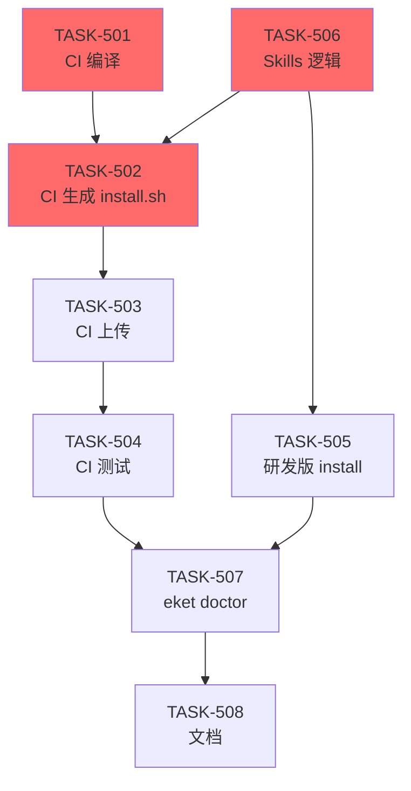

# EPIC-005 最终任务清单 v2

**更新时间**: 2026-05-07 14:25
**基于**: 人类澄清 - install.sh 自动生成机制

---

## ✅ 已完成（可复用，3 个）

| TASK | 产出 | 复用方式 |
|------|------|---------|
| **TASK-427** | complete.ts 编译修复 | ✅ 已合并，TASK-501 依赖 |
| **TASK-426** | setup.sh sha256 校验 | 📋 TASK-502 模板参考 |
| **TASK-418** | 本地编译逻辑 | 📋 TASK-505 复用 |

---

## 📋 新任务清单（8 个）

### M1: GitHub Actions 自动化（20h）

| TASK | 描述 | 工时 | 依赖 | 优先级 |
|------|------|------|------|-------|
| **TASK-501** | CI 编译 Rust + Node | 6h | 427 ✅ | P0 |
| **TASK-502** | CI 动态生成 install.sh | 8h | 501 + 506 | P0 |
| **TASK-503** | CI 上传 Release assets | 2h | 502 | P0 |
| **TASK-504** | CI 跨平台测试 | 4h | 503 | P1 |

---

### M2: 本地开发安装（7h）

| TASK | 描述 | 工时 | 依赖 | 优先级 |
|------|------|------|------|-------|
| **TASK-506** | Skills 安装逻辑抽取 | 3h | 无 | P0 |
| **TASK-505** | 研发版 install 脚本 | 4h | 506 | P1 |

---

### M3: 用户体验（7h）

| TASK | 描述 | 工时 | 依赖 | 优先级 |
|------|------|------|------|-------|
| **TASK-507** | `eket doctor` skills 验证 | 4h | 504 + 505 | P1 |
| **TASK-508** | 文档更新 | 3h | 507 | P2 |

---

## 📊 工时对比

| 版本 | 任务数 | 总工时 | 实际天数 | 状态 |
|------|--------|--------|---------|------|
| **v1（废弃）** | 12 | 56.5h | 4-5 天 | ❌ 基于错误假设 |
| **v2（最终）** | 8 | 34h | **2-3 天** | ✅ 正确理解 |

**节省**: -40% 工作量

---

## 🔗 依赖关系 v2

**关键路径**: T501 → T502 → T503 → T504 → T507 → T508（24h）

**并行路径**: T506 → T505（7h）

**总时长**: ~24h（3 Slaver 并行 → 实际 **2 天**）

---

## 🚀 执行策略

### Phase 1（Day 1，12h）
**并行**:
- Slaver A: TASK-506（skills 逻辑）→ TASK-505（研发版）
- Slaver B: TASK-501（CI 编译）→ TASK-502（生成 install.sh）

### Phase 2（Day 2，8h）
**并行**:
- Slaver B: TASK-503（上传）→ TASK-504（测试）
- Slaver C: TASK-507（doctor）

### Phase 3（Day 2 下午，3h）
**串行**:
- Slaver A: TASK-508（文档）

---

**下一步**: Master 分配 TASK-501/506 给 Slaver 团队
