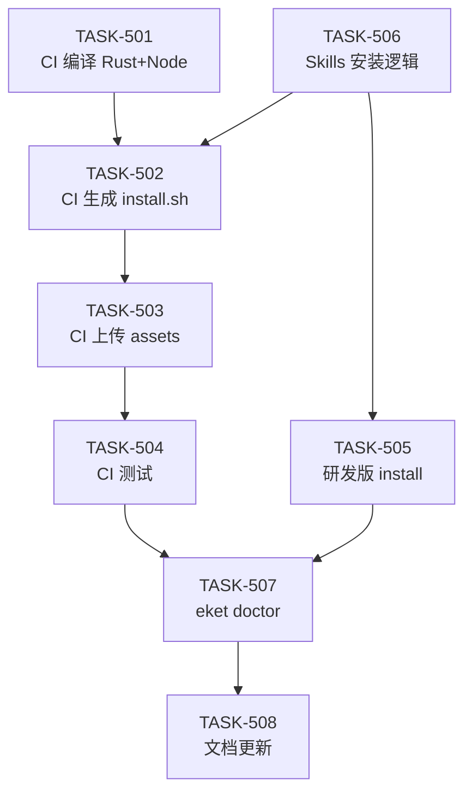

# EPIC-005 任务拆解 v2（基于澄清需求）

**拆解时间**: 2026-05-07 14:20
**基于**: 人类澄清 - install.sh 由 CI 自动生成

---

## 核心理解

### install.sh 两个版本

| 版本 | 生成方式 | 用途 | 用户 |
|------|---------|------|------|
| **简版** | GitHub Actions 自动生成 | 下载预编译包 + 更新 skills | 普通用户 |
| **研发版** | `scripts/dev-install.sh`（静态） | 本地编译 + 更新 skills | 开发者 |

### 共同最终行为

**两版本都做**:
1. 准备执行文件（下载 or 编译）
2. **更新 `~/.claude/skills/eket/`**（核心产出）
3. 注册 `/eket` 命令
4. 验证安装

---

## 新任务拆解（8 个 TASK）

### M1: GitHub Actions 自动化（4 TASK）

**TASK-501**: CI 编译 Rust + Node（调整现有 release.yml）
- 编译 Rust（已有，验证）
- 新增 Node pkg 打包
- 生成 sha256
- **工时**: 6h

**TASK-502**: CI 动态生成 install.sh（简版）
- 从模板生成（注入版本号/下载链接/sha256）
- 包含环境检测 + 下载逻辑
- 包含 skills 更新逻辑
- **工时**: 8h

**TASK-503**: CI 上传 Release assets
- 上传 Rust binaries
- 上传 Node binaries
- 上传 sha256 文件
- 上传生成的 install.sh
- **工时**: 2h

**TASK-504**: CI 测试验证
- 跨平台编译测试（3 平台）
- install.sh 自动生成验证
- **工时**: 4h

---

### M2: 本地开发安装（2 TASK）

**TASK-505**: 研发版 install 脚本（`scripts/dev-install.sh`）
- 本地编译 Rust（复用 TASK-418 逻辑）
- 本地编译 Node
- 更新 skills
- **工时**: 4h

**TASK-506**: Skills 安装逻辑抽取
- 创建 `scripts/lib/install-skills.sh`
- 复制 `.claude/skills/eket/` → `~/.claude/skills/`
- 简版和研发版共用此函数
- **工时**: 3h

---

### M3: 用户体验（2 TASK）

**TASK-507**: `eket doctor` 验证
- 检查 binary 可执行性
- 检查 skills 安装
- 检查环境变量
- **工时**: 4h

**TASK-508**: 文档更新
- README 一键安装命令
- 研发版安装指南
- skills 机制说明
- **工时**: 3h

---

## 总工时

**新计划**: 8 TASK × 34h → 3 Slaver 并行 → **2-3 天**

**对比旧计划**:
- 旧：12 TASK × 56.5h（基于错误假设）
- 新：8 TASK × 34h（核心是 CI 自动化）

---

## 依赖关系

**关键路径**: T501 → T502 → T503 → T504 → T507 → T508

---

## 核心变化

| 旧方案 | 新方案 | 原因 |
|--------|--------|------|
| Slaver 手写 install.sh | CI 模板 + 变量注入 | install.sh 自动生成 |
| 下载 .sha256 文件校验 | sha256 值硬编码脚本中 | CI 注入 |
| 5 级选择菜单 | 2 个脚本（简版 + 研发版） | 简化用户选择 |
| sha256 校验独立函数 | 集成到 install.sh 模板 | 减少依赖 |

---

**下一步**: Master 创建 8 个新 TASK (501-508)
