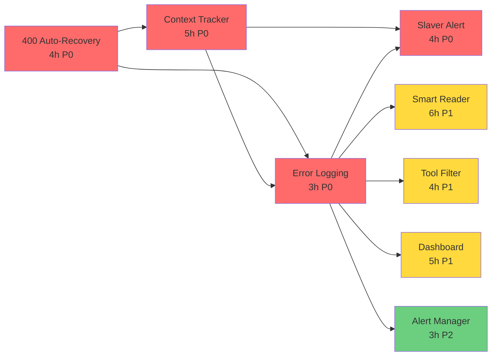

# EPIC-006 Task Decomposition

**创建时间**: 2026-05-08  
**Master**: master-001

---

## Tasks 总览

| Task | 标题 | 工时 | 优先级 | 依赖 | Milestone |
|------|------|------|--------|------|-----------|
| **TASK-601** | 400 Auto-Recovery 机制 | 4h | P0 | 无 | M0-Emergency |
| **TASK-602** | Context Tracker + 动态 Compact | 5h | P0 | TASK-601 | M0-Emergency |
| **TASK-603** | Error Logging + Session Snapshot | 3h | P0 | TASK-601 | M0-Emergency |
| **TASK-608** | Slaver 主动 Context 风险上报 + 拆卡 | 4h | P0 | TASK-602, TASK-603 | M0-Emergency |
| **TASK-604** | Smart File Reader（分段 + 摘要） | 6h | P1 | TASK-603 | M1-Optimization |
| **TASK-605** | Tool Output Filtering | 4h | P1 | TASK-603 | M1-Optimization |
| **TASK-606** | Context Health Dashboard | 5h | P1 | TASK-603 | M1-Optimization |
| **TASK-607** | 连续错误告警机制 | 3h | P2 | TASK-603 | M2-Monitoring |

**总工时**: 34h  
**Critical Path**: TASK-601 → TASK-602 → TASK-603 → TASK-608 → TASK-604 (22h)

---

## 依赖关系图

**颜色说明**: 🔴 P0 | 🟡 P1 | 🟢 P2

---

## Milestone 定义

### M0-Emergency（紧急防御，1.5 days）

**目标**: 防止 400 错误导致任务中断 + Slaver 主动风险管理

**交付物**:
- ✅ 400 错误自动恢复（compact + retry + nuclear option）
- ✅ Context tracker 动态触发 compact
- ✅ 错误日志 + session 快照
- ✅ **Slaver 主动上报 context 风险 + Master 拆卡能力**

**验收**: 模拟 50 轮对话 → 无 400 中断，或触发后自动恢复；Slaver 达到 80% 阈值主动上报

**Tasks**: TASK-601, TASK-602, TASK-603, **TASK-608**

---

### M1-Optimization（源头优化，3 days）

**目标**: 从源头减少 context 膨胀

**交付物**:
- ✅ 智能文件读取（大文件分段/摘要）
- ✅ Tool output 过滤（结果分页）
- ✅ Context health dashboard

**验收**: Slaver 深度分析任务，context 节省 > 60%

**Tasks**: TASK-604, TASK-605, TASK-606

---

### M2-Monitoring（监控告警，2 days）

**目标**: 可观测性 + 主动告警

**交付物**:
- ✅ 连续错误告警
- ✅ Dashboard 实时刷新
- ✅ 趋势分析

**验收**: 连续 3 次 400 → 自动告警文件生成

**Tasks**: TASK-607

---

## 并行执行建议

### Wave 1（Day 1，并行）
- **Slaver A**: TASK-601（400 recovery）— 4h
- **Slaver B**: TASK-602（context tracker）— 5h（依赖 601 完成后开始）

### Wave 2（Day 1 下午，串行）
- **Slaver A**: TASK-603（logging）— 3h（依赖 601/602）

### Wave 3（Day 2-3，并行）
- **Slaver A**: TASK-604（smart reader）— 6h
- **Slaver B**: TASK-605（tool filter）— 4h
- **Slaver C**: TASK-606（dashboard）— 5h

### Wave 4（Day 4，独立）
- **Slaver A**: TASK-607（alert）— 3h

---

## INVEST 检查

| Task | I | N | V | E | S | T |
|------|---|---|---|---|---|---|
| TASK-601 | ✅ | ✅ | ✅ High | ✅ 4h | ✅ <2d | ✅ 7 AC |
| TASK-602 | ✅ | ✅ | ✅ High | ✅ 5h | ✅ <2d | ✅ 5 AC |
| TASK-603 | ✅ | ✅ | ✅ Med | ✅ 3h | ✅ <2d | ✅ 5 AC |
| TASK-608 | ✅ | ✅ | ✅ High | ✅ 4h | ✅ <2d | ✅ 5 AC |
| TASK-604 | ✅ | ✅ | ✅ High | ✅ 6h | ✅ <2d | ✅ 5 AC |
| TASK-605 | ✅ | ✅ | ✅ Med | ✅ 4h | ✅ <2d | ✅ 5 AC |
| TASK-606 | ✅ | ✅ | ✅ Med | ✅ 5h | ✅ <2d | ✅ 5 AC |
| TASK-607 | ✅ | ✅ | ✅ Low | ✅ 3h | ✅ <2d | ✅ 5 AC |

**结论**: 全部通过 INVEST 检查

---

**状态**: ✅ 拆解完成  
**下一步**: Master 初始化 Slaver 团队
