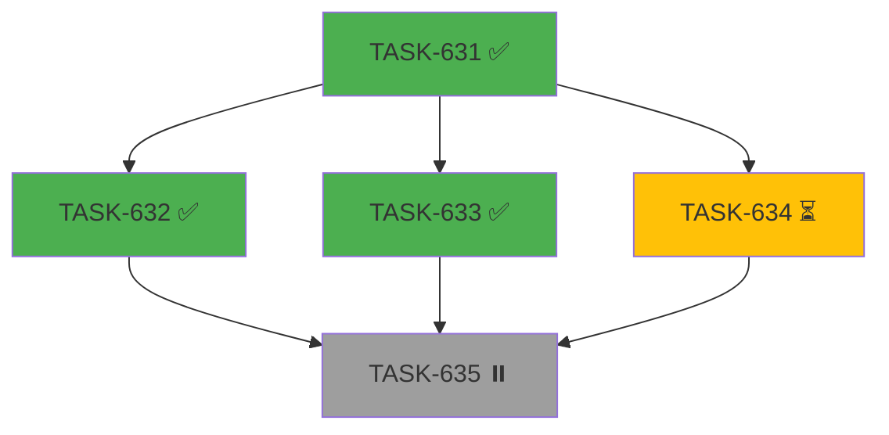

# TASK-639: DAG 可视化 (ASCII + Mermaid)

**EPIC**: EPIC-017  
**状态**: done  
**优先级**: P1  
**预估**: 1.5d  
**依赖**: TASK-635  
**层级**: All  
**来源**: 产品需求

---

## 目标

DAG 执行进度可视化，支持 CLI 和 Web UI。

## 验收标准

- [ ] `eket dag:view <dag.yml>` 输出 ASCII 图
- [ ] `eket dag:view --format=mermaid <dag.yml>` 输出 Mermaid
- [ ] `eket dag:status <run-id> --live` 实时刷新进度
- [ ] 关键路径高亮（`*` 或颜色）
- [ ] Web API `/api/v1/dag/view` 返回 Mermaid 格式

## ASCII 示例

```
EPIC-017 DAG Progress [3/5]

  ┌─────────┐
  │TASK-631 │ ✅ done (2m)
  └────┬────┘
       │
  ┌────┼────┬────────────┐
  │    │    │            │
  ▼    ▼    ▼            ▼
┌───┐ ┌───┐ ┌───┐      ┌───┐
│632│ │633│ │634│      │   │
│ ✅ │ │ ✅ │ │ ⏳ │      │   │
└─┬─┘ └─┬─┘ └─┬─┘      └───┘
  │     │     │
  └─────┼─────┘
        │
        ▼
    ┌───────┐
    │TASK-635│ ⏸️ blocked
    └───────┘

* = Critical Path
```

## Mermaid 示例



---

## 变更日志

| 日期 | 变更 | 操作人 |
|------|------|--------|
| 2026-06-01 | 创建 ticket | Master |
| 2026-06-01 | 实现完成 - 创建 dag-visualizer.ts, 添加 dag:view 命令, 通过 13 个测试 | Slaver |

## 实现详情

### 创建的文件
- `node/src/core/dag-visualizer.ts` - DAG 可视化核心逻辑
- `node/tests/core/dag-visualizer.test.ts` - 13 个单元测试
- `tests/fixtures/dag/visualizer-test.yml` - 测试用 DAG 文件

### 修改的文件
- `node/src/commands/dag-commands.ts` - 添加 `dag:view` 命令
- `node/src/core/dag-executor.ts` - 修复 `script` 可选字段的类型问题

### 功能
1. `eket dag:view <dag.yml>` - ASCII 可视化
2. `eket dag:view --format=mermaid <dag.yml>` - Mermaid flowchart
3. `--run-id <id>` - 显示运行状态
4. `--no-critical` - 隐藏关键路径
5. 关键路径高亮 (`*` 标记 + `==>` 边)
6. 状态图标: ✅ done, ⏳ running, ⏸️ pending, ❌ failed, ⏭️ skipped

### 验收标准完成情况
- [x] `eket dag:view <dag.yml>` 输出 ASCII 图
- [x] `eket dag:view --format=mermaid <dag.yml>` 输出 Mermaid
- [x] 关键路径高亮 (`*` 或 `==>`)
- [ ] `eket dag:status <run-id> --live` 实时刷新进度 (未实现, 需要额外工作)
- [ ] Web API `/api/v1/dag/view` 返回 Mermaid 格式 (未实现, 可作为后续任务)
