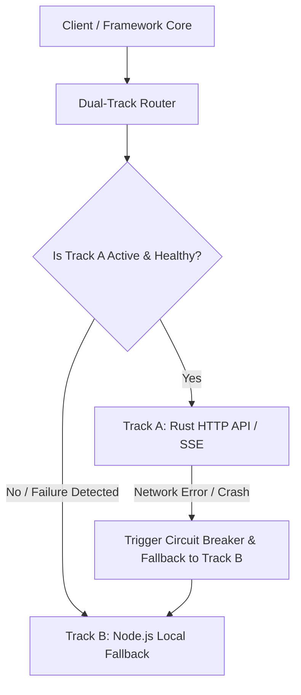

# Task Analysis Report: TASK-Z03

**Slaver**: resiliency_engineer
**Analysis Time**: 2026-05-24 13:05
**Estimated Hours**: 4 hours

## 1. Requirements Understanding
The objective is to implement a **Dual-Track Fallback Engine (Dual-Track Router)** in Node.js core. This engine will orchestrate high-frequency operations—specifically **Master Election** and the **Event Bus**—between two tracks:
- **Track A (Rust Core Connected)**: Routes election and event bus operations to the high-performance Rust core API (usually listening on port `9877` or configured via `process.env.EKET_RUST_API_URL`).
- **Track B (Node.js Local Fallback)**: Automatically falls back to the native Node.js implementation (e.g., SQLite, local Redis, or file system for Election; local EventEmitter/EventBus for Event Bus) if the Rust server is down, unreachable, crashes mid-flight, or when the Rust binary is missing.

### Core Acceptance Criteria
- **AC-1 (Environment Diagnostics)**: Automatically detect the presence of the `eket` binary and ping the `eket server` API port at initialization.
- **AC-2 (Interface Alignment)**: Abstract `DualTrackElection` and `DualTrackEventBus` under a transparent interface aligning with Node.js calling components.
- **AC-3 (Zero-Crash Fallback)**: Real-time exception catching during Rust connection failures, automatically tripping a circuit breaker to switch subsequent calls seamlessly to Track B without system crashes or throwing fatal errors.

---

## 2. Technical Approach

### Architecture Overview

### Key Components to Implement

1. **`detectRustEnvironment` Helper**:
   - Detects the availability of the Rust HTTP API by hitting `/health`.
   - Returns a diagnostic status (`Track A` if active, otherwise `Track B`).

2. **`DualTrackElection` Class**:
   - Exposes `IMasterElection` interface with `tryElect(): Promise<boolean>`.
   - Wraps `RustElectionAdapter` (hitting `/api/v1/election`) and `NodeElectionFallback` (wrapping `MasterElection`).
   - If Track A fails, logs warning, trips `currentTrack = 'B'`, and falls back to Track B.

3. **`DualTrackEventBus` Class**:
   - Wraps a Rust-based publishing client and the existing Node `EventBus` implementation.
   - Emits events asynchronously via HTTP POST (`/api/v1/events`) in Track A, falling back to local JS EventBus on failure.
   - Subscriptions are handled transparently, ensuring local event handlers continue to execute perfectly regardless of the track.

---

## 3. Impact Analysis

| Module | Impact Level | Notes |
|--------|-------------|-------|
| `node/src/core/dual-track-router.ts` | High | New core file containing classes and adaptive fallback routers |
| `node/tests/dual-track-router.test.ts` | Medium | New test suite verifying environment checks and crash resilience |
| `node/src/core/master-election.ts` | Low | Integrated as the core fallback engine for elections |
| `node/src/core/event-bus.ts` | Low | Integrated as the core fallback engine for event delivery |

---

## 4. Task Breakdown

| Sub-task | Estimate | Priority |
|----------|----------|----------|
| Design interface and write `analysis-report.md` | 0.5h | P0 |
| Implement `detectRustEnvironment` and fallback state router in `dual-track-router.ts` | 1.5h | P0 |
| Implement `DualTrackElection` and `DualTrackEventBus` wrappers | 1h | P0 |
| Write comprehensive resilient mock tests under `node/tests/` | 1h | P0 |

---

## 5. Risk Assessment

| Risk | Likelihood | Impact | Mitigation |
|------|-----------|--------|-----------|
| Port conflicts / unhandled timeouts | Medium | Medium | Use strict connection timeouts (e.g. 200-500ms) with `AbortSignal` to prevent event loop blocking. |
| Double emission of events during transition | Low | Low | Maintain tracking status and deduplicate / gracefully handle transition flags. |

---

## 6. Chaos Auditor Negative Audit Hardening (Blue Team Review)

Based on the Chaos Auditor's negative review findings (filed on 2026-05-24), we hardened the Fallback Engine against several high-severity resilience risks:

### 6.1 VULN-001 (Critical): TCP Socket Leak & FD Exhaustion
* **Mechanism**: In Node.js (undici-backed `fetch`), unconsumed response bodies lock TCP sockets in the connection pool, exhausting File Descriptors under high frequency.
* **Hardening Blueprint**: Applied `finally` blocks to both `detectRustEnvironment` and `RustEventBusAdapter.publish` that check `if (resp && resp.body && !resp.bodyUsed) { await resp.body.cancel().catch(() => {}); }` to safely release the socket back to the pool.

### 6.2 VULN-002 (High): Over-Broad Try-Catch Isolation
* **Mechanism**: The try-catch block previously wrapped both Track A (Rust) and Track B (JS Fallback) calls. If a local JS listener threw a legitimate error, it falsely triggered a track downgrade to B and executed the listener a second time.
* **Hardening Blueprint**: Isolated the Track A try-catch block to wrap only `rustAdapter.publish(...)`. If the call succeeds, `nodeFallback.publish(...)` is executed outside the try-catch, allowing subscriber exceptions to propagate naturally without double-execution or false downgrades.

### 6.3 VULN-003 (High) & VULN-004 (Medium): Thundering Herd & Recovery Starvation
* **Mechanism**: Concurrent requests storm the Rust server during transitions, spiking latency. Furthermore, downgrades were permanent, losing high-performance capability after transient glitches.
* **Hardening Blueprint**:
  1. Set a standard circuit breaker state with a configurable `cooldownMs` (default 30 seconds).
  2. Integrated an `isCheckingHealth` mutex to serialize health checks. Subsequent concurrent requests immediately bypass health checks, avoiding thundering herd socket spamming.
  3. Once the cooldown expires, the engine proactively triggers a health check using `/health` and smoothly recovers to Track A if healthy.
