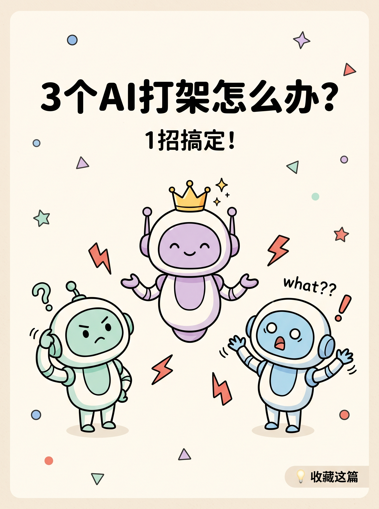
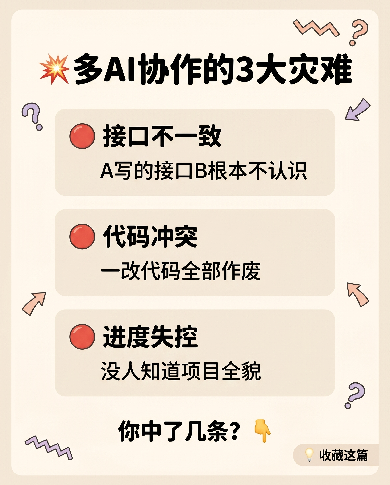
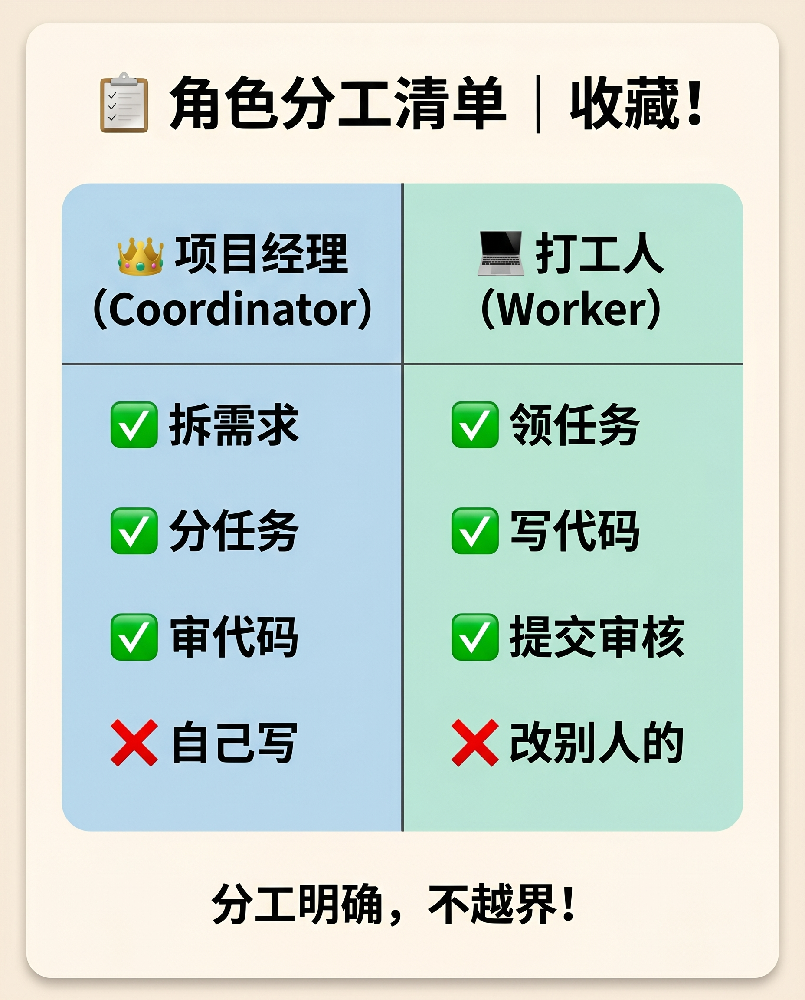
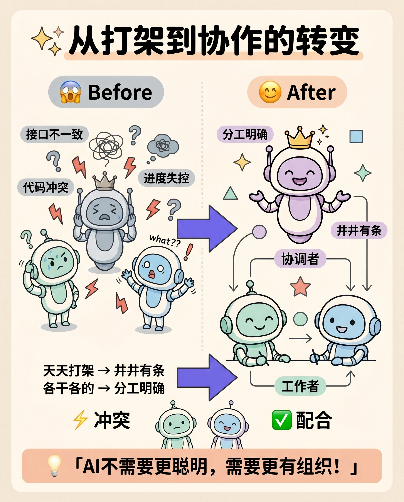
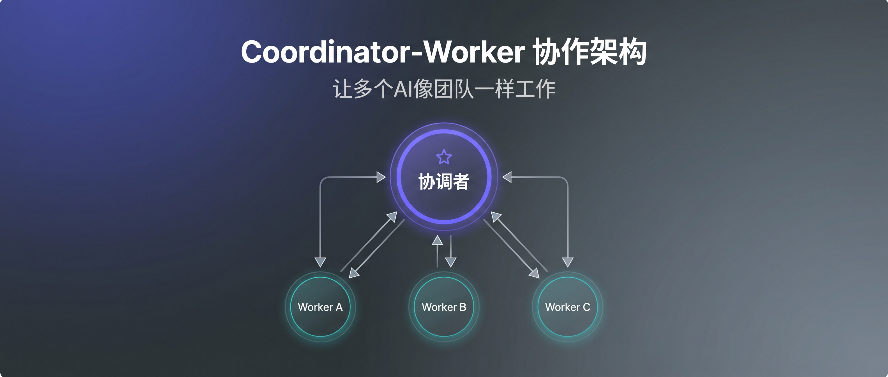
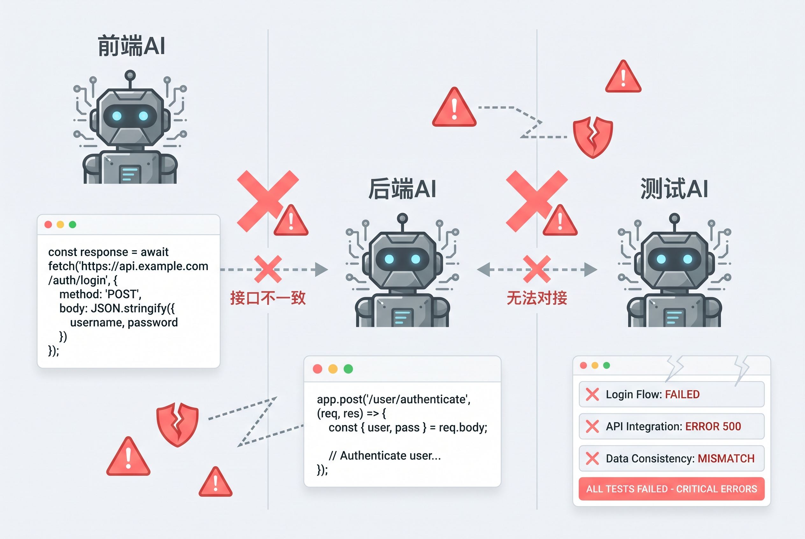
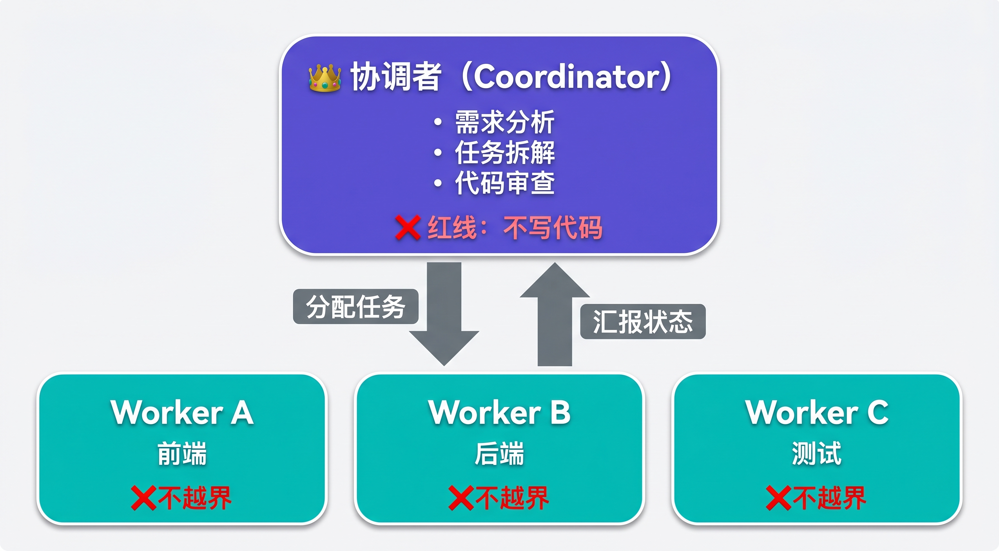
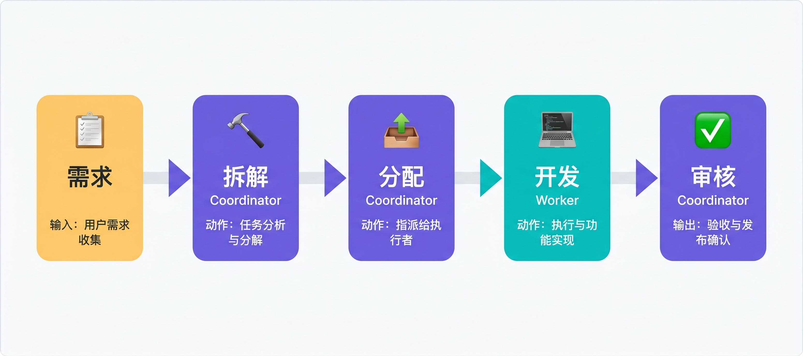
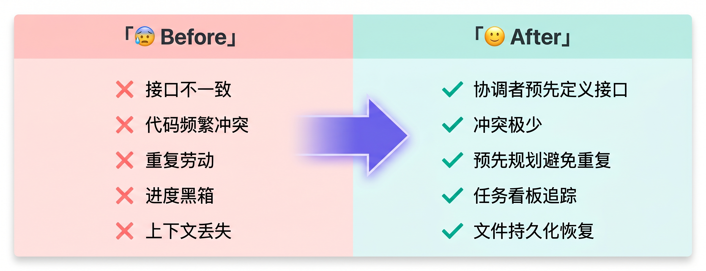

# L1-01 多AI协作：从打架到分工

> 小红书版和公众号版完全独立，针对不同平台用户特点定制

---

# 📱 小红书版

## 发布信息

- **标题**: 3个AI打架怎么办？1招让它们乖乖分工｜附清单
- **字数**: 约480字
- **配图**: 4张

---

## 封面



---

## 正文

姐妹们！我发现一个超离谱的事！

上周我同时开了3个Claude窗口写代码
想着效率翻倍？

结果——全!乱!套!了!💀

---



💥 A写的接口，B根本不认识
💥 C写测试，AB一改代码全废
💥 最后合代码？直接爆炸

我问它们谁能告诉我进度
3个都说：「我不知道别人在干嘛」

我：？？？

---

后来我想通了！

问题不是AI不够聪明
是没人管它们啊！！

就像3个实习生同时改一份PPT
没人协调=灾难现场

---

💡 解法超简单：给它们分个工！

我现在这样用👇

🔷 1号AI当「项目经理」
- 只负责拆任务、审代码
- 红线：自己不动手写！

🔷 其他AI当「打工人」
- 只管自己领的活
- 红线：不越界帮忙！

---



📋【收藏！角色分工清单】

| 项目经理 | 打工人 |
|---------|--------|
| ✅ 拆需求 | ✅ 领任务 |
| ✅ 分任务 | ✅ 写代码 |
| ✅ 审代码 | ✅ 提交审核 |
| ❌ 写代码 | ❌ 改别人的 |

---



效果？

从天天打架 → 井井有条
从各干各的 → 分工明确

真的爽！！

---

💬 核心就一句话：

AI不需要更聪明
需要更有组织！💡

---

你们用AI有没有遇到类似的坑？
评论区聊聊👇

下篇讲具体怎么给AI分任务～关注不迷路！

···

#AI #AI工具 #Claude #效率神器 #程序员日常 #多AI协作 #打工人必备 #科技博主 #效率提升 #编程

---

## 配图清单

| 序号 | 文件 | 插入位置 | 说明 |
|------|------|----------|------|
| 1 | `01-cover-ai-fight.png` | 封面 | 3个萌系AI机器人，中间戴皇冠 |
| 2 | `02-content-problems.png` | 问题段落前 | 3大灾难清单卡片 |
| 3 | `03-content-solution.png` | 解法段落后 | 角色分工清单（核心截图卡） |
| 4 | `04-ending-transformation.png` | 效果段落前 | Before/After 对比转变图 |

---
---

# 💚 微信公众号版

## 发布信息

- **标题**: 3个AI同时写代码，我差点被气疯——多Agent协作踩坑与解法
- **摘要**: 用多个AI并行开发本该提效，却陷入接口不一致、代码冲突、进度失控的泥潭。本文复盘一次失败实验，分析问题根源，并分享一套让多AI像团队一样协作的框架。
- **字数**: 约2200字
- **配图**: 5张（待生成）

---

## 封面



---

## 正文

### 一、一次失败的实验

上周，我决定做一个实验：用3个Claude窗口并行开发一个用户登录功能。

分工很清晰：
- 窗口A：前端表单和交互
- 窗口B：后端API和数据库
- 窗口C：集成测试

理论上，三路并行应该把开发时间压缩到原来的三分之一。

但事实是，我花了比平时更长的时间，最后还得全部推翻重来。

---

### 二、三个AI，三场灾难



**灾难一：接口打架**

我让A开发登录表单，让B开发登录API。各自都完成得很漂亮。

直到我尝试对接——

A的前端调用的是：
```javascript
POST /auth/login
Body: { username: string, password: string }
```

B的后端实现的是：
```javascript
POST /user/authenticate  
Body: { email: string, pass: string }
```

路径不一样，字段名不一样，参数类型不一样。

两边都"完成"了，但根本连不上。

**灾难二：重复劳动**

更离谱的是，A和B都写了用户验证逻辑——密码强度检查、邮箱格式校验、防注入处理。

两份几乎一样的代码，分别在前端和后端各实现了一遍。

**灾难三：测试全废**

C花了两小时写完测试用例，覆盖了登录成功、失败、异常等场景。

然后A和B分别做了一轮重构。

C的测试全废，得从头再来。

**灾难四：进度失控**

我问窗口A："现在项目进度怎么样？"

它说："前端这边都好了，不知道后端情况。"

我问窗口B："后端API完成了吗？"

它说："完成了，但不知道前端需要什么格式。"

我问窗口C："测试能跑吗？"

它说："能跑，但好像接口变了？"

三个AI，各自confident，没有一个知道全貌。

---

### 三、问题根源：缺的不是智能，是组织

冷静下来复盘，我意识到一个关键问题：

**我把AI当成了工具，而不是团队成员。**

如果是三个人类开发者，我会怎么做？

- 先开会对齐需求和接口
- 指定一个人负责协调
- 建立代码审查机制
- 用任务看板追踪进度

但对AI，我只是简单地说"你做前端""你做后端""你写测试"，然后期望它们自动配合。

这就像把三个实习生扔进一个项目，没有任何管理，期望他们自己协调出完美的交付。

不可能的。

---

### 四、解法：给AI装上组织架构

基于这次教训，我设计了一套多AI协作框架，核心思路是：

**让AI像人类团队一样分工协作。**

#### 4.1 两种角色



**协调者（Coordinator）**
- 负责：需求分析、任务拆解、进度监控、代码审查
- 红线：自己不写代码

**执行者（Worker）**
- 负责：领取任务、设计方案、编码实现、提交审查
- 红线：只处理自己的任务，不越界

为什么协调者不能写代码？

因为一旦协调者也参与开发，它就会失去全局视角。它会陷入自己的代码逻辑，忽略其他Worker的进度和问题。

这和人类团队管理的逻辑一样：好的Tech Lead不是写最多代码的人，而是让团队产出最大化的人。

#### 4.2 任务流转机制



```
需求 → 协调者拆解 → Worker领取 → Worker开发 → 协调者审查 → 合并
```

每个环节都有明确的输入输出：

| 阶段 | 输入 | 输出 | 责任人 |
|------|------|------|--------|
| 拆解 | 需求文档 | 任务卡片列表 | 协调者 |
| 领取 | 任务卡片 | 认领确认 | Worker |
| 开发 | 任务卡片 | 代码+测试 | Worker |
| 审查 | 代码PR | 审批/驳回 | 协调者 |

#### 4.3 状态持久化

关键设计：**所有状态写入文件，不依赖AI记忆。**

为什么？

因为AI的上下文窗口有限，对话长了就会"忘事"。如果状态只存在于对话中，任何一次上下文丢失都会导致混乱。

我的做法是：
- 每个任务对应一个Markdown文件
- 任务状态、设计方案、代码路径全部记录
- Worker开始工作前先读取任务文件
- 完成后更新任务状态

这样，即使AI"忘了"之前的对话，它也能从文件中恢复上下文。

---

### 五、效果对比



实施这套框架后，同样的登录功能开发：

| 指标 | Before | After |
|------|--------|-------|
| 接口对齐 | 各自定义，事后对接 | 协调者预先定义 |
| 代码冲突 | 频繁 | 极少 |
| 重复劳动 | 多处 | 预先规划避免 |
| 进度可见性 | 黑箱 | 任务看板追踪 |
| 上下文丢失 | 每天都有 | 文件恢复 |

最大的变化是：我终于可以随时了解项目全貌，而不是分别问三个AI然后自己拼凑信息。

---

### 六、一点思考

这次实验让我意识到：

> AI工具的瓶颈，往往不在AI本身的能力，而在于我们如何组织和使用它们。

一个更强大的模型不能解决协作混乱的问题。

GPT-5或Claude 4不会自动知道另一个窗口在做什么。

**AI不需要更聪明，需要更有组织。**

这也许是下一代AI工作流的关键命题：不是让单个Agent更强，而是让多个Agent更好地协作。

---

### 下一篇预告

本文介绍了多AI协作的核心思路。下一篇，我会详细拆解协调者和执行者的工作流程，包括：

- 任务卡片的标准格式
- 五阶段生命周期管理
- 代码审查的自动化

关注公众号，第一时间获取更新。

---

**你用多个AI协作时遇到过什么问题？欢迎在评论区分享你的经验。**

---

## 配图清单

| 序号 | 状态 | 插入位置 | 描述 | 尺寸 |
|------|------|----------|------|------|
| 1 | ✅ | 封面 | 「多Agent协作」架构图风格 | 900×383 |
| 2 | ✅ | 二、三个AI | 3个AI各自为战的示意图 | 900×600 |
| 3 | ✅ | 4.1 两种角色 | 协调者-执行者架构图 | 900×500 |
| 4 | ✅ | 4.2 任务流转 | 任务流转流程图 | 900×400 |
| 5 | ✅ | 五、效果对比 | Before/After对比表可视化 | 900×350 |

---

## 两版本对比

| 维度 | 小红书版 | 公众号版 |
|------|----------|----------|
| 字数 | 480字 | 2200字 |
| 配图 | 4张 ✅ | 5张 ✅ |
| 人称 | 「姐妹们」亲密口语 | 「我」+「你」理性叙述 |
| 情绪 | 浓烈（？？？、爆炸、爽） | 节制（冷静复盘、思考） |
| 结构 | 短段落、emoji分隔 | 章节标题、层级清晰 |
| 代码 | 无 | 有（接口示例） |
| 深度 | 点到为止 | 展开论述+方法论 |

---

*L1-01 | 更新于 2026.05.26*
