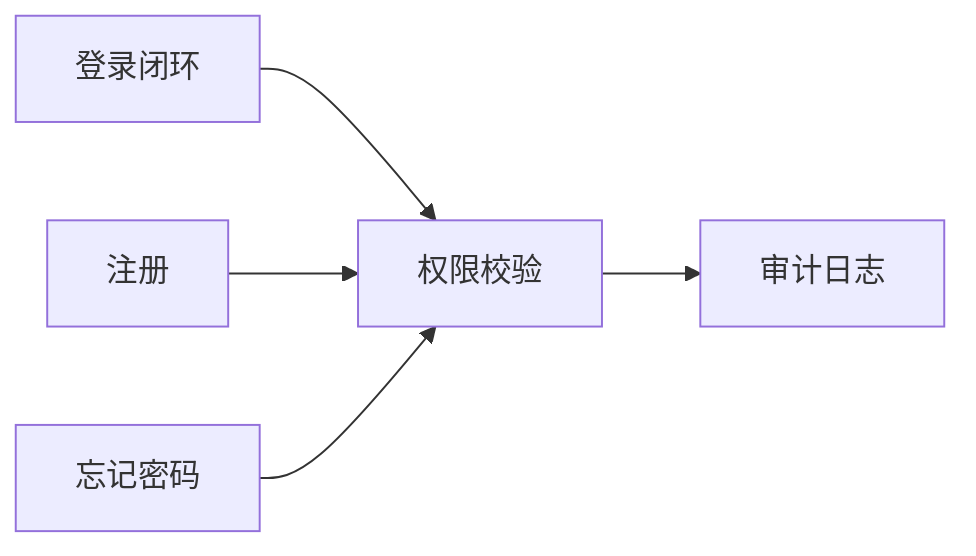

# EXPERT-PANEL-PLAYBOOK.md — 需求分析 / 任务规划 / 任务拆解 专家组手册

> **适用对象**：Master（项目经理角色）。
> **触发时机**：收到新需求、重大变更、跨 Sprint 规划、受阻需要重新拆解。
> **与 [MASTER-RULES.md](MASTER-RULES.md) 关系**：RULES 管红线与硬性 Checklist；本文件管**方法论**——如何把模糊需求转成可执行 ticket。

---

## 0. 何时召唤专家组

| 场景 | 最少专家数 | 必要角色 |
|------|-----------|---------|
| 新需求 → PRD | 3 | 产品 / 架构 / QA |
| 架构变更 | 4 | 架构 / 安全 / 性能 / DevOps |
| 重构/迁移 | 4 | 架构 / 并发 / 回滚策略 / QA |
| 生产事故根因分析 | 5 | SRE / 安全 / 性能 / 架构 / 数据 |
| 日常 ticket 拆解 | 可跳过 | —— |

**不召唤**：单一已知模式的实现任务（CRUD / 文案修改 / 配置项）。召唤专家组 = 承认存在**不确定性**。

---

## 1. 需求分析（Requirement Analysis）

### 1.1 输入闸门 —— 不合格直接打回

拿到需求原文（`inbox/human_input.md`）后，先过 **5-Why + 4-W 闸门**：

| 检查项 | 不合格表现 | 处理 |
|--------|-----------|------|
| **Who** 受益人是谁？ | 仅"用户"二字 | 写 `inbox/human_feedback/[BLOCK]`，问具体角色 |
| **What** 要交付什么 artifact？ | 仅动词（"优化"/"改善"） | 追问可见产物 |
| **Why** 当前状态问题是什么？ | 跳过直接写方案 | 回退追问痛点证据 |
| **When** 成功的判据？ | 无法被证伪 | 追问可测量的验收标准 |
| **Why-5** 连问 5 次根因 | 回答循环 | 需求本身可能是伪命题 |

> **红线**：Master 不得在任何 Why 未澄清的情况下直接开始拆任务。**先澄清，后拆解。**

### 1.2 结构化输出（强制模板）

每次需求分析完成后，产出 `jira/tickets/<EPIC-ID>/requirement-analysis.md`：

```markdown
# Requirement Analysis: <EPIC-ID>

## 1. 原始诉求（原文引用）
> <一字不差引用 human_input>

## 2. 受益人 × 场景矩阵
| Persona | 触发场景 | 当前痛点（证据） | 期望结果 |
|---------|---------|-----------------|---------|
| ... | ... | ... (日志/数据/用户反馈) | ... |

## 3. 验收标准（Given-When-Then）
- **AC-1**: Given <context>, When <action>, Then <observable outcome>
- **AC-2**: ...
- （每条必须可以用一条命令或一次点击验证）

## 4. 非目标（Out of Scope）
- 明确列出**本轮不做**的相关项，防止范围蔓延

## 5. 未知与假设
| ID | 类型 | 内容 | 阻塞级别 | 解除方式 |
|----|------|------|---------|---------|
| U-1 | 未知 | <X 服务 QPS 上限不明> | P0 | 压测 |
| A-1 | 假设 | <用户量 < 1 万> | P1 | 数据对账 |

## 6. 风险与缓解
| 风险 | 可能性 H/M/L | 影响 H/M/L | 缓解策略 |
```

> **Master 只有在本文档每一节都非空后，才能进入 §2 规划阶段。**

### 1.3 专家组角色（需求阶段）

| 专家 | 关注点 | 典型发问 |
|------|--------|---------|
| **产品经理** | 受益人 / 业务价值 | "如果这个不做会死吗？" |
| **架构师** | 技术可行性 / 耦合度 | "现有哪些模块必须动？" |
| **QA** | 验收可测性 | "你怎么证明它对？" |
| **安全/合规** | 数据边界 / 权限 | "谁能读/写哪些字段？" |
| **运维/SRE** | 上线可观测性 | "坏了怎么发现？怎么回滚？" |

每位专家必须**提至少一个关键问题**。全员无异议 = 可能所有人都没认真看，Master 应主动挑战。

---

## 2. 任务规划（Task Planning）

### 2.1 垂直切片优先（Vertical Slicing）

拆任务时，**每个 ticket 必须能独立交付一小片完整用户价值**。禁止按技术层切（"先写所有 API"/"再写所有 UI"）。

| 反模式 | 正模式 |
|--------|--------|
| FEAT-1 设计 DB / FEAT-2 写 API / FEAT-3 写 UI | FEAT-1 登录最小闭环（DB+API+UI 全栈）<br>FEAT-2 登录加验证码（在同一栈再加一层） |

判据：**任一 ticket 合并后都能部署上线展示给用户**，哪怕功能极简。

### 2.2 INVEST 自检（每个 ticket）

- **I**ndependent  可独立开发与合并
- **N**egotiable  粒度可在 analysis 阶段调整
- **V**aluable  单独具备用户/运维价值
- **E**stimable  可给出 hours 估算
- **S**mall  ≤ 2 工作日；超标必须继续拆
- **T**estable  有明确 AC

**任一项不满足 → 强制重拆**。

### 2.3 依赖图与关键路径

在 `confluence/architecture/<EPIC>-plan.md` 产出：



- **关键路径**：最长依赖链 → Master 优先派发这条链上的 ticket
- **可并行块**：无互相依赖的 ticket → Master 必须同时初始化多个 Slaver

### 2.4 Milestone 拆分

每 5-7 个 ticket 设一个 Milestone，交付物必须对应**一个可演示的 Demo**。Demo 不通过 = Milestone 不 done，Master 禁止开下一个 Milestone。

---

## 3. 任务拆解（Task Decomposition）

### 3.1 拆解启发式（按优先级）

1. **风险优先**：最大未知/最大回滚代价的部分 → 拆出来独立 ticket，优先做（fail fast）
2. **边界优先**：进程/网络/权限边界 → 单独 ticket，因为这里最容易出 bug
3. **数据写入优先**：写操作 ticket 永远排在读操作 ticket 之前（保证数据结构先落地）
4. **可观测性内嵌**：每个 ticket 的 AC 必须包含"如何观察它在跑"（日志/指标/追踪），不得事后补

### 3.2 Ticket 最小字段集

Master 创建 ticket 时，以下字段**缺一不能 ready**：

```yaml
id: FEAT-NNN
title: "<动词开头，动作+对象>"          # ❌ "优化系统" ✅ "增加登录失败重试锁定"
parent_epic: EPIC-NNN
agent_type: frontend_dev | backend_dev | fullstack | qa | devops
priority: P0 | P1 | P2 | P3
estimate_hours: <number>                # ≤ 16；超标重拆
blocked_by: [TICKET-ID, ...]
acceptance_criteria:
  - AC-1: Given/When/Then
observability:                          # 必填
  logs: ["event_name"]
  metrics: ["metric_name"]
rollback_plan: "<一句话，如何关闭这个改动>"
test_strategy:
  unit: "<覆盖哪些函数>"
  integration: "<哪条端到端流>"
  regression: "<dual-engine 场景号 or manual step>"
```

### 3.3 不可继续拆解的判据

当 Master 觉得某 ticket "再拆会拆碎"时，回答 3 问：

1. **Slaver 能否 1 小时内读完全文并开始写代码？** 不能 → 继续拆
2. **AC 能否一句话描述？** 不能 → 拆成多个 ticket 每个单 AC
3. **是否触碰 3+ 模块？** 是 → 按模块拆

全 "是" 才停。

---

## 4. 专家组运行协议

### 4.1 召唤模板

```markdown
## 专家组召唤：<主题>

**背景**：<3 句话>
**目标**：<期望专家组产出什么决策>
**参与角色**：产品 / 架构 / QA / SRE / 安全（勾选）

### 发言规则
1. 每位专家**先独立给出分析**，禁止先看他人意见（防群体偏见）
2. 发言结构固定：**观察 → 担忧 → 建议**
3. 分歧必须留在文档里，不得私下协商消除
4. Master 汇总 + 给出最终决策，并**写明为何采纳/驳回每条建议**
```

### 4.2 防伪造

专家组输出必须落文件：`docs/reviews/<YYYY-MM-DD>-<topic>.md`。**严禁**仅口头/对话中讨论后直接行动——留痕是审计前提。

### 4.3 分歧解决

| 分歧类型 | 解决方式 |
|---------|---------|
| 事实分歧（A 说有 bug，B 说没有） | 写最小复现脚本，用脚本结果裁决 |
| 价值分歧（A 说该做，B 说不该做） | 回到 §1.1 的 Why-5，看根因 |
| 方案分歧（两条路都可行） | 列决策矩阵，按"风险/成本/可回滚性/延展性"4 维打分 |

---

## 5. 交付物 Checklist（Master 完成需求分析阶段的硬性标准）

- [ ] `jira/tickets/<EPIC>/requirement-analysis.md` 六节全填
- [ ] `confluence/architecture/<EPIC>-plan.md` 含依赖图 + 关键路径标注
- [ ] 所有 ticket 通过 INVEST 自检
- [ ] 至少一个 ticket 已在 ready 状态且 agent_type 明确
- [ ] 风险表每一项有缓解策略（不得留空）
- [ ] 专家组记录文件存在于 `docs/reviews/`
- [ ] 下发消息到 `shared/message_queue/inbox/`，唤醒对应 Slaver

**任一项缺失 = Master 未完成需求分析阶段，禁止宣布"已拆好"。**

---

## 附录 A：常见反模式速查

| 反模式 | 识别特征 | 修正方式 |
|--------|---------|---------|
| 范围蔓延 | ticket 描述里出现"顺便"/"同时"/"另外" | 拆出独立 ticket |
| 伪拆解 | 子 ticket 必须全部完成才能验证任何一个 | 重拆为垂直切片 |
| 技术层切片 | ticket 标题只含层名："API 层"/"DB 层" | 按用户场景重命名 |
| AC 伪可测 | AC 含"应当流畅"/"友好" | 替换为可断言句式 |
| 无回滚方案 | `rollback_plan` 写"重新部署" | 改成具体开关/feature flag |
| 无观测 | `observability` 留空 | 强制补 log + metric |

## 附录 B：与 EKET 红线的对齐

- 本 Playbook §1.2 的未知/假设表 → 对应 RULES §4 "禁止混淆计划与事实"
- 本 Playbook §3.2 的 `test_strategy` → 对应 RULES §3 "PR 必须附真实 npm test stdout"
- 本 Playbook §4.2 留痕要求 → 对应 RULES §2 "禁止伪造测试结果"
- 本 Playbook §4.3 分歧解决不得私下消除 → 对应 RULES §2 "禁止自我闭环审查"
